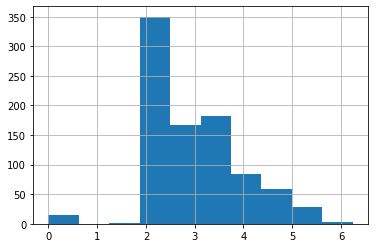
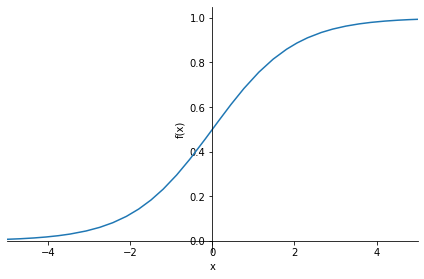

# 0005_fastai_linear_neuralnet_scratch

**Official course site**:  for lesson [3](https://course.fast.ai/Lessons/lesson3.html)    

**Official notebooks** [repo](https://github.com/fastai/course22), on [nbviewer](https://nbviewer.org/github/fastai/course22/tree/master/)

Official **neuralnet from scratch** [notebook](https://www.kaggle.com/code/jhoward/linear-model-and-neural-net-from-scratch) on kaggle     


## how to not execute the entire notebook
---
skip_exec: true
---
## Introduction

In this notebook we're going to build and train a deep learning model "from scratch" -- by which I mean that we're not going to use any pre-built architecture, or optimizers, or data loading frameworks, etc.

We'll be assuming you already know the basics of how a neural network works. If you don't, read this notebook first: [How does a neural net really work?
](https://www.kaggle.com/code/jhoward/how-does-a-neural-net-really-work). We'll be using Kaggle's [Titanic](https://www.kaggle.com/competitions/titanic/) competition in this notebook, because it's very small and simple, but also has displays many of the tricky real-life issues that we need to handle in most practical projects. (Note, however, that this competition is a small "learner" competition on Kaggle, so don't expect to actually see much benefits from using a neural net just yet; that will come once we try our some real competitions!)

It's great to be able to run the same notebook on your own machine or Colab, as well as Kaggle. To allow for this, we use this code to download the data as needed when not on Kaggle (see [this notebook](https://www.kaggle.com/code/jhoward/getting-started-with-nlp-for-absolute-beginners/) for details about this technique):

## How to download kaggle dataset to your local machine or colab? how to ues kaggle api and zipfile to download data into specified folder; how to use `pathlib.Path` to create a path;


```
import os
from pathlib import Path

iskaggle = os.environ.get('KAGGLE_KERNEL_RUN_TYPE', '')
if iskaggle: path = Path('../input/titanic')
else:
    path = Path('titanic')
    if not path.exists():
        import zipfile,kaggle
        kaggle.api.competition_download_cli(str(path))
        zipfile.ZipFile(f'{path}.zip').extractall(path)
```

Note that the data for Kaggle comps always lives in the `../input` folder. The easiest way to get the path is to click the "K" button in the top-right of the Kaggle notebook, click on the folder shown there, and click the copy button.

We'll be using *numpy* and *pytorch* for array calculations in this notebook, and *pandas* for working with tabular data, so we'll import them and set them to display using a bit more space than they default to.

## how to set the print display option for numpy, torch and pandas


```
import torch, numpy as np, pandas as pd
np.set_printoptions(linewidth=140)
torch.set_printoptions(linewidth=140, sci_mode=False, edgeitems=7)
pd.set_option('display.width', 140)
```

## Cleaning the data

### how to read csv file with pandas and `path/'subfolder_name'`

This is a *tabular data* competition -- the data is in the form of a table. It's provided as a Comma Separated Values (CSV) file. We can open it using the *pandas* library, which will create a `DataFrame`.


```
df = pd.read_csv(path/'train.csv')
df
```


<div>
<style scoped>
    .dataframe tbody tr th:only-of-type {
        vertical-align: middle;
    }

    .dataframe tbody tr th {
        vertical-align: top;
    }

    .dataframe thead th {
        text-align: right;
    }
</style>
<table border="1" class="dataframe">
  <thead>
    <tr style="text-align: right;">
      <th></th>
      <th>PassengerId</th>
      <th>Survived</th>
      <th>Pclass</th>
      <th>Name</th>
      <th>Sex</th>
      <th>Age</th>
      <th>SibSp</th>
      <th>Parch</th>
      <th>Ticket</th>
      <th>Fare</th>
      <th>Cabin</th>
      <th>Embarked</th>
    </tr>
  </thead>
  <tbody>
    <tr>
      <th>0</th>
      <td>1</td>
      <td>0</td>
      <td>3</td>
      <td>Braund, Mr. Owen Harris</td>
      <td>male</td>
      <td>22.0</td>
      <td>1</td>
      <td>0</td>
      <td>A/5 21171</td>
      <td>7.2500</td>
      <td>NaN</td>
      <td>S</td>
    </tr>
    <tr>
      <th>1</th>
      <td>2</td>
      <td>1</td>
      <td>1</td>
      <td>Cumings, Mrs. John Bradley (Florence Briggs Th...</td>
      <td>female</td>
      <td>38.0</td>
      <td>1</td>
      <td>0</td>
      <td>PC 17599</td>
      <td>71.2833</td>
      <td>C85</td>
      <td>C</td>
    </tr>
    <tr>
      <th>2</th>
      <td>3</td>
      <td>1</td>
      <td>3</td>
      <td>Heikkinen, Miss. Laina</td>
      <td>female</td>
      <td>26.0</td>
      <td>0</td>
      <td>0</td>
      <td>STON/O2. 3101282</td>
      <td>7.9250</td>
      <td>NaN</td>
      <td>S</td>
    </tr>
    <tr>
      <th>3</th>
      <td>4</td>
      <td>1</td>
      <td>1</td>
      <td>Futrelle, Mrs. Jacques Heath (Lily May Peel)</td>
      <td>female</td>
      <td>35.0</td>
      <td>1</td>
      <td>0</td>
      <td>113803</td>
      <td>53.1000</td>
      <td>C123</td>
      <td>S</td>
    </tr>
    <tr>
      <th>4</th>
      <td>5</td>
      <td>0</td>
      <td>3</td>
      <td>Allen, Mr. William Henry</td>
      <td>male</td>
      <td>35.0</td>
      <td>0</td>
      <td>0</td>
      <td>373450</td>
      <td>8.0500</td>
      <td>NaN</td>
      <td>S</td>
    </tr>
    <tr>
      <th>...</th>
      <td>...</td>
      <td>...</td>
      <td>...</td>
      <td>...</td>
      <td>...</td>
      <td>...</td>
      <td>...</td>
      <td>...</td>
      <td>...</td>
      <td>...</td>
      <td>...</td>
      <td>...</td>
    </tr>
    <tr>
      <th>886</th>
      <td>887</td>
      <td>0</td>
      <td>2</td>
      <td>Montvila, Rev. Juozas</td>
      <td>male</td>
      <td>27.0</td>
      <td>0</td>
      <td>0</td>
      <td>211536</td>
      <td>13.0000</td>
      <td>NaN</td>
      <td>S</td>
    </tr>
    <tr>
      <th>887</th>
      <td>888</td>
      <td>1</td>
      <td>1</td>
      <td>Graham, Miss. Margaret Edith</td>
      <td>female</td>
      <td>19.0</td>
      <td>0</td>
      <td>0</td>
      <td>112053</td>
      <td>30.0000</td>
      <td>B42</td>
      <td>S</td>
    </tr>
    <tr>
      <th>888</th>
      <td>889</td>
      <td>0</td>
      <td>3</td>
      <td>Johnston, Miss. Catherine Helen "Carrie"</td>
      <td>female</td>
      <td>NaN</td>
      <td>1</td>
      <td>2</td>
      <td>W./C. 6607</td>
      <td>23.4500</td>
      <td>NaN</td>
      <td>S</td>
    </tr>
    <tr>
      <th>889</th>
      <td>890</td>
      <td>1</td>
      <td>1</td>
      <td>Behr, Mr. Karl Howell</td>
      <td>male</td>
      <td>26.0</td>
      <td>0</td>
      <td>0</td>
      <td>111369</td>
      <td>30.0000</td>
      <td>C148</td>
      <td>C</td>
    </tr>
    <tr>
      <th>890</th>
      <td>891</td>
      <td>0</td>
      <td>3</td>
      <td>Dooley, Mr. Patrick</td>
      <td>male</td>
      <td>32.0</td>
      <td>0</td>
      <td>0</td>
      <td>370376</td>
      <td>7.7500</td>
      <td>NaN</td>
      <td>Q</td>
    </tr>
  </tbody>
</table>
<p>891 rows × 12 columns</p>
</div>


### why missing value is a problem? how to find out the num of missing values of each column with pandas?

As we learned in the *How does a neural net really work* notebook, we going to want to multiply each column by some coefficients. But we can see in the `Cabin` column that there are `NaN` values, which is how Pandas refers to missing values. We can't multiply something by a missing value!

Let's check which columns contain `NaN` values. Pandas' `isna()` function returns `True` (which is treated as `1` when used as a number) for `NaN` values, so we can just add them up for each column:


```
df.isna().sum()
```


    PassengerId      0
    Survived         0
    Pclass           0
    Name             0
    Sex              0
    Age            177
    SibSp            0
    Parch            0
    Ticket           0
    Fare             0
    Cabin          687
    Embarked         2
    dtype: int64


### which value is most used to replace missing value? how to get mode for each column with pandas using `iloc[0]`

Notice that by default Pandas sums over columns.

We'll need to replace the missing values with something. It doesn't generally matter too much what we choose. We'll use the most common value (the "*mode*"). We can use the `mode` function for that. One wrinkle is that it returns more than one row in the case of ties, so we just grab the first row with `iloc[0]`:


```
modes = df.mode().iloc[0]
modes
```


    PassengerId                      1
    Survived                       0.0
    Pclass                         3.0
    Name           Abbing, Mr. Anthony
    Sex                           male
    Age                           24.0
    SibSp                          0.0
    Parch                          0.0
    Ticket                        1601
    Fare                          8.05
    Cabin                      B96 B98
    Embarked                         S
    Name: 0, dtype: object


### how to use pandas `iloc` function

BTW, it's never a good idea to use functions without understanding them. So be sure to google for anything you're not familiar with. E.g if you want to learn about `iloc` (which is a very important function indeed!) then Google will give you a link to a [great tutorial](https://www.shanelynn.ie/pandas-iloc-loc-select-rows-and-columns-dataframe/).

### how to fill missing values with mode without making a new copy with `pandas.fillna`

Now that we've got the mode of each column, we can use `fillna` to replace the missing values with the mode of each column. We'll do it "in place" -- meaning that we'll change the dataframe itself, rather than returning a new one.


```
df.fillna(modes, inplace=True)
```

We can now check there's no missing values left:


```
df.isna().sum()
```


    PassengerId    0
    Survived       0
    Pclass         0
    Name           0
    Sex            0
    Age            0
    SibSp          0
    Parch          0
    Ticket         0
    Fare           0
    Cabin          0
    Embarked       0
    dtype: int64


### how to get a quick summary of all the numeric columns with pandas and numpy

Here's how we get a quick summary of all the numeric columns in the dataset:


```
import numpy as np

df.describe(include=(np.number))
```


<div>
<style scoped>
    .dataframe tbody tr th:only-of-type {
        vertical-align: middle;
    }

    .dataframe tbody tr th {
        vertical-align: top;
    }

    .dataframe thead th {
        text-align: right;
    }
</style>
<table border="1" class="dataframe">
  <thead>
    <tr style="text-align: right;">
      <th></th>
      <th>PassengerId</th>
      <th>Survived</th>
      <th>Pclass</th>
      <th>Age</th>
      <th>SibSp</th>
      <th>Parch</th>
      <th>Fare</th>
    </tr>
  </thead>
  <tbody>
    <tr>
      <th>count</th>
      <td>891.000000</td>
      <td>891.000000</td>
      <td>891.000000</td>
      <td>891.000000</td>
      <td>891.000000</td>
      <td>891.000000</td>
      <td>891.000000</td>
    </tr>
    <tr>
      <th>mean</th>
      <td>446.000000</td>
      <td>0.383838</td>
      <td>2.308642</td>
      <td>28.566970</td>
      <td>0.523008</td>
      <td>0.381594</td>
      <td>32.204208</td>
    </tr>
    <tr>
      <th>std</th>
      <td>257.353842</td>
      <td>0.486592</td>
      <td>0.836071</td>
      <td>13.199572</td>
      <td>1.102743</td>
      <td>0.806057</td>
      <td>49.693429</td>
    </tr>
    <tr>
      <th>min</th>
      <td>1.000000</td>
      <td>0.000000</td>
      <td>1.000000</td>
      <td>0.420000</td>
      <td>0.000000</td>
      <td>0.000000</td>
      <td>0.000000</td>
    </tr>
    <tr>
      <th>25%</th>
      <td>223.500000</td>
      <td>0.000000</td>
      <td>2.000000</td>
      <td>22.000000</td>
      <td>0.000000</td>
      <td>0.000000</td>
      <td>7.910400</td>
    </tr>
    <tr>
      <th>50%</th>
      <td>446.000000</td>
      <td>0.000000</td>
      <td>3.000000</td>
      <td>24.000000</td>
      <td>0.000000</td>
      <td>0.000000</td>
      <td>14.454200</td>
    </tr>
    <tr>
      <th>75%</th>
      <td>668.500000</td>
      <td>1.000000</td>
      <td>3.000000</td>
      <td>35.000000</td>
      <td>1.000000</td>
      <td>0.000000</td>
      <td>31.000000</td>
    </tr>
    <tr>
      <th>max</th>
      <td>891.000000</td>
      <td>1.000000</td>
      <td>3.000000</td>
      <td>80.000000</td>
      <td>8.000000</td>
      <td>6.000000</td>
      <td>512.329200</td>
    </tr>
  </tbody>
</table>
</div>


### what is long-tailed data in histogram and why it is a problem for neuralnet

We can see that `Fare` contains mainly values of around `0` to `30`, but there's a few really big ones. This is very common with fields contain monetary values, and it can cause problems for our model, because once that column is multiplied by a coefficient later, the few rows with really big values will dominate the result.

You can see the issue most clearly visually by looking at a histogram, which shows a long tail to the right (and don't forget: if you're not entirely sure what a histogram is, Google "[histogram tutorial](https://www.google.com/search?q=histogram+tutorial&oq=histogram+tutorial)" and do a bit of reading before continuing on):

### how to plot histogram with pandas on a single column


```
df['Fare'].hist();
```


    

    


### how to fix long-tailed data with logarithm; why should logarithm work; how to handle zero values when applying logarithm

To fix this, the most common approach is to take the logarithm, which squishes the big numbers and makes the distribution more reasonable. Note, however, that there are zeros in the `Fare` column, and `log(0)` is infinite -- to fix this, we'll simply add `1` to all values first:


```
df['LogFare'] = np.log(df['Fare']+1)
```

The histogram now shows a more even distribution of values without the long tail:


```
df['LogFare'].hist();
```


    

    


It looks from the `describe()` output like `Pclass` contains just 3 values, which we can confirm by looking at the [Data Dictionary](https://www.kaggle.com/competitions/titanic/data) (which you should always study carefully for any project!) -- 


```
pclasses = sorted(df.Pclass.unique())
pclasses
```


    [1, 2, 3]


### how to get a quick summary of all the non-numeric columns with pandas

Here's how we get a quick summary of all the non-numeric columns in the dataset:


```
df.describe(include=[object])
```


<div>
<style scoped>
    .dataframe tbody tr th:only-of-type {
        vertical-align: middle;
    }

    .dataframe tbody tr th {
        vertical-align: top;
    }

    .dataframe thead th {
        text-align: right;
    }
</style>
<table border="1" class="dataframe">
  <thead>
    <tr style="text-align: right;">
      <th></th>
      <th>Name</th>
      <th>Sex</th>
      <th>Ticket</th>
      <th>Cabin</th>
      <th>Embarked</th>
    </tr>
  </thead>
  <tbody>
    <tr>
      <th>count</th>
      <td>891</td>
      <td>891</td>
      <td>891</td>
      <td>891</td>
      <td>891</td>
    </tr>
    <tr>
      <th>unique</th>
      <td>891</td>
      <td>2</td>
      <td>681</td>
      <td>147</td>
      <td>3</td>
    </tr>
    <tr>
      <th>top</th>
      <td>Braund, Mr. Owen Harris</td>
      <td>male</td>
      <td>347082</td>
      <td>B96 B98</td>
      <td>S</td>
    </tr>
    <tr>
      <th>freq</th>
      <td>1</td>
      <td>577</td>
      <td>7</td>
      <td>691</td>
      <td>646</td>
    </tr>
  </tbody>
</table>
</div>


### when do we need dummy variables and how to create dummy variables with pandas

Clearly we can't multiply strings like `male` or `S` by coefficients, so we need to replace those with numbers.

We do that by creating new columns containing *dummy variables*. A dummy variable is a column that contains a `1` where a particular column contains a particular value, or a `0` otherwise. For instance, we could create a dummy variable for `Sex='male'`, which would be a new column containing `1` for rows where `Sex` is `'male'`, and 0 for rows where it isn't.

Pandas can create these automatically using `get_dummies`, which also remove the original columns. We'll create dummy variables for `Pclass`, even although it's numeric, since the numbers `1`, `2`, and `3` correspond to first, second, and third class cabins - not to counts or measures that make sense to multiply by. We'll also create dummies for `Sex` and `Embarked` since we'll want to use those as predictors in our model. On the other hand, `Cabin`, `Name`, and `Ticket` have too many unique values for it to make sense creating dummy variables for them.


```
df = pd.get_dummies(df, columns=["Sex","Pclass","Embarked"])
df.columns
```


    Index(['PassengerId', 'Survived', 'Name', 'Age', 'SibSp', 'Parch', 'Ticket', 'Fare', 'Cabin', 'LogFare', 'Sex_female', 'Sex_male',
           'Pclass_1', 'Pclass_2', 'Pclass_3', 'Embarked_C', 'Embarked_Q', 'Embarked_S'],
          dtype='object')


### how to check the first few rows of selected columns with pandas

We can see that 5 columns have been added to the end -- one for each of the possible values of each of the three columns we requested, and that those three requested columns have been removed.

Here's what the first few rows of those newly added columns look like:


```
added_cols = ['Sex_male', 'Sex_female', 'Pclass_1', 'Pclass_2', 'Pclass_3', 'Embarked_C', 'Embarked_Q', 'Embarked_S']
df[added_cols].head()
```


<div>
<style scoped>
    .dataframe tbody tr th:only-of-type {
        vertical-align: middle;
    }

    .dataframe tbody tr th {
        vertical-align: top;
    }

    .dataframe thead th {
        text-align: right;
    }
</style>
<table border="1" class="dataframe">
  <thead>
    <tr style="text-align: right;">
      <th></th>
      <th>Sex_male</th>
      <th>Sex_female</th>
      <th>Pclass_1</th>
      <th>Pclass_2</th>
      <th>Pclass_3</th>
      <th>Embarked_C</th>
      <th>Embarked_Q</th>
      <th>Embarked_S</th>
    </tr>
  </thead>
  <tbody>
    <tr>
      <th>0</th>
      <td>1</td>
      <td>0</td>
      <td>0</td>
      <td>0</td>
      <td>1</td>
      <td>0</td>
      <td>0</td>
      <td>1</td>
    </tr>
    <tr>
      <th>1</th>
      <td>0</td>
      <td>1</td>
      <td>1</td>
      <td>0</td>
      <td>0</td>
      <td>1</td>
      <td>0</td>
      <td>0</td>
    </tr>
    <tr>
      <th>2</th>
      <td>0</td>
      <td>1</td>
      <td>0</td>
      <td>0</td>
      <td>1</td>
      <td>0</td>
      <td>0</td>
      <td>1</td>
    </tr>
    <tr>
      <th>3</th>
      <td>0</td>
      <td>1</td>
      <td>1</td>
      <td>0</td>
      <td>0</td>
      <td>0</td>
      <td>0</td>
      <td>1</td>
    </tr>
    <tr>
      <th>4</th>
      <td>1</td>
      <td>0</td>
      <td>0</td>
      <td>0</td>
      <td>1</td>
      <td>0</td>
      <td>0</td>
      <td>1</td>
    </tr>
  </tbody>
</table>
</div>


### how to create dependent/target variable and independent/predictor variables in PyTorch tensors; how to create variables in tensor from pandas dataframe


Now we can create our independent (predictors) and dependent (target) variables. They both need to be PyTorch tensors. Our dependent variable is `Survived`:


```
from torch import tensor

t_dep = tensor(df.Survived)
```

Our independent variables are all the continuous variables of interest plus all the dummy variables we just created:


```
indep_cols = ['Age', 'SibSp', 'Parch', 'LogFare'] + added_cols

t_indep = tensor(df[indep_cols].values, dtype=torch.float)
t_indep
```


    tensor([[22.0000,  1.0000,  0.0000,  2.1102,  1.0000,  0.0000,  0.0000,  0.0000,  1.0000,  0.0000,  0.0000,  1.0000],
            [38.0000,  1.0000,  0.0000,  4.2806,  0.0000,  1.0000,  1.0000,  0.0000,  0.0000,  1.0000,  0.0000,  0.0000],
            [26.0000,  0.0000,  0.0000,  2.1889,  0.0000,  1.0000,  0.0000,  0.0000,  1.0000,  0.0000,  0.0000,  1.0000],
            [35.0000,  1.0000,  0.0000,  3.9908,  0.0000,  1.0000,  1.0000,  0.0000,  0.0000,  0.0000,  0.0000,  1.0000],
            [35.0000,  0.0000,  0.0000,  2.2028,  1.0000,  0.0000,  0.0000,  0.0000,  1.0000,  0.0000,  0.0000,  1.0000],
            [24.0000,  0.0000,  0.0000,  2.2469,  1.0000,  0.0000,  0.0000,  0.0000,  1.0000,  0.0000,  1.0000,  0.0000],
            [54.0000,  0.0000,  0.0000,  3.9677,  1.0000,  0.0000,  1.0000,  0.0000,  0.0000,  0.0000,  0.0000,  1.0000],
            ...,
            [25.0000,  0.0000,  0.0000,  2.0857,  1.0000,  0.0000,  0.0000,  0.0000,  1.0000,  0.0000,  0.0000,  1.0000],
            [39.0000,  0.0000,  5.0000,  3.4054,  0.0000,  1.0000,  0.0000,  0.0000,  1.0000,  0.0000,  1.0000,  0.0000],
            [27.0000,  0.0000,  0.0000,  2.6391,  1.0000,  0.0000,  0.0000,  1.0000,  0.0000,  0.0000,  0.0000,  1.0000],
            [19.0000,  0.0000,  0.0000,  3.4340,  0.0000,  1.0000,  1.0000,  0.0000,  0.0000,  0.0000,  0.0000,  1.0000],
            [24.0000,  1.0000,  2.0000,  3.1966,  0.0000,  1.0000,  0.0000,  0.0000,  1.0000,  0.0000,  0.0000,  1.0000],
            [26.0000,  0.0000,  0.0000,  3.4340,  1.0000,  0.0000,  1.0000,  0.0000,  0.0000,  1.0000,  0.0000,  0.0000],
            [32.0000,  0.0000,  0.0000,  2.1691,  1.0000,  0.0000,  0.0000,  0.0000,  1.0000,  0.0000,  1.0000,  0.0000]])


### how to check the size (rows and columns) of independent variables in tensor

Here's the number of rows and columns we have for our independent variables:


```
t_indep.shape
```


    torch.Size([891, 12])


## Setting up a linear model

### how to create coefficients for each (column) of our independent variables; how to get random seed in torch; how to get the num of columns; how to create random number between -0.5 and 0.5;

Now that we've got a matrix of independent variables and a dependent variable vector, we can work on calculating our predictions and our loss. In this section, we're going to manually do a single step of calculating predictions and loss for every row of our data.

Our first model will be a simple linear model. We'll need a coefficient for each column in `t_indep`. We'll pick random numbers in the range `(-0.5,0.5)`, and set our manual seed so that my explanations in the prose in this notebook will be consistent with what you see when you run it.


```
torch.manual_seed(442)
n_coeff = t_indep.shape[1]
coeffs = torch.rand(n_coeff)-0.5
coeffs
```


    tensor([-0.4629,  0.1386,  0.2409, -0.2262, -0.2632, -0.3147,  0.4876,  0.3136,  0.2799, -0.4392,  0.2103,  0.3625])


### why no bias or a constant is needed for this Titanic dataset?

Our predictions will be calculated by multiplying each row by the coefficients, and adding them up. One interesting point here is that we don't need a separate constant term (also known as a "bias" or "intercept" term), or a column of all `1`s to give the same effect has having a constant term. That's because our dummy variables already cover the entire dataset -- e.g. there's a column for "male" and a column for "female", and everyone in the dataset is in exactly one of these; therefore, we don't need a separate intercept term to cover rows that aren't otherwise part of a column.

Here's what the multiplication looks like:


```
t_indep*coeffs
```


    tensor([[-10.1838,   0.1386,   0.0000,  -0.4772,  -0.2632,  -0.0000,   0.0000,   0.0000,   0.2799,  -0.0000,   0.0000,   0.3625],
            [-17.5902,   0.1386,   0.0000,  -0.9681,  -0.0000,  -0.3147,   0.4876,   0.0000,   0.0000,  -0.4392,   0.0000,   0.0000],
            [-12.0354,   0.0000,   0.0000,  -0.4950,  -0.0000,  -0.3147,   0.0000,   0.0000,   0.2799,  -0.0000,   0.0000,   0.3625],
            [-16.2015,   0.1386,   0.0000,  -0.9025,  -0.0000,  -0.3147,   0.4876,   0.0000,   0.0000,  -0.0000,   0.0000,   0.3625],
            [-16.2015,   0.0000,   0.0000,  -0.4982,  -0.2632,  -0.0000,   0.0000,   0.0000,   0.2799,  -0.0000,   0.0000,   0.3625],
            [-11.1096,   0.0000,   0.0000,  -0.5081,  -0.2632,  -0.0000,   0.0000,   0.0000,   0.2799,  -0.0000,   0.2103,   0.0000],
            [-24.9966,   0.0000,   0.0000,  -0.8973,  -0.2632,  -0.0000,   0.4876,   0.0000,   0.0000,  -0.0000,   0.0000,   0.3625],
            ...,
            [-11.5725,   0.0000,   0.0000,  -0.4717,  -0.2632,  -0.0000,   0.0000,   0.0000,   0.2799,  -0.0000,   0.0000,   0.3625],
            [-18.0531,   0.0000,   1.2045,  -0.7701,  -0.0000,  -0.3147,   0.0000,   0.0000,   0.2799,  -0.0000,   0.2103,   0.0000],
            [-12.4983,   0.0000,   0.0000,  -0.5968,  -0.2632,  -0.0000,   0.0000,   0.3136,   0.0000,  -0.0000,   0.0000,   0.3625],
            [ -8.7951,   0.0000,   0.0000,  -0.7766,  -0.0000,  -0.3147,   0.4876,   0.0000,   0.0000,  -0.0000,   0.0000,   0.3625],
            [-11.1096,   0.1386,   0.4818,  -0.7229,  -0.0000,  -0.3147,   0.0000,   0.0000,   0.2799,  -0.0000,   0.0000,   0.3625],
            [-12.0354,   0.0000,   0.0000,  -0.7766,  -0.2632,  -0.0000,   0.4876,   0.0000,   0.0000,  -0.4392,   0.0000,   0.0000],
            [-14.8128,   0.0000,   0.0000,  -0.4905,  -0.2632,  -0.0000,   0.0000,   0.0000,   0.2799,  -0.0000,   0.2103,   0.0000]])


### why a column `Age` having higher values than other columns can cause problem for our model; how to solve this problem by making them the same scale; how to get the max value of each column with pandas dataframe max func

We can see we've got a problem here. The sums of each row will be dominated by the first column, which is `Age`, since that's bigger on average than all the others.

Let's make all the columns contain numbers from `0` to `1`, by dividing each column by its `max()`:


```
vals,indices = t_indep.max(dim=0)
t_indep = t_indep / vals
```

As we see, that removes the problem of one column dominating all the others:


```
t_indep*coeffs
```


    tensor([[-0.1273,  0.0173,  0.0000, -0.0765, -0.2632, -0.0000,  0.0000,  0.0000,  0.2799, -0.0000,  0.0000,  0.3625],
            [-0.2199,  0.0173,  0.0000, -0.1551, -0.0000, -0.3147,  0.4876,  0.0000,  0.0000, -0.4392,  0.0000,  0.0000],
            [-0.1504,  0.0000,  0.0000, -0.0793, -0.0000, -0.3147,  0.0000,  0.0000,  0.2799, -0.0000,  0.0000,  0.3625],
            [-0.2025,  0.0173,  0.0000, -0.1446, -0.0000, -0.3147,  0.4876,  0.0000,  0.0000, -0.0000,  0.0000,  0.3625],
            [-0.2025,  0.0000,  0.0000, -0.0798, -0.2632, -0.0000,  0.0000,  0.0000,  0.2799, -0.0000,  0.0000,  0.3625],
            [-0.1389,  0.0000,  0.0000, -0.0814, -0.2632, -0.0000,  0.0000,  0.0000,  0.2799, -0.0000,  0.2103,  0.0000],
            [-0.3125,  0.0000,  0.0000, -0.1438, -0.2632, -0.0000,  0.4876,  0.0000,  0.0000, -0.0000,  0.0000,  0.3625],
            ...,
            [-0.1447,  0.0000,  0.0000, -0.0756, -0.2632, -0.0000,  0.0000,  0.0000,  0.2799, -0.0000,  0.0000,  0.3625],
            [-0.2257,  0.0000,  0.2008, -0.1234, -0.0000, -0.3147,  0.0000,  0.0000,  0.2799, -0.0000,  0.2103,  0.0000],
            [-0.1562,  0.0000,  0.0000, -0.0956, -0.2632, -0.0000,  0.0000,  0.3136,  0.0000, -0.0000,  0.0000,  0.3625],
            [-0.1099,  0.0000,  0.0000, -0.1244, -0.0000, -0.3147,  0.4876,  0.0000,  0.0000, -0.0000,  0.0000,  0.3625],
            [-0.1389,  0.0173,  0.0803, -0.1158, -0.0000, -0.3147,  0.0000,  0.0000,  0.2799, -0.0000,  0.0000,  0.3625],
            [-0.1504,  0.0000,  0.0000, -0.1244, -0.2632, -0.0000,  0.4876,  0.0000,  0.0000, -0.4392,  0.0000,  0.0000],
            [-0.1852,  0.0000,  0.0000, -0.0786, -0.2632, -0.0000,  0.0000,  0.0000,  0.2799, -0.0000,  0.2103,  0.0000]])


### what is maxtrix by vector operation (multiply or divide)

One thing you hopefully noticed is how amazingly cool this line of code is:

    t_indep = t_indep / vals

That is dividing a matrix by a vector -- what on earth does that mean?!? The trick here is that we're taking advantage of a technique in numpy and PyTorch (and many other languages, going all the way back to APL) called [broadcasting](https://numpy.org/doc/stable/user/basics.broadcasting.html). In short, this acts as if there's a separate copy of the vector for every row of the matrix, so it divides each row of the matrix by the vector. In practice, it doesn't actually make any copies, and does the whole thing in a highly optimized way, taking full advantage of modern CPUs (or, indeed, GPUs, if we're using them). Broadcasting is one of the most important techniques for making your code concise, maintainable, and fast, so it's well worth studying and practicing.

### How to calculate the prediction of a linear model

We can now create predictions from our linear model, by adding up the rows of the product:


```
preds = (t_indep*coeffs).sum(axis=1)
```

### how to look at the first 10 values of predictions

Let's take a look at the first few:


```
preds[:10]
```


    tensor([ 0.1927, -0.6239,  0.0979,  0.2056,  0.0968,  0.0066,  0.1306,  0.3476,  0.1613, -0.6285])


### how to calc mean absolute error

Of course, these predictions aren't going to be any use, since our coefficients are random -- they're just a starting point for our gradient descent process.

To do gradient descent, we need a loss function. Taking the average error of the rows (i.e. the absolute value of the difference between the prediction and the dependent) is generally a reasonable approach:


```
loss = torch.abs(preds-t_dep).mean()
loss
```


    tensor(0.5382)


### how to calc predictions with a func `calc_preds`; how to calc loss with a func `calc_loss`

Now that we've tested out a way of calculating predictions, and loss, let's pop them into functions to make life easier:


```
def calc_preds(coeffs, indeps): return (indeps*coeffs).sum(axis=1)
def calc_loss(coeffs, indeps, deps): return torch.abs(calc_preds(coeffs, indeps)-deps).mean()
```

## Doing a gradient descent step

In this section, we're going to do a single "epoch" of gradient descent manually. The only thing we're going to automate is calculating gradients, because let's face it that's pretty tedious and entirely pointless to do by hand! To get PyTorch to calculate gradients, we'll need to call `requires_grad_()` on our `coeffs` (if you're not sure why, review the previous notebook, [How does a neural net really work?](https://www.kaggle.com/code/jhoward/how-does-a-neural-net-really-work), before continuing):


```
coeffs.requires_grad_()
```

Now when we calculate our loss, PyTorch will keep track of all the steps, so we'll be able to get the gradients afterwards:


```
loss = calc_loss(coeffs, t_indep, t_dep)
loss
```


    tensor(0.5382, grad_fn=<MeanBackward0>)


Use `backward()` to ask PyTorch to calculate gradients now:


```
loss.backward()
```

Let's see what they look like:


```
coeffs.grad
```


    tensor([-0.0106,  0.0129, -0.0041, -0.0484,  0.2099, -0.2132, -0.1212, -0.0247,  0.1425, -0.1886, -0.0191,  0.2043])


### How to cacl gradients for coefficients

Note that each time we call `backward`, the gradients are actually *added* to whatever is in the `.grad` attribute. Let's try running the above steps again:


```
loss = calc_loss(coeffs, t_indep, t_dep)
loss.backward()
coeffs.grad
```


    tensor([-0.0212,  0.0258, -0.0082, -0.0969,  0.4198, -0.4265, -0.2424, -0.0494,  0.2851, -0.3771, -0.0382,  0.4085])


### why set gradients to zero after each gradient descent step; how to set gradient to zero; how to do one iteration of training

As you see, our `.grad` values are have doubled. That's because it added the gradients a second time. For this reason, after we use the gradients to do a gradient descent step, we need to set them back to zero.

We can now do one gradient descent step, and check that our loss decreases:


```
loss = calc_loss(coeffs, t_indep, t_dep)
loss.backward()
with torch.no_grad():
    coeffs.sub_(coeffs.grad * 0.1)
    coeffs.grad.zero_()
    print(calc_loss(coeffs, t_indep, t_dep))
```

    tensor(0.4945)


### what does _ mean for `coeffs.sub_()` and `grad.zero_()`

Note that `a.sub_(b)` subtracts `b` from `a` in-place. In PyTorch, any method that ends in `_` changes its object in-place. Similarly, `a.zero_()` sets all elements of a tensor to zero.

## Training the linear model

### how to split the dataset by using train and valid idx produced by `fastai.data.transforms.RandomSplitter`

Before we begin training our model, we'll need to ensure that we hold out a validation set for calculating our metrics (for details on this, see "[Getting started with NLP for absolute beginners](https://www.kaggle.com/code/jhoward/getting-started-with-nlp-for-absolute-beginners#Test-and-validation-sets)".

There's lots of different ways we can do this. In the next notebook we'll be comparing our approach here to what the fastai library does, so we'll want to ensure we split the data in the same way. So let's use `RandomSplitter` to get indices that will split our data into training and validation sets:


```
from fastai.data.transforms import RandomSplitter
trn_split,val_split=RandomSplitter(seed=42)(df)
```

Now we can apply those indicies to our independent and dependent variables:


```
trn_indep,val_indep = t_indep[trn_split],t_indep[val_split]
trn_dep,val_dep = t_dep[trn_split],t_dep[val_split]
len(trn_indep),len(val_indep)
```


    (713, 178)


We'll create functions for the three things we did manually above: updating `coeffs`, doing one full gradient descent step, and initilising `coeffs` to random numbers:

### how to udpate coefficients in a function `update_coeffs`


```
def update_coeffs(coeffs, lr):
    coeffs.sub_(coeffs.grad * lr)
    coeffs.grad.zero_()
```

### how to do one epoch training in a function `one_epoch`


```
def one_epoch(coeffs, lr):
    loss = calc_loss(coeffs, trn_indep, trn_dep)
    loss.backward()
    with torch.no_grad(): update_coeffs(coeffs, lr)
    print(f"{loss:.3f}", end="; ")
```

### how to initializing coefficients in a function `init_coeffs`


```
def init_coeffs(): return (torch.rand(n_coeff)-0.5).requires_grad_()
```

### how to integrate funcs above to form a function `train_model` on multiple epochs

We can now use these functions to train our model:


```
def train_model(epochs=30, lr=0.01):
    torch.manual_seed(442)
    coeffs = init_coeffs()
    for i in range(epochs): one_epoch(coeffs, lr=lr)
    return coeffs
```

Let's try it. Our loss will print at the end of every step, so we hope we'll see it going down:


```
coeffs = train_model(18, lr=0.2)
```

    0.536; 0.502; 0.477; 0.454; 0.431; 0.409; 0.388; 0.367; 0.349; 0.336; 0.330; 0.326; 0.329; 0.304; 0.314; 0.296; 0.300; 0.289; 

### how to display coefficients of the model with func `show_coeffs`

It does!

Let's take a look at the coefficients for each column:


```
def show_coeffs(): return dict(zip(indep_cols, coeffs.requires_grad_(False)))
show_coeffs()
```


    {'Age': tensor(-0.2694),
     'SibSp': tensor(0.0901),
     'Parch': tensor(0.2359),
     'LogFare': tensor(0.0280),
     'Sex_male': tensor(-0.3990),
     'Sex_female': tensor(0.2345),
     'Pclass_1': tensor(0.7232),
     'Pclass_2': tensor(0.4112),
     'Pclass_3': tensor(0.3601),
     'Embarked_C': tensor(0.0955),
     'Embarked_Q': tensor(0.2395),
     'Embarked_S': tensor(0.2122)}


## Measuring accuracy

### There are many possible loss options such as accuracy other than mean absolute error

The Kaggle competition is not, however, scored by absolute error (which is our loss function). It's scored by *accuracy* -- the proportion of rows where we correctly predict survival. Let's see how accurate we were on the validation set. First, calculate the predictions:


```
preds = calc_preds(coeffs, val_indep)
```

### how to calc accuracy for the binary dependent variable

We'll assume that any passenger with a score of over `0.5` is predicted to survive. So that means we're correct for each row where `preds>0.5` is the same as the dependent variable:


```
results = val_dep.bool()==(preds>0.5)
results[:16]
```


    tensor([ True,  True,  True,  True,  True,  True,  True,  True,  True,  True, False, False, False,  True,  True, False])


Let's see what our average accuracy is:


```
results.float().mean()
```


    tensor(0.7865)


### how to wrap the process of calc accuracy using coeffs into a func `acc(coeffs)`

That's not a bad start at all! We'll create a function so we can calcuate the accuracy easy for other models we train:


```
def acc(coeffs): return (val_dep.bool()==(calc_preds(coeffs, val_indep)>0.5)).float().mean()
acc(coeffs)
```


    tensor(0.7865)


## Using sigmoid

### when will we be needing something like sigmoid

Looking at our predictions, there's one obvious problem -- some of our predictions of the probability of survival are `>1`, and some are `<0`:


```
preds[:28]
```


    tensor([ 0.8160,  0.1295, -0.0148,  0.1831,  0.1520,  0.1350,  0.7279,  0.7754,  0.3222,  0.6740,  0.0753,  0.0389,  0.2216,  0.7631,
             0.0678,  0.3997,  0.3324,  0.8278,  0.1078,  0.7126,  0.1023,  0.3627,  0.9937,  0.8050,  0.1153,  0.1455,  0.8652,  0.3425])


### how to write and plot a func like `sigmoid` using sympy

To fix this, we should pass every prediction through the *sigmoid function*, which has a minimum at zero and maximum at one, and is defined as follows:


```
import sympy
sympy.plot("1/(1+exp(-x))", xlim=(-5,5));
```


    

    


### how to update `calc_preds` by wrapping `torch.sigmoid` around prediction

PyTorch already defines that function for us, so we can modify `calc_preds` to use it:


```
def calc_preds(coeffs, indeps): return torch.sigmoid((indeps*coeffs).sum(axis=1))
```

Let's train a new model now, using this updated function to calculate predictions:


```
coeffs = train_model(lr=100)
```

    0.510; 0.327; 0.294; 0.207; 0.201; 0.199; 0.198; 0.197; 0.196; 0.196; 0.196; 0.195; 0.195; 0.195; 0.195; 0.195; 0.195; 0.195; 0.194; 0.194; 0.194; 0.194; 0.194; 0.194; 0.194; 0.194; 0.194; 0.194; 0.194; 0.194; 

The loss has improved by a lot. Let's check the accuracy:


```
acc(coeffs)
```


    tensor(0.8258)


That's improved too! Here's the coefficients of our trained model:


```
show_coeffs()
```


    {'Age': tensor(-1.5061),
     'SibSp': tensor(-1.1575),
     'Parch': tensor(-0.4267),
     'LogFare': tensor(0.2543),
     'Sex_male': tensor(-10.3320),
     'Sex_female': tensor(8.4185),
     'Pclass_1': tensor(3.8389),
     'Pclass_2': tensor(2.1398),
     'Pclass_3': tensor(-6.2331),
     'Embarked_C': tensor(1.4771),
     'Embarked_Q': tensor(2.1168),
     'Embarked_S': tensor(-4.7958)}


These coefficients seem reasonable -- in general, older people and males were less likely to survive, and first class passengers were more likely to survive.

## Submitting to Kaggle

Now that we've got a trained model, we can prepare a submission to Kaggle. To do that, first we need to read the test set:

### read test data using `pandas.read_csv`


```
tst_df = pd.read_csv(path/'test.csv')
```

### why and how to fill the missing value in Fare column with 0 instead of mode

In this case, it turns out that the test set is missing `Fare` for one passenger. We'll just fill it with `0` to avoid problems:


```
tst_df['Fare'] = tst_df.Fare.fillna(0)
```

### how to handle missing values, long-tailed distribution and dummies together for test data

Now we can just copy the same steps we did to our training set and do the same exact things on our test set to preprocess the data:


```
tst_df.fillna(modes, inplace=True)
tst_df['LogFare'] = np.log(tst_df['Fare']+1)
tst_df = pd.get_dummies(tst_df, columns=["Sex","Pclass","Embarked"])
```

### how to turn independent variable values into tensor


```
tst_indep = tensor(tst_df[indep_cols].values, dtype=torch.float)
```

### how to make sure independent variable in test data share the same value scare with those in training data


```
tst_indep = tst_indep / vals
```

### how to turn true or false into 1 or 0 and save them into a column

Let's calculate our predictions of which passengers survived in the test set:


```
tst_df['Survived'] = (calc_preds(tst_indep, coeffs)>0.5).int()
```

### how to select two columns of a dataframe and save them into a csv file using `to_csv`

The sample submission on the Kaggle competition site shows that we're expected to upload a CSV with just `PassengerId` and `Survived`, so let's create that and save it:


```
sub_df = tst_df[['PassengerId','Survived']]
sub_df.to_csv('sub.csv', index=False)
```

### how to check the first few lines of the csv file using `!head`

We can check the first few rows of the file to make sure it looks reasonable:


```
!head sub.csv
```

    PassengerId,Survived
    892,0
    893,0
    894,0
    895,0
    896,0
    897,0
    898,1
    899,0
    900,1


When you click "save version" in Kaggle, and wait for the notebook to run, you'll see that `sub.csv` appears in the "Data" tab. Clicking on that file will show a *Submit* button, which allows you to submit to the competition.

## Using matrix product

### how to do matrix product `@` between a matrix and a vector with PyTorch; how to use `@` instead of doing multiplication and then addition together

We can make things quite a bit neater...

Take a look at the inner-most calculation we're doing to get the predictions:


```
(val_indep*coeffs).sum(axis=1)
```


    tensor([ 12.3288, -14.8119, -15.4540, -13.1513, -13.3512, -13.6469,   3.6248,   5.3429, -22.0878,   3.1233, -21.8742, -15.6421, -21.5504,
              3.9393, -21.9190, -12.0010, -12.3775,   5.3550, -13.5880,  -3.1015, -21.7237, -12.2081,  12.9767,   4.7427, -21.6525, -14.9135,
             -2.7433, -12.3210, -21.5886,   3.9387,   5.3890,  -3.6196, -21.6296, -21.8454,  12.2159,  -3.2275, -12.0289,  13.4560, -21.7230,
             -3.1366, -13.2462, -21.7230, -13.6831,  13.3092, -21.6477,  -3.5868, -21.6854, -21.8316, -14.8158,  -2.9386,  -5.3103, -22.2384,
            -22.1097, -21.7466, -13.3780, -13.4909, -14.8119, -22.0690, -21.6666, -21.7818,  -5.4439, -21.7407, -12.6551, -21.6671,   4.9238,
            -11.5777, -13.3323, -21.9638, -15.3030,   5.0243, -21.7614,   3.1820, -13.4721, -21.7170, -11.6066, -21.5737, -21.7230, -11.9652,
            -13.2382, -13.7599, -13.2170,  13.1347, -21.7049, -21.7268,   4.9207,  -7.3198,  -5.3081,   7.1065,  11.4948, -13.3135, -21.8723,
            -21.7230,  13.3603, -15.5670,   3.4105,  -7.2857, -13.7197,   3.6909,   3.9763, -14.7227, -21.8268,   3.9387, -21.8743, -21.8367,
            -11.8518, -13.6712, -21.8299,   4.9440,  -5.4471, -21.9666,   5.1333,  -3.2187, -11.6008,  13.7920, -21.7230,  12.6369,  -3.7268,
            -14.8119, -22.0637,  12.9468, -22.1610,  -6.1827, -14.8119,  -3.2838, -15.4540, -11.6950,  -2.9926,  -3.0110, -21.5664, -13.8268,
              7.3426, -21.8418,   5.0744,   5.2582,  13.3415, -21.6289, -13.9898, -21.8112,  -7.3316,   5.2296, -13.4453,  12.7891, -22.1235,
            -14.9625,  -3.4339,   6.3089, -21.9839,   3.1968,   7.2400,   2.8558,  -3.1187,   3.7965,   5.4667, -15.1101, -15.0597, -22.9391,
            -21.7230,  -3.0346, -13.5206, -21.7011,  13.4425,  -7.2690, -21.8335, -12.0582,  13.0489,   6.7993,   5.2160,   5.0794, -12.6957,
            -12.1838,  -3.0873, -21.6070,   7.0744, -21.7170, -22.1001,   6.8159, -11.6002, -21.6310])


Multiplying elements together and then adding across rows is identical to doing a matrix-vector product! Python uses the `@` operator to indicate matrix products, and is supported by PyTorch tensors. Therefore, we can replicate the above calculate more simply like so:


```
val_indep@coeffs
```


    tensor([ 12.3288, -14.8119, -15.4540, -13.1513, -13.3511, -13.6468,   3.6248,   5.3429, -22.0878,   3.1233, -21.8742, -15.6421, -21.5504,
              3.9393, -21.9190, -12.0010, -12.3775,   5.3550, -13.5880,  -3.1015, -21.7237, -12.2081,  12.9767,   4.7427, -21.6525, -14.9135,
             -2.7433, -12.3210, -21.5886,   3.9387,   5.3890,  -3.6196, -21.6296, -21.8454,  12.2159,  -3.2275, -12.0289,  13.4560, -21.7230,
             -3.1366, -13.2462, -21.7230, -13.6831,  13.3092, -21.6477,  -3.5868, -21.6854, -21.8316, -14.8158,  -2.9386,  -5.3103, -22.2384,
            -22.1097, -21.7466, -13.3780, -13.4909, -14.8119, -22.0690, -21.6666, -21.7818,  -5.4439, -21.7407, -12.6551, -21.6671,   4.9238,
            -11.5777, -13.3323, -21.9638, -15.3030,   5.0243, -21.7614,   3.1820, -13.4721, -21.7170, -11.6066, -21.5737, -21.7230, -11.9652,
            -13.2382, -13.7599, -13.2170,  13.1347, -21.7049, -21.7268,   4.9207,  -7.3198,  -5.3081,   7.1065,  11.4948, -13.3135, -21.8723,
            -21.7230,  13.3603, -15.5670,   3.4105,  -7.2857, -13.7197,   3.6909,   3.9763, -14.7227, -21.8268,   3.9387, -21.8743, -21.8367,
            -11.8518, -13.6712, -21.8299,   4.9440,  -5.4471, -21.9666,   5.1333,  -3.2187, -11.6008,  13.7920, -21.7230,  12.6369,  -3.7268,
            -14.8119, -22.0637,  12.9468, -22.1610,  -6.1827, -14.8119,  -3.2838, -15.4540, -11.6950,  -2.9926,  -3.0110, -21.5664, -13.8268,
              7.3426, -21.8418,   5.0744,   5.2582,  13.3415, -21.6289, -13.9898, -21.8112,  -7.3316,   5.2296, -13.4453,  12.7891, -22.1235,
            -14.9625,  -3.4339,   6.3089, -21.9839,   3.1968,   7.2400,   2.8558,  -3.1187,   3.7965,   5.4667, -15.1101, -15.0597, -22.9391,
            -21.7230,  -3.0346, -13.5206, -21.7011,  13.4425,  -7.2690, -21.8335, -12.0582,  13.0489,   6.7993,   5.2160,   5.0794, -12.6957,
            -12.1838,  -3.0873, -21.6070,   7.0744, -21.7170, -22.1001,   6.8159, -11.6002, -21.6310])


### update `calc_preds` func using matrix multiplication `@`

It also turns out that this is much faster, because matrix products in PyTorch are very highly optimised.

Let's use this to replace how `calc_preds` works:


```
def calc_preds(coeffs, indeps): return torch.sigmoid(indeps@coeffs)
```

### how to initialize coeffs and turn it into a matrix with a single column; question: but why make coeffs between 0 and 0.1 instead of -0.5 and 0.5

In order to do matrix-matrix products (which we'll need in the next section), we need to turn `coeffs` into a column vector (i.e. a matrix with a single column), which we can do by passing a second argument `1` to `torch.rand()`, indicating that we want our coefficients to have one column:


```
def init_coeffs(): return (torch.rand(n_coeff, 1)*0.1).requires_grad_()
```

### how to turn a single column of dependent variable into a single column matrix or a column vector

We'll also need to turn our dependent variable into a column vector, which we can do by indexing the column dimension with the special value `None`, which tells PyTorch to add a new dimension in this position:


```
trn_dep = trn_dep[:,None]
val_dep = val_dep[:,None]
```

### question: why set learning rate to be 100 for this Titanic model

We can now train our model as before and confirm we get identical outputs...:


```
coeffs = train_model(lr=100)
```

    0.512; 0.323; 0.290; 0.205; 0.200; 0.198; 0.197; 0.197; 0.196; 0.196; 0.196; 0.195; 0.195; 0.195; 0.195; 0.195; 0.195; 0.194; 0.194; 0.194; 0.194; 0.194; 0.194; 0.194; 0.194; 0.194; 0.194; 0.194; 0.194; 0.194; 

...and identical accuracy:


```
acc(coeffs)
```


    tensor(0.8258)


## A neural network

### how to initialize coeffs for a neuralnet with two layers (including a hidden layer of n neurons) and the final output layer is a single neuron with a single coeff; question: how do `-0.5` and `-0.3` come from?

We've now got what we need to implement our neural network.

First, we'll need to create coefficients for each of our layers. Our first set of coefficients will take our `n_coeff` inputs, and create `n_hidden` outputs. We can choose whatever `n_hidden` we like -- a higher number gives our network more flexibility, but makes it slower and harder to train. So we need a matrix of size `n_coeff` by `n_hidden`. We'll divide these coefficients by `n_hidden` so that when we sum them up in the next layer we'll end up with similar magnitude numbers to what we started with.

Then our second layer will need to take the `n_hidden` inputs and create a single output, so that means we need a `n_hidden` by `1` matrix there. The second layer will also need a constant term added.


```
def init_coeffs(n_hidden=20):
    layer1 = (torch.rand(n_coeff, n_hidden)-0.5)/n_hidden
    layer2 = torch.rand(n_hidden, 1)-0.3
    const = torch.rand(1)[0]
    return layer1.requires_grad_(),layer2.requires_grad_(),const.requires_grad_()
```

### how to update `calc_preds` for this 2 layer neuralnet using `F.relu`, matrix product `@`, and `torch.sigmoid`

Now we have our coefficients, we can create our neural net. The key steps are the two matrix products, `indeps@l1` and `res@l2` (where `res` is the output of the first layer). The first layer output is passed to `F.relu` (that's our non-linearity), and the second is passed to `torch.sigmoid` as before.


```
import torch.nn.functional as F

def calc_preds(coeffs, indeps):
    l1,l2,const = coeffs
    res = F.relu(indeps@l1)
    res = res@l2 + const
    return torch.sigmoid(res)
```

### how to update coeffs layer by layer with `layer.sub_` and `layer.grad.zero_`

Finally, now that we have more than one set of coefficients, we need to add a loop to update each one:


```
def update_coeffs(coeffs, lr):
    for layer in coeffs:
        layer.sub_(layer.grad * lr)
        layer.grad.zero_()
```

### question: how the learning rate is chosen (1.4 or 20) when training

That's it -- we're now ready to train our model!


```
coeffs = train_model(lr=1.4)
```

    0.543; 0.532; 0.520; 0.505; 0.487; 0.466; 0.439; 0.407; 0.373; 0.343; 0.319; 0.301; 0.286; 0.274; 0.264; 0.256; 0.250; 0.245; 0.240; 0.237; 0.234; 0.231; 0.229; 0.227; 0.226; 0.224; 0.223; 0.222; 0.221; 0.220; 


```
coeffs = train_model(lr=20)
```

    0.543; 0.400; 0.260; 0.390; 0.221; 0.211; 0.197; 0.195; 0.193; 0.193; 0.193; 0.193; 0.193; 0.193; 0.193; 0.193; 0.193; 0.192; 0.192; 0.192; 0.192; 0.192; 0.192; 0.192; 0.192; 0.192; 0.192; 0.192; 0.192; 0.192; 

It's looking good -- our loss is lower than before. Let's see if that translates to a better result on the validation set:


```
acc(coeffs)
```


    tensor(0.8258)


In this case our neural net isn't showing better results than the linear model. That's not surprising; this dataset is very small and very simple, and isn't the kind of thing we'd expect to see neural networks excel at. Furthermore, our validation set is too small to reliably see much accuracy difference. But the key thing is that we now know exactly what a real neural net looks like!

## Deep learning

### how to move from neuralnet with one hidden layer to a deep learning

The neural net in the previous section only uses one hidden layer, so it doesn't count as "deep" learning. But we can use the exact same technique to make our neural net deep, by adding more matrix multiplications.

First, we'll need to create additional coefficients for each layer:


```
def init_coeffs():
    hiddens = [10, 10]  # <-- set this to the size of each hidden layer you want
    sizes = [n_coeff] + hiddens + [1]
    n = len(sizes)
    layers = [(torch.rand(sizes[i], sizes[i+1])-0.3)/sizes[i+1]*4 for i in range(n-1)]
    consts = [(torch.rand(1)[0]-0.5)*0.1 for i in range(n-1)]
    for l in layers+consts: l.requires_grad_()
    return layers,consts
```

### why so many messy constants and how they block the progress of deep learning in the early days

You'll notice here that there's a lot of messy constants to get the random numbers in just the right ranges. When you train the model in a moment, you'll see that the tiniest changes to these initialisations can cause our model to fail to train at all! This is a key reason that deep learning failed to make much progress in the early days -- it's very finicky to get a good starting point for our coefficients. Nowadays, we have ways to deal with that, which we'll learn about in other notebooks.

Our deep learning `calc_preds` looks much the same as before, but now we loop through each layer, instead of listing them separately:

### how to use `enumerate` to loop both idx and item


```
import torch.nn.functional as F

def calc_preds(coeffs, indeps):
    layers,consts = coeffs
    n = len(layers)
    res = indeps
    for i,l in enumerate(layers):
        res = res@l + consts[i]
        if i!=n-1: res = F.relu(res)
    return torch.sigmoid(res)
```

We also need a minor update to `update_coeffs` since we've got `layers` and `consts` separated now:


```
def update_coeffs(coeffs, lr):
    layers,consts = coeffs
    for layer in layers+consts:
        layer.sub_(layer.grad * lr)
        layer.grad.zero_()
```

Let's train our model...


```
coeffs = train_model(lr=4)
```

    0.521; 0.483; 0.427; 0.379; 0.379; 0.379; 0.379; 0.378; 0.378; 0.378; 0.378; 0.378; 0.378; 0.378; 0.378; 0.378; 0.377; 0.376; 0.371; 0.333; 0.239; 0.224; 0.208; 0.204; 0.203; 0.203; 0.207; 0.197; 0.196; 0.195; 

...and check its accuracy:


```
acc(coeffs)
```


    tensor(0.8258)


## Final thoughts

### How much similar or different between practical models and the models from scratch above

It's actually pretty cool that we've managed to create a real deep learning model from scratch and trained it to get over 80% accuracy on this task, all in the course of a single notebook!

The "real" deep learning models that are used in research and industry look very similar to this, and in fact if you look inside the source code of any deep learning model you'll recognise the basic steps are the same.

The biggest differences in practical models to what we have above are:

- How initialisation and normalisation is done to ensure the model trains correctly every time
- Regularization (to avoid over-fitting)
- Modifying the neural net itself to take advantage of knowledge of the problem domain
- Doing gradient descent steps on smaller batches, rather than the whole dataset.

I'll be adding notebooks about all these later, and will add links here once they're ready.

If you found this notebook useful, please remember to click the little up-arrow at the top to upvote it, since I like to know when people have found my work useful, and it helps others find it too. (BTW, be sure you're looking at my [original notebook here](https://www.kaggle.com/code/jhoward/linear-model-and-neural-net-from-scratch) when you do that, and are not on your own copy of it, otherwise your upvote won't get counted!) And if you have any questions or comments, please pop them below -- I read every comment I receive!


```
from fastdebug.utils import *
```


```
fastnbs("numpy book")
```


## a  <mark style="background-color: #ffff00">numpy</mark>   <mark style="background-color: #FFFF00">book</mark>  recommended by jeremy; what is a tensor


As you can see, they're *tensors*. A tensor is just like an `array` in numpy (if you're not familiar with numpy, I strongly recommend reading [this great book](https://wesmckinney.com/book/), because it's a critical foundation for nearly all numeric programming in Python. Furthermore, PyTorch, which most researchers use for deep learning, is modeled closely on numpy.) A tensor can be a single number (a *scalar* or *rank-0 tensor*), a list of numbers (a *vector* or *rank-1 tensor*), a table of numbers (a *matrix* or *rank-0 tensor*), a table of tables of numbers (a *rank-3 tensor*), and so forth.

We're not going to learn much about our data by just looking at the raw numbers, so let's draw a picture:


[Open `0004_fastai_how_neuralnet_work` in Jupyter Notebook](http://localhost:8888/tree/nbs/2022part1/0004_fastai_how_neuralnet_work.ipynb)


```
fastlistnbs()
```

    
    /Users/Natsume/Documents/fastdebug/mds/2022part1/0004_fastai_how_neuralnet_work.md
    ## Fitting a function with *gradient descent*
    ### Is neuralnet just a math function? what does the function look like?
    ### why neuralnet is random at first and how to make neuralnet useful
    ### `plot_function`: how to plot a function with plt; how to create x input with torch.linspace; how to plot x, y, color and title with plt;
    ### how to create a particular quadratic function
    ### how to write a function `quad` to create any quadratic function
    ### how does `partial` and `quad` work to modify `quad` to a slightly different func?
    ### how to add noise to both mult and add of the neuralnet/function; how to create noise using `np.random.normal`
    ### how to create a random seed to ensure x and y are the same each run
    ## A numpy book recommended by Jeremy; what is a tensor
    ### how to scatterplot with plt
    ### how to plot a scatterplot and a line and slides for 3 params of the line func
    ### why need a loss function? how to write a mean absolute error function with torch.abs and mean
    ### how display and change loss by changing values of params with sliders of interactive plot
    ### A 15-min calculus video series recommended by Jeremy to watch first
    ## Automating gradient descent
    ### how derivatives automatically guide params to change for a lower loss
    ### how to create a mean absolute error function on any quadratic model
    ### how to create an random tensor with 3 values as initialized params
    ### how to calc gradients of params? 1. tell PyTorch to get ready for calculating gradients for these params; 2. calc loss; 3. calc the gradients with `loss.backward()`; 4. how to access params' gradients; 
    ### how to change params with gradients properly to lower loss¶
    ### why `with torch.no_grad():` when updating params with gradients
    ### how to do 10 iterations of updating params with gradients
    ## How a neural network approximates any given function
    ## how to combine a linear func with max(x, 0) into a rectified linear function; how to use torch.clip(y, 0.) to perform max(y, 0.)
    ## how to use partial to wrap rectified_linear to create a specific rectified_linear func
    ## how to use `F.relu` to replace `torch.clip` to create a rectified linear func; 
    ### create double and quaduple relu func/neuralnet
    ## How to recognise an owl
    ### deep learning basically is drawing squiggly lines infinitely given computation and time
    
    /Users/Natsume/Documents/fastdebug/mds/2022part1/0001_fastai_is_it_a_bird.md
    ## Useful Course sites
    ## How to use autoreload
    ## How to install and update libraries
    ## Know a little about the libraries
    ### what is fastai
    ### what is duckduckgo
    ## How to use fastdebug with fastai notebooks
    ### how to use fastdebug
    ### Did I document it in a notebook before?
    ### Did I document it in a src before?
    ## how to search and get a url of an image; how to download with an url; how to view an image;
    ### how to create folders using path; how to search and download images in folders; how to resize images 
    ## Train my model
    ### How to find and unlink images not properly downloaded
    ### How to create a DataLoaders with DataBlock; how to view data with it
    ### How to build my model with dataloaders and pretrained model; how to train my model
    ### How to predict with my model; how to avoid running cells in nbdev_prepare
    
    /Users/Natsume/Documents/fastdebug/mds/2022part1/0002_fastai_Saving_Model_fastai.md
    ## what to import to handle vision problems in fastai
    ## how to download and decompress datasets prepared by fastai
    ## how to tell it is a cat by reading filename
    ## how to create dataloaders with `from_name_func`
    ## how to create a pretrained model with resnet18 and error_rate; how to fine tune it 3 epochs
    ## how to export model to a pickle file and download it from Kaggle
    ## how to convert ipynb to md
    
    /Users/Natsume/Documents/fastdebug/mds/2022part1/0005_fastai_linear_neuralnet_scratch.md
    ## how to not execute the entire notebook
    ## Introduction
    ## How to download kaggle dataset to your local machine or colab? how to ues kaggle api and zipfile to download data into specified folder; how to use `pathlib.Path` to create a path;
    ## how to set the print display option for numpy, torch and pandas
    ## Cleaning the data
    ### how to read csv file with pandas and `path/'subfolder_name'`
    ### why missing value is a problem? how to find out the num of missing values of each column with pandas?
    ### which value is most used to replace missing value? how to get mode for each column with pandas using `iloc[0]`
    ### how to use pandas `iloc` function
    ### how to fill missing values with mode without making a new copy with `pandas.fillna`
    ### how to get a quick summary of all the numeric columns with pandas and numpy
    ### what is long-tailed data in histogram and why it is a problem for neuralnet
    ### how to plot histogram with pandas on a single column
    ### how to fix long-tailed data with logarithm; why should logarithm work; how to handle zero values when applying logarithm
    ### how to get a quick summary of all the non-numeric columns with pandas
    ### when do we need dummy variables and how to create dummy variables with pandas
    ### how to check the first few rows of selected columns with pandas
    ### how to create dependent/target variable and independent/predictor variables in PyTorch tensors; how to create variables in tensor from pandas dataframe
    ### how to check the size (rows and columns) of independent variables in tensor
    ## Setting up a linear model
    ### how to create coefficients for each (column) of our independent variables; how to get random seed in torch; how to get the num of columns; how to create random number between -0.5 and 0.5;
    ### why no bias or a constant is needed for this Titanic dataset?
    ### why a column `Age` having higher values than other columns can cause problem for our model; how to solve this problem by making them the same scale; how to get the max value of each column with pandas dataframe max func
    ### what is maxtrix by vector operation (multiply or divide)
    ### How to calculate the prediction of a linear model
    ### how to look at the first 10 values of predictions
    ### how to calc mean absolute error
    ### how to calc predictions with a func `calc_preds`; how to calc loss with a func `calc_loss`
    ## Doing a gradient descent step
    ### How to cacl gradients for coefficients
    ### why set gradients to zero after each gradient descent step; how to set gradient to zero; how to do one iteration of training
    ### what does _ mean for `coeffs.sub_()` and `grad.zero_()`
    ## Training the linear model
    ### how to split the dataset by using train and valid idx produced by `fastai.data.transforms.RandomSplitter`
    ### how to udpate coefficients in a function `update_coeffs`
    ### how to do one epoch training in a function `one_epoch`
    ### how to initializing coefficients in a function `init_coeffs`
    ### how to integrate funcs above to form a function `train_model` on multiple epochs
    ### how to display coefficients of the model with func `show_coeffs`
    ## Measuring accuracy
    ### There are many possible loss options such as accuracy other than mean absolute error
    ### how to calc accuracy for the binary dependent variable
    ### how to wrap the process of calc accuracy using coeffs into a func `acc(coeffs)`
    ## Using sigmoid
    ### when will we be needing something like sigmoid
    ### how to write and plot a func like `sigmoid` using sympy
    ### how to update `calc_preds` by wrapping `torch.sigmoid` around prediction
    ## Submitting to Kaggle
    ### read test data using `pandas.read_csv`
    ### why and how to fill the missing value in Fare column with 0 instead of mode
    ### how to handle missing values, long-tailed distribution and dummies together for test data
    ### how to turn independent variable values into tensor
    ### how to make sure independent variable in test data share the same value scare with those in training data
    ### how to turn true or false into 1 or 0 and save them into a column
    ### how to select two columns of a dataframe and save them into a csv file using `to_csv`
    ### how to check the first few lines of the csv file using `!head`
    ## Using matrix product
    ### how to do matrix product `@` between a matrix and a vector with PyTorch; how to use `@` instead of doing multiplication and then addition together
    ### update `calc_preds` func using matrix multiplication `@`
    ### how to initialize coeffs and turn it into a matrix with a single column; question: but why make coeffs between 0 and 0.1 instead of -0.5 and 0.5
    ### how to turn a single column of dependent variable into a single column matrix or a column vector
    ### question: why set learning rate to be 100 for this Titanic model
    ## A neural network
    ### how to initialize coeffs for a neuralnet with two layers (including a hidden layer of n neurons) and the final output layer is a single neuron with a single coeff; question: how do `-0.5` and `-0.3` come from?
    ### how to update `calc_preds` for this 2 layer neuralnet using `F.relu`, matrix product `@`, and `torch.sigmoid`
    ### how to update coeffs layer by layer with `layer.sub_` and `layer.grad.zero_`
    ### question: how the learning rate is chosen (1.4 or 20) when training
    ## Deep learning
    ### how to move from neuralnet with one hidden layer to a deep learning
    ### why so many messy constants and how they block the progress of deep learning in the early days
    ### how to use `enumerate` to loop both idx and item
    ## Final thoughts
    ### How much similar or different between practical models and the models from scratch above
    
    /Users/Natsume/Documents/fastdebug/mds/2022part1/0003_fastai_which_image_model_best.md
    ## timm
    ## how to git clone TIMM analysis data; how to enter a directory with %cd
    ## how to read a csv file with pandas
    ## how to merge data with pandas; how to create new column with pandas; how to string extract with regex expression; how to select columns up to a particular column with pandas; how to do loc in pandas; how to select a group of columns using str.contains and regex
    ## Inference results
    ### how to scatterplot with plotly.express; how to set the plot's width, height, size, title, x, y, log_x, color, hover_name, hover_data; 
    ### how to scatterplot on a subgroup of data using regex and plotly
    ## Training results
    ### convert ipynb to md
    
    /Users/Natsume/Documents/fastdebug/mds/lib/utils.md
    ## setup for exporting to a module
    ## how to get current notebook's name, path and url
    ## how to convert ipynb to md automatically; how to run commands in python
    ## Autoreload for every notebook
    ## Expand cells
    ## Import fastcore env
    ## to inspect a class
    ### get the docs for each function of a class
    ## is it a metaclass?
    ## is it a decorator
    ### handle all kinds of exceptions for evaluating retn 
    ## whatinside a module of a library
    ### show the type of objects inside `__all__`
    ### working for fastdebug.core
    ### to show Fastdb methods
    ## whichversion of a library
    ## fastview
    ## fastscrs
    ## getrootport
    ## jn_link
    ## get_all_nbs
    ### get all nbs path for both md and ipynb
    ### add index.ipynb
    ## openNB
    ## highlight
    ## display_md
    ## display_block
    ### handle both file path and file content at the same time
    ## fastnbs
    ## fastcodes
    ## fastnotes
    ### multiple folders
    ## fastlistnbs
    ## fastlistsrcs
    ## Best practice of fastdebug.core
    ## Best practice of fastdebug.utils
    ## Export
    
    /Users/Natsume/Documents/fastdebug/mds/lib/00_core.md
    ## make life easier with defaults  
    ## globals() and locals()
    ## Execute strings
    ### new variable or updated variable by exec will only be accessible from locals()
    ### eval can override its own globals() and locals()
    ### when exec update existing functions
    ### when the func to be udpated involve other libraries
    ### inside a function, exec() allow won't give you necessary env from function namespace
    ### magic of `exec(b, globals().update(locals()))`
    ### Bring variables from a func namespace to the sideout world
    ### globals() in a cell vs globals() in a func
    ## make a colorful string
    ## align text to the most right
    ## printsrcwithidx
    ### print the entire source code with idx from 0
    ### print the whole src with idx or print them in parts
    ### use cmts from dbprint to print out src with comments
    ### no more update for printsrcwithidx, for the latest see Fastdb.print
    ## print out src code
    ### basic version
    ### print src with specific number of lines
    ### make the naming more sensible
    ### Allow a dbline occur more than once
    ### adding idx to the selected srclines
    #### printsrclinewithidx
    ### dblines can be string of code or idx number
    ### avoid multi-occurrance of the same srcline
    ## dbprint on expression
    ### basic version
    ### insert dbcode and make a new dbfunc
    ### Bring outside namespace variables into exec()
    ### Bring what inside the func namespace variables to the outside world
    ### Adding g = locals() to dbprintinsert to avoid adding env individually
    ### enable srclines to be either string or int 
    ### enable = to be used as assignment in codes
    ### avoid adding "env=g" for dbprintinsert
    ### collect cmt for later printsrcwithidx to print comments together
    ### make sure only one line with correct idx is debugged
    ### avoid typing "" when there is no codes
    ### no more update for dbprint, for the latest see Fastdb.dbprint
    ### use dbprint to override the original official code without changing its own pyfile
    ## dbprintinsert
    ### Run and display the inserted dbcodes 
    ### use locals() inside the dbsrc code to avoid adding env individually
    ### enable dbprintinsert to do exec on a block of code
    ## printrunsrclines() 
    ### Examples
    #### simple example
    #### complex example
    ### insert a line after each srcline to add idx
    ### add correct indentation to each inserted line
    #### count the indentation for each srcline
    ### indentation special case: if, else, for, def
    ### remove pure comments or docs from dbsrc
    ### print out the srclines which get run
    ### Make sure all if, else, for get printed
    ### Put all together into the function printrunsrclines()
    #### no more renaming of foo
    #### add example as a param into the function
    #### improve on search for `if`, else, for, def to avoid errors for more examples
    #### remove an empty line with indentation
    ### make it work
    ### more difficult examples to test printrunsrc()
    ## Make fastdebug a class
    ### improve on the line idx readability
    ### collect cmt from dbprint and print
    ### make sure only the line with correct idx is debugged
    ### having "" or "   " inside codes without causing error
    ### replace Fastdb.printsrcwithdix with Fastdb.print
    ### add idx to dbsrc when showdbsrc=True
    ### not load the inner locals() to outenv can prevent mysterious printing of previous db messages
    ### using @patch to enable docs for instance methods like `dbprint` and `print`
    ### move param env into `__init__`
    ### Add example to the obj
    ### Take not only function but also class
    ### To remove the necessity of self.takExample()
    ### Try to remove g = locals()
    ### Make sure `showdbsrc=True` give us the line starting with 'dbprintinsert'
    ### Make sure `showdbsrc=True` give us info on changes in g or outenv
    ### exit and print a warning message: idx has to be int
    ### handle errors by codes with trailing spaces 
    ### showdbsrc=True, check whether Fastdb.dbprint and fdb.dbprint are same object using `is`
    ### remove unnecessary db printout when showdbsrc=True and add printout to display sections
    ### raise TypeError when decode are not integer and showdbsrc=true working on both method and function
    ### when debugging dbprint, make sure dbsrc is printed with the same idx as original
    ### update dbsrc to the global env
    ### go back to normal before running dbprint again
    ### auto print src with cmt and idx as the ending part of dbprint
    ### to mark my explorations (expressions to evaluate) to stand out
    ### Add the print of src with idx and comments at the end of dbsrc
    ### embed example and autoprint to shorten the code to type
    ### Make title for dbprint
    ### Adding self.eg info and color group into dbprint and print
    #### todo: make the comments with same self.eg have the same color
    ### make dbsrc print idx right
    ### add self.eg to a dict with keys are idxsrc
    ### handle both function and class as src
    ### documenting on Fastdb.dbprint itself
    ## mk_dbsrc
    ## Turn mk_dbsrc into docsrc 
    ### handle when no codes are given
    ## create_dbsrc_from_string
    ## replaceWithDbsrc
    ### handle class and metaclass
    ### improve on handling function as decorator
    ### Handling `inspect._signature_from_callable` to become `self.dbsrc`
    ### handling usage of `@delegates`
    ### handling `@delegates` with indentation before it
    ### handling classes by inspect.isclass() rather than == type and add more class situations
    ### handling `class _T(_TestA, metaclass=BypassNewMeta): `
    ## run_example
    ### `exec(self.eg, globals().update(self.egEnv), locals())` works better than `...update(locals()), self.egEnv)
    ### no more env cells run before `fdb.eg` to make `fdb.run_example` work
    ## Autoprint
    ## Take an example and its env into Fastdb obj
    ## print src with idx and cmt in whole or parts
    ### print self.eg after each comment and colorize comments
    ### color examples and cmts separately and make the func simpler
    ### split each cmt and colorize parts randomly
    ### printcmts1 while saving into a file
    ## goback
    ## Fastdb.explore
    ### adding one breakpoint with comment
    ### Adding multiple breakpoints by multiple set_trace()
    ### Go back to normal before running explore again
    ### enable fdb.takExample("whatinside(fu), ...) without using `fu.whatinside`
    ### refactory explore
    ## snoop
    ### snoop on both function and class
    ### snoop on class and method and all???
    ### snoop
    ### simplify adding @snoop for both normal function and decorator
    ### handling classes
    ### add watch
    ## Snoop
    ### add watch
    ### use guide on Fastdb.dbprint
    ## reliveonce
    ## Fastdb.debug
    ## Export
    ## Send to Obsidian
    
    /Users/Natsume/Documents/fastdebug/mds/demos/0001_fastcore_meta_delegates.md
    ## Import
    ## Initiate Fastdb and example in str
    ## Example
    ## docsrc
    ## Snoop
    
    /Users/Natsume/Documents/fastdebug/mds/demos/0003_Explore_document_FixSigMeta_PrePostInitMeta_AutoInit.md
    ## Initialize fastdebug objects
    ## class FixSigMeta(type) vs class Foo(type)
    ## class Foo()
    ## class PrePostInitMeta(FixSigMeta)
    ## class Foo(metaclass=FixSigMeta)
    ## class AutoInit(metaclass=PrePostInitMeta)
    ## Prepare examples for FixSigMeta, PrePostInitMeta, AutoInit 
    ## Snoop them together in one go
    ### embed the dbsrc of FixSigMeta into PrePostInitMeta
    ### embed dbsrc of PrePostInitMeta into AutoInit
    ## Explore and Document on them together 
    
    /Users/Natsume/Documents/fastdebug/mds/demos/0004_fastcore.meta._rm_self.md
    ## imports
    ## set up
    ## document
    ## snoop
    
    /Users/Natsume/Documents/fastdebug/mds/demos/0005_fastcore.meta.test_sig.md
    ## imports
    ## setups
    ## documents
    ## snoop
    
    /Users/Natsume/Documents/fastdebug/mds/demos/0007_fastcore.meta.BypassNewMeta.md
    ## Reading official docs
    ## Inspecting class
    ## Initiating with examples
    ## Snoop
    ## Document
    
    /Users/Natsume/Documents/fastdebug/mds/demos/0002_signature_from_callable.md
    ## Expand cell
    ## Imports and initiate
    ## Examples
    
    /Users/Natsume/Documents/fastdebug/mds/demos/0008_use_kwargs_dict.md
    ## Imports
    ## Reading official docs
    ## empty2none
    ## `_mk_param`
    ## use_kwargs_dict
    ### Reading docs
    ## use_kwargs
    ### Reading docs
    
    /Users/Natsume/Documents/fastdebug/mds/demos/0006_fastcore.meta.NewChkMeta.md
    ## Import and Initalization
    ## Official docs
    ## Prepare Example
    ## Inspect classes
    ## Snoop
    ## Document
    
    /Users/Natsume/Documents/fastdebug/mds/demos/0000_tour.md
    ### Documentation
    ### Testing
    ### Foundations
    ### L
    ### Transforms
    
    /Users/Natsume/Documents/fastdebug/mds/demos/0012_fastcore_foundation_L.md
    ## Document `L` with fastdebug
    
    /Users/Natsume/Documents/fastdebug/mds/demos/0011_Fastdb.md
    
    /Users/Natsume/Documents/fastdebug/mds/demos/0009_funcs_kwargs.md
    ## fastcore.meta.method
    ### Reading Docs
    ### Running codes
    ### Document
    ### snoop
    ## funcs_kwargs
    ### Official docs
    ### snoop: from _funcs_kwargs to funcs_kwargs
    ### snoop only '_funcs_kwargs' by breaking up 'funcs_kwargs'
    
    /Users/Natsume/Documents/fastdebug/mds/demos/0010_fastcore_meta_summary.md
    ## import
    ## fastcore and fastcore.meta
    ### What's inside fastcore.meta
    ## Review individual funcs and classes
    ### What is fastcore.meta all about? 
    ### What can these metaclasses do for me?
    #### FixSigMeta
    #### PrePostInitMeta
    #### AutoInit
    #### NewChkMeta
    #### BypassNewMeta
    ### What can those decorators do for me?
    #### use_kwargs_dict
    #### use_kwargs
    #### delegates
    #### funcs_kwargs
    ### The remaining functions
    ## What is fastcore.meta all about
    
    /Users/Natsume/Documents/fastdebug/mds/questions/00_question_anno_dict.md
    ## `anno_dict` docs
    ## Dive in
    ## `anno_dict` seems not add anything new to `__annotations__`
    ## use fastdebug to double check
    ## Does fastcore want anno_dict to include params with no annos?
    ## Jeremy's response


```
ipy2md()
```

    [jupytext] Reading /Users/Natsume/Documents/fastdebug/nbs/2022part1/0005_fastai_linear_neuralnet_scratch.ipynb in format ipynb
    [jupytext] Writing /Users/Natsume/Documents/fastdebug/nbs/2022part1/0005_fastai_linear_neuralnet_scratch.md
    cp to : /Users/Natsume/Documents/divefastai/Debuggable/jupytext
    move to : /Users/Natsume/Documents/fastdebug/mds/2022part1/


    [NbConvertApp] Converting notebook /Users/Natsume/Documents/fastdebug/nbs/2022part1/0005_fastai_linear_neuralnet_scratch.ipynb to markdown


    copy to : /Users/Natsume/Documents/fastdebug/mds_output
    move to : /Users/Natsume/Documents/divefastai/Debuggable/nbconvert


    [NbConvertApp] Support files will be in 0005_fastai_linear_neuralnet_scratch_files/
    [NbConvertApp] Making directory /Users/Natsume/Documents/fastdebug/nbs/2022part1/0005_fastai_linear_neuralnet_scratch_files
    [NbConvertApp] Making directory /Users/Natsume/Documents/fastdebug/nbs/2022part1/0005_fastai_linear_neuralnet_scratch_files
    [NbConvertApp] Making directory /Users/Natsume/Documents/fastdebug/nbs/2022part1/0005_fastai_linear_neuralnet_scratch_files
    [NbConvertApp] Writing 54964 bytes to /Users/Natsume/Documents/fastdebug/nbs/2022part1/0005_fastai_linear_neuralnet_scratch.md

