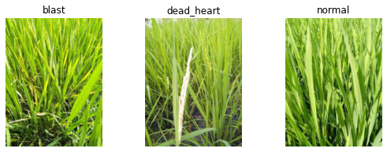
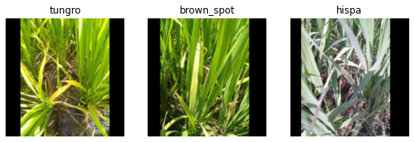
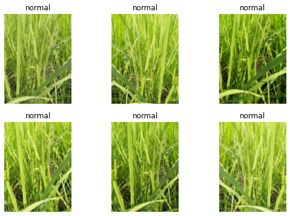

# 0009_fastai_small_models_road_to_the_top_part_2
---
skip_exec: true
---

```
# install fastkaggle if not available
try: import fastkaggle
except ModuleNotFoundError:
    !pip install -q fastkaggle

from fastkaggle import *
```

    WARNING: Running pip as the 'root' user can result in broken permissions and conflicting behaviour with the system package manager. It is recommended to use a virtual environment instead: https://pip.pypa.io/warnings/venv
    

This is part 2 of the [Road to the Top](https://www.kaggle.com/code/jhoward/first-steps-road-to-the-top-part-1) series, in which I show the process I used to tackle the [Paddy Doctor](https://www.kaggle.com/competitions/paddy-disease-classification) competition, leading to four 1st place submissions. If you haven't already, first check out [part 1](https://www.kaggle.com/code/jhoward/first-steps-road-to-the-top-part-1).

## Going faster

First we'll repeat the steps we used last time to access the data and ensure all the latest libraries are installed:


```
comp = 'paddy-disease-classification'
path = setup_comp(comp, install='"fastcore>=1.4.5" "fastai>=2.7.1" "timm>=0.6.2.dev0"')
from fastai.vision.all import *
set_seed(42)
```

    ERROR: pip's dependency resolver does not currently take into account all the packages that are installed. This behaviour is the source of the following dependency conflicts.
    tensorflow-io 0.21.0 requires tensorflow-io-gcs-filesystem==0.21.0, which is not installed.
    tensorflow 2.6.4 requires absl-py~=0.10, but you have absl-py 1.0.0 which is incompatible.
    tensorflow 2.6.4 requires numpy~=1.19.2, but you have numpy 1.21.6 which is incompatible.
    tensorflow 2.6.4 requires six~=1.15.0, but you have six 1.16.0 which is incompatible.
    tensorflow 2.6.4 requires wrapt~=1.12.1, but you have wrapt 1.14.1 which is incompatible.
    tensorflow-transform 1.8.0 requires tensorflow!=2.0.*,!=2.1.*,!=2.2.*,!=2.3.*,!=2.4.*,!=2.5.*,!=2.6.*,!=2.7.*,<2.9,>=1.15.5, but you have tensorflow 2.6.4 which is incompatible.
    tensorflow-serving-api 2.8.0 requires tensorflow<3,>=2.8.0, but you have tensorflow 2.6.4 which is incompatible.
    rich 12.4.4 requires typing-extensions<5.0,>=4.0.0; python_version < "3.9", but you have typing-extensions 3.10.0.2 which is incompatible.
    pytorch-lightning 1.6.3 requires typing-extensions>=4.0.0, but you have typing-extensions 3.10.0.2 which is incompatible.
    pytools 2022.1.9 requires typing-extensions>=4.0; python_version < "3.11", but you have typing-extensions 3.10.0.2 which is incompatible.
    flax 0.5.0 requires typing-extensions>=4.1.1, but you have typing-extensions 3.10.0.2 which is incompatible.
    flake8 4.0.1 requires importlib-metadata<4.3; python_version < "3.8", but you have importlib-metadata 4.11.4 which is incompatible.
    apache-beam 2.38.0 requires dill<0.3.2,>=0.3.1.1, but you have dill 0.3.5.1 which is incompatible.
    apache-beam 2.38.0 requires httplib2<0.20.0,>=0.8, but you have httplib2 0.20.4 which is incompatible.
    aioitertools 0.10.0 requires typing_extensions>=4.0; python_version < "3.10", but you have typing-extensions 3.10.0.2 which is incompatible.
    aiobotocore 2.3.2 requires botocore<1.24.22,>=1.24.21, but you have botocore 1.26.7 which is incompatible.


### why kaggle gpu is much slower for training and how does fastai to fix it with `resize_images`

A big issue I noticed last time was that originally I created the notebook on my home PC, and each epoch of the resnet we created took under 20 seconds to run. But on Kaggle they took over 3 minutes each! Whilst Kaggle's GPUs are less powerful than what I've got at home, that doesn't come close to explaining this vast difference in speed.

I noticed when Kaggle was running that the "GPU" indicator in the top right was nearly empty, and the "CPU" one was always full. This strongly suggests that the problem was that Kaggle's notebook was CPU bound by decoding and resizing the images. This is a common problem on machines with poor CPU performance -- and indeed Kaggle only provides 2 virtual CPUs at the time of writing.

We really need to fix this, since we need to be able to iterate much more quickly. What we can do is to simply resize all the images to half their height and width -- which reduces their number of pixels 4x. This should mean an around 4x increase in performance for training small models.

Luckily, fastai has a function which does exactly this, whilst maintaining the folder structure of the data: `resize_images`.

### how to create a new folder with `Path`


```
trn_path = Path('sml')
```

### how to resize all images (including those in subfolders) of `train_images` folder and save them into a new destination folder; max_size = 256 does shrink the total size by 4+, but question: how Jeremy pick 256 not 250; 


```
resize_images(path/'train_images', dest=trn_path, max_size=256, recurse=True)
```

### how to create an image dataloaders using the resized image folder and specify the resize for each image item; how to display just 3 images in a batch

This will give us 192x256px images. Let's take a look:


```
dls = ImageDataLoaders.from_folder(trn_path, valid_pct=0.2, seed=42,
    item_tfms=Resize((256,192)))

dls.show_batch(max_n=3)
```


    

    


### how to wrap dataloaders creation, model creation, fine tuning together in a func `train` and return the trained model; how use model architecture, item transforms, and batch transforms, and num of epochs as the params of the `train` function;

In this notebook, we'll be experimenting with a few different architectures and image processing approaches (item and batch transforms). In order to make this easier, we'll put our modeling steps together into a little function which we can pass the architecture, item transforms, and batch transforms to:


```
def train(arch, item, batch, epochs=5):
    dls = ImageDataLoaders.from_folder(trn_path, seed=42, valid_pct=0.2, item_tfms=item, batch_tfms=batch)
    learn = vision_learner(dls, arch, metrics=error_rate).to_fp16()
    learn.fine_tune(epochs, 0.01)
    return learn
```

Our `item_tfms` already resize our images to small sizes, so this shouldn't impact the accuracy of our models much, if at all. Let's re-run our resnet26d to test.


```
learn = train('resnet26d', item=Resize(192),
              batch=aug_transforms(size=128, min_scale=0.75))
```

    Downloading: "https://github.com/rwightman/pytorch-image-models/releases/download/v0.1-weights/resnet26d-69e92c46.pth" to /root/.cache/torch/hub/checkpoints/resnet26d-69e92c46.pth


<style>
    /* Turns off some styling */
    progress {
        /* gets rid of default border in Firefox and Opera. */
        border: none;
        /* Needs to be in here for Safari polyfill so background images work as expected. */
        background-size: auto;
    }
    .progress-bar-interrupted, .progress-bar-interrupted::-webkit-progress-bar {
        background: #F44336;
    }
</style>


<table border="1" class="dataframe">
  <thead>
    <tr style="text-align: left;">
      <th>epoch</th>
      <th>train_loss</th>
      <th>valid_loss</th>
      <th>error_rate</th>
      <th>time</th>
    </tr>
  </thead>
  <tbody>
    <tr>
      <td>0</td>
      <td>1.875997</td>
      <td>1.478083</td>
      <td>0.445459</td>
      <td>00:36</td>
    </tr>
  </tbody>
</table>


<style>
    /* Turns off some styling */
    progress {
        /* gets rid of default border in Firefox and Opera. */
        border: none;
        /* Needs to be in here for Safari polyfill so background images work as expected. */
        background-size: auto;
    }
    .progress-bar-interrupted, .progress-bar-interrupted::-webkit-progress-bar {
        background: #F44336;
    }
</style>


<table border="1" class="dataframe">
  <thead>
    <tr style="text-align: left;">
      <th>epoch</th>
      <th>train_loss</th>
      <th>valid_loss</th>
      <th>error_rate</th>
      <th>time</th>
    </tr>
  </thead>
  <tbody>
    <tr>
      <td>0</td>
      <td>1.268640</td>
      <td>1.031712</td>
      <td>0.343585</td>
      <td>00:33</td>
    </tr>
    <tr>
      <td>1</td>
      <td>0.989115</td>
      <td>0.701631</td>
      <td>0.223931</td>
      <td>00:33</td>
    </tr>
    <tr>
      <td>2</td>
      <td>0.708181</td>
      <td>0.527319</td>
      <td>0.161941</td>
      <td>00:33</td>
    </tr>
    <tr>
      <td>3</td>
      <td>0.522309</td>
      <td>0.405053</td>
      <td>0.127343</td>
      <td>00:33</td>
    </tr>
    <tr>
      <td>4</td>
      <td>0.428306</td>
      <td>0.388762</td>
      <td>0.121576</td>
      <td>00:33</td>
    </tr>
  </tbody>
</table>


That's a big improvement in speed, and the accuracy looks fine.

## A ConvNeXt model

### How to tell whether a larger pretrained model would affect our training speed by reading GPU and CPU usage bar? why to pick convnext_small for our second model;

I noticed that the GPU usage bar in Kaggle was still nearly empty, so we're still CPU bound. That means we should be able to use a more capable model with little if any speed impact. Let's look again at the options in [The best vision models for fine-tuning](https://www.kaggle.com/code/jhoward/the-best-vision-models-for-fine-tuning). `convnext_small` tops the performance/accuracy tradeoff score there, so let's give it a go!

### how to load and use a new pretrained model in fastai


```
arch = 'convnext_small_in22k'
```


```
learn = train(arch, item=Resize(192, method='squish'),
              batch=aug_transforms(size=128, min_scale=0.75))
```

    Downloading: "https://dl.fbaipublicfiles.com/convnext/convnext_small_22k_224.pth" to /root/.cache/torch/hub/checkpoints/convnext_small_22k_224.pth


<style>
    /* Turns off some styling */
    progress {
        /* gets rid of default border in Firefox and Opera. */
        border: none;
        /* Needs to be in here for Safari polyfill so background images work as expected. */
        background-size: auto;
    }
    .progress-bar-interrupted, .progress-bar-interrupted::-webkit-progress-bar {
        background: #F44336;
    }
</style>


<table border="1" class="dataframe">
  <thead>
    <tr style="text-align: left;">
      <th>epoch</th>
      <th>train_loss</th>
      <th>valid_loss</th>
      <th>error_rate</th>
      <th>time</th>
    </tr>
  </thead>
  <tbody>
    <tr>
      <td>0</td>
      <td>1.371264</td>
      <td>0.853445</td>
      <td>0.270062</td>
      <td>00:42</td>
    </tr>
  </tbody>
</table>


<style>
    /* Turns off some styling */
    progress {
        /* gets rid of default border in Firefox and Opera. */
        border: none;
        /* Needs to be in here for Safari polyfill so background images work as expected. */
        background-size: auto;
    }
    .progress-bar-interrupted, .progress-bar-interrupted::-webkit-progress-bar {
        background: #F44336;
    }
</style>


<table border="1" class="dataframe">
  <thead>
    <tr style="text-align: left;">
      <th>epoch</th>
      <th>train_loss</th>
      <th>valid_loss</th>
      <th>error_rate</th>
      <th>time</th>
    </tr>
  </thead>
  <tbody>
    <tr>
      <td>0</td>
      <td>0.716509</td>
      <td>0.541614</td>
      <td>0.186449</td>
      <td>00:54</td>
    </tr>
    <tr>
      <td>1</td>
      <td>0.539565</td>
      <td>0.378337</td>
      <td>0.117251</td>
      <td>00:54</td>
    </tr>
    <tr>
      <td>2</td>
      <td>0.362223</td>
      <td>0.235239</td>
      <td>0.073522</td>
      <td>00:53</td>
    </tr>
    <tr>
      <td>3</td>
      <td>0.208453</td>
      <td>0.179712</td>
      <td>0.058626</td>
      <td>00:54</td>
    </tr>
    <tr>
      <td>4</td>
      <td>0.142692</td>
      <td>0.157421</td>
      <td>0.045651</td>
      <td>00:53</td>
    </tr>
  </tbody>
</table>


Wow our error rate has halved! That's a great result. And, as expected, the speed hasn't gone up much at all. This seems like a great model for iterating on.

## Preprocessing experiments

### question: why trying different ways of cutting images could possibly improve model performance; what are the proper options for cutting images or preparing images

So, what shall we try first? One thing which can make a difference is whether we "squish" a rectangular image into a square shape by changing it's aspect ratio, or randomly crop out a square from it, or whether we add black padding to the edges to make it a square. In the previous version we "squished". Let's try "crop" instead, which is fastai's default:

### how to try cutting image with `crop` instead of `squish` 


```
learn = train(arch, item=Resize(192),
              batch=aug_transforms(size=128, min_scale=0.75))
```


<style>
    /* Turns off some styling */
    progress {
        /* gets rid of default border in Firefox and Opera. */
        border: none;
        /* Needs to be in here for Safari polyfill so background images work as expected. */
        background-size: auto;
    }
    .progress-bar-interrupted, .progress-bar-interrupted::-webkit-progress-bar {
        background: #F44336;
    }
</style>


<table border="1" class="dataframe">
  <thead>
    <tr style="text-align: left;">
      <th>epoch</th>
      <th>train_loss</th>
      <th>valid_loss</th>
      <th>error_rate</th>
      <th>time</th>
    </tr>
  </thead>
  <tbody>
    <tr>
      <td>0</td>
      <td>1.380402</td>
      <td>0.855188</td>
      <td>0.283518</td>
      <td>00:40</td>
    </tr>
  </tbody>
</table>


<style>
    /* Turns off some styling */
    progress {
        /* gets rid of default border in Firefox and Opera. */
        border: none;
        /* Needs to be in here for Safari polyfill so background images work as expected. */
        background-size: auto;
    }
    .progress-bar-interrupted, .progress-bar-interrupted::-webkit-progress-bar {
        background: #F44336;
    }
</style>


<table border="1" class="dataframe">
  <thead>
    <tr style="text-align: left;">
      <th>epoch</th>
      <th>train_loss</th>
      <th>valid_loss</th>
      <th>error_rate</th>
      <th>time</th>
    </tr>
  </thead>
  <tbody>
    <tr>
      <td>0</td>
      <td>0.758646</td>
      <td>0.532799</td>
      <td>0.172513</td>
      <td>00:51</td>
    </tr>
    <tr>
      <td>1</td>
      <td>0.587157</td>
      <td>0.407430</td>
      <td>0.133590</td>
      <td>00:52</td>
    </tr>
    <tr>
      <td>2</td>
      <td>0.390106</td>
      <td>0.260073</td>
      <td>0.082653</td>
      <td>00:52</td>
    </tr>
    <tr>
      <td>3</td>
      <td>0.245907</td>
      <td>0.188568</td>
      <td>0.061028</td>
      <td>00:52</td>
    </tr>
    <tr>
      <td>4</td>
      <td>0.185185</td>
      <td>0.160873</td>
      <td>0.049015</td>
      <td>00:52</td>
    </tr>
  </tbody>
</table>


### what is transform image with padding and how does it differ from squish and crop

That doesn't seem to have made much difference...

We can also try padding, which keeps all the original image without transforming it -- here's what that looks like:


```
dls = ImageDataLoaders.from_folder(trn_path, valid_pct=0.2, seed=42,
    item_tfms=Resize(192, method=ResizeMethod.Pad, pad_mode=PadMode.Zeros))
dls.show_batch(max_n=3)
```


    

    


### question: how `resize(256, 192)` and `size(171, 128)` are determined


```
learn = train(arch, item=Resize((256,192), method=ResizeMethod.Pad, pad_mode=PadMode.Zeros),
      batch=aug_transforms(size=(171,128), min_scale=0.75))
```


<style>
    /* Turns off some styling */
    progress {
        /* gets rid of default border in Firefox and Opera. */
        border: none;
        /* Needs to be in here for Safari polyfill so background images work as expected. */
        background-size: auto;
    }
    .progress-bar-interrupted, .progress-bar-interrupted::-webkit-progress-bar {
        background: #F44336;
    }
</style>


<table border="1" class="dataframe">
  <thead>
    <tr style="text-align: left;">
      <th>epoch</th>
      <th>train_loss</th>
      <th>valid_loss</th>
      <th>error_rate</th>
      <th>time</th>
    </tr>
  </thead>
  <tbody>
    <tr>
      <td>0</td>
      <td>1.349685</td>
      <td>0.873837</td>
      <td>0.283998</td>
      <td>00:44</td>
    </tr>
  </tbody>
</table>


<style>
    /* Turns off some styling */
    progress {
        /* gets rid of default border in Firefox and Opera. */
        border: none;
        /* Needs to be in here for Safari polyfill so background images work as expected. */
        background-size: auto;
    }
    .progress-bar-interrupted, .progress-bar-interrupted::-webkit-progress-bar {
        background: #F44336;
    }
</style>


<table border="1" class="dataframe">
  <thead>
    <tr style="text-align: left;">
      <th>epoch</th>
      <th>train_loss</th>
      <th>valid_loss</th>
      <th>error_rate</th>
      <th>time</th>
    </tr>
  </thead>
  <tbody>
    <tr>
      <td>0</td>
      <td>0.727163</td>
      <td>0.486494</td>
      <td>0.155214</td>
      <td>01:01</td>
    </tr>
    <tr>
      <td>1</td>
      <td>0.576610</td>
      <td>0.401801</td>
      <td>0.127823</td>
      <td>01:00</td>
    </tr>
    <tr>
      <td>2</td>
      <td>0.369458</td>
      <td>0.265897</td>
      <td>0.083614</td>
      <td>01:00</td>
    </tr>
    <tr>
      <td>3</td>
      <td>0.214277</td>
      <td>0.185793</td>
      <td>0.056704</td>
      <td>01:01</td>
    </tr>
    <tr>
      <td>4</td>
      <td>0.157982</td>
      <td>0.162269</td>
      <td>0.045171</td>
      <td>01:00</td>
    </tr>
  </tbody>
</table>


That's looking like a pretty good improvement.

## Test time augmentation

### how does test time augmentation TTA work; question: what is the rationale behind TTA

To make the predictions even better, we can try [test time augmentation](https://nbviewer.org/github/fastai/fastbook/blob/master/07_sizing_and_tta.ipynb#Test-Time-Augmentation) (TTA), which [our book](https://www.amazon.com/Deep-Learning-Coders-fastai-PyTorch/dp/1492045527) defines as:

> *During inference or validation, creating multiple versions of each image, using data augmentation, and then taking the average or maximum of the predictions for each augmented version of the image.*

Before trying that out, we'll first see how to check the predictions and error rate of our model without TTA:

### how to check the performance of our model on validation set


```
valid = learn.dls.valid
preds,targs = learn.get_preds(dl=valid)
```


<style>
    /* Turns off some styling */
    progress {
        /* gets rid of default border in Firefox and Opera. */
        border: none;
        /* Needs to be in here for Safari polyfill so background images work as expected. */
        background-size: auto;
    }
    .progress-bar-interrupted, .progress-bar-interrupted::-webkit-progress-bar {
        background: #F44336;
    }
</style>


```
error_rate(preds, targs)
```


    TensorBase(0.0452)


### how to display the transformations which have been done to a single image in the training set

That's the same error rate we saw at the end of training, above, so we know that we're doing that correctly.

Here's what our data augmentation is doing -- if you look carefully, you can see that each image is a bit lighter or darker, sometimes flipped, zoomed, rotated, warped, and/or zoomed:


```
learn.dls.train.show_batch(max_n=6, unique=True)
```


    

    


### how to do TTA on validation set

If we call `tta()` then we'll get the average of predictions made for multiple different augmented versions of each image, along with the unaugmented original:


```
tta_preds,_ = learn.tta(dl=valid)
```


<style>
    /* Turns off some styling */
    progress {
        /* gets rid of default border in Firefox and Opera. */
        border: none;
        /* Needs to be in here for Safari polyfill so background images work as expected. */
        background-size: auto;
    }
    .progress-bar-interrupted, .progress-bar-interrupted::-webkit-progress-bar {
        background: #F44336;
    }
</style>


<div>
  <progress value='0' class='' max='5' style='width:300px; height:20px; vertical-align: middle;'></progress>

</div>


<style>
    /* Turns off some styling */
    progress {
        /* gets rid of default border in Firefox and Opera. */
        border: none;
        /* Needs to be in here for Safari polyfill so background images work as expected. */
        background-size: auto;
    }
    .progress-bar-interrupted, .progress-bar-interrupted::-webkit-progress-bar {
        background: #F44336;
    }
</style>


### how to calc the error rate of the tta_preds

Let's check the error rate of this:


```
error_rate(tta_preds, targs)
```


    TensorBase(0.0485)


That's a huge improvement! We'll definitely want to use this for any submission we make!

## Scaling up

### how to scale up on the model using padding and the tta approach in terms of image size and epoch number

Now that we've got a pretty good model and preprocessing approach, let's scale it up to larger images and more epochs. We'll switch back our path to the original un-resized images, and use 12 epochs using our best settings so far, with larger final augmented images:


```
trn_path = path/'train_images'
```


```
learn = train(arch, epochs=12,
              item=Resize((480, 360), method=ResizeMethod.Pad, pad_mode=PadMode.Zeros),
              batch=aug_transforms(size=(256,192), min_scale=0.75))
```


<style>
    /* Turns off some styling */
    progress {
        /* gets rid of default border in Firefox and Opera. */
        border: none;
        /* Needs to be in here for Safari polyfill so background images work as expected. */
        background-size: auto;
    }
    .progress-bar-interrupted, .progress-bar-interrupted::-webkit-progress-bar {
        background: #F44336;
    }
</style>


<table border="1" class="dataframe">
  <thead>
    <tr style="text-align: left;">
      <th>epoch</th>
      <th>train_loss</th>
      <th>valid_loss</th>
      <th>error_rate</th>
      <th>time</th>
    </tr>
  </thead>
  <tbody>
    <tr>
      <td>0</td>
      <td>1.240577</td>
      <td>0.803256</td>
      <td>0.260932</td>
      <td>02:19</td>
    </tr>
  </tbody>
</table>


<style>
    /* Turns off some styling */
    progress {
        /* gets rid of default border in Firefox and Opera. */
        border: none;
        /* Needs to be in here for Safari polyfill so background images work as expected. */
        background-size: auto;
    }
    .progress-bar-interrupted, .progress-bar-interrupted::-webkit-progress-bar {
        background: #F44336;
    }
</style>


<table border="1" class="dataframe">
  <thead>
    <tr style="text-align: left;">
      <th>epoch</th>
      <th>train_loss</th>
      <th>valid_loss</th>
      <th>error_rate</th>
      <th>time</th>
    </tr>
  </thead>
  <tbody>
    <tr>
      <td>0</td>
      <td>0.622355</td>
      <td>0.316984</td>
      <td>0.097069</td>
      <td>02:35</td>
    </tr>
    <tr>
      <td>1</td>
      <td>0.453550</td>
      <td>0.296619</td>
      <td>0.094666</td>
      <td>02:34</td>
    </tr>
    <tr>
      <td>2</td>
      <td>0.389912</td>
      <td>0.296899</td>
      <td>0.087458</td>
      <td>02:35</td>
    </tr>
    <tr>
      <td>3</td>
      <td>0.344765</td>
      <td>0.258925</td>
      <td>0.076406</td>
      <td>02:33</td>
    </tr>
    <tr>
      <td>4</td>
      <td>0.264739</td>
      <td>0.207181</td>
      <td>0.058626</td>
      <td>02:34</td>
    </tr>
    <tr>
      <td>5</td>
      <td>0.193956</td>
      <td>0.128093</td>
      <td>0.035560</td>
      <td>02:34</td>
    </tr>
    <tr>
      <td>6</td>
      <td>0.149894</td>
      <td>0.137023</td>
      <td>0.037482</td>
      <td>02:33</td>
    </tr>
    <tr>
      <td>7</td>
      <td>0.096056</td>
      <td>0.123581</td>
      <td>0.033157</td>
      <td>02:35</td>
    </tr>
    <tr>
      <td>8</td>
      <td>0.079198</td>
      <td>0.102848</td>
      <td>0.028832</td>
      <td>02:36</td>
    </tr>
    <tr>
      <td>9</td>
      <td>0.055733</td>
      <td>0.095993</td>
      <td>0.024988</td>
      <td>02:35</td>
    </tr>
    <tr>
      <td>10</td>
      <td>0.041112</td>
      <td>0.090146</td>
      <td>0.022105</td>
      <td>02:33</td>
    </tr>
    <tr>
      <td>11</td>
      <td>0.038906</td>
      <td>0.090561</td>
      <td>0.022105</td>
      <td>02:35</td>
    </tr>
  </tbody>
</table>


### how to check the performance of the scaled up model using validation set

This is around twice as accurate as our previous best model - let's see how it performs with TTA too:


```
tta_preds,targs = learn.tta(dl=learn.dls.valid)
error_rate(tta_preds, targs)
```


<style>
    /* Turns off some styling */
    progress {
        /* gets rid of default border in Firefox and Opera. */
        border: none;
        /* Needs to be in here for Safari polyfill so background images work as expected. */
        background-size: auto;
    }
    .progress-bar-interrupted, .progress-bar-interrupted::-webkit-progress-bar {
        background: #F44336;
    }
</style>


<div>
  <progress value='0' class='' max='12' style='width:300px; height:20px; vertical-align: middle;'></progress>

</div>


<style>
    /* Turns off some styling */
    progress {
        /* gets rid of default border in Firefox and Opera. */
        border: none;
        /* Needs to be in here for Safari polyfill so background images work as expected. */
        background-size: auto;
    }
    .progress-bar-interrupted, .progress-bar-interrupted::-webkit-progress-bar {
        background: #F44336;
    }
</style>


    TensorBase(0.0197)


Once again, we get a big boost from TTA. This is one of the most under-appreciated deep learning tricks, in my opinion! (I'm not sure there's any other frameworks that make it quite so easy, so perhaps that's part of the reason why...)

## Submission

### how to use TTA to predict instead of the usual `get_preds` to get predictions on the test set

We're now ready to get our Kaggle submission sorted. First, we'll grab the test set like we did in the last notebook:


```
tst_files = get_image_files(path/'test_images').sorted()
tst_dl = learn.dls.test_dl(tst_files)
```

Next, do TTA on that test set:


```
preds,_ = learn.tta(dl=tst_dl)
```


<style>
    /* Turns off some styling */
    progress {
        /* gets rid of default border in Firefox and Opera. */
        border: none;
        /* Needs to be in here for Safari polyfill so background images work as expected. */
        background-size: auto;
    }
    .progress-bar-interrupted, .progress-bar-interrupted::-webkit-progress-bar {
        background: #F44336;
    }
</style>


<div>
  <progress value='0' class='' max='12' style='width:300px; height:20px; vertical-align: middle;'></progress>

</div>


<style>
    /* Turns off some styling */
    progress {
        /* gets rid of default border in Firefox and Opera. */
        border: none;
        /* Needs to be in here for Safari polyfill so background images work as expected. */
        background-size: auto;
    }
    .progress-bar-interrupted, .progress-bar-interrupted::-webkit-progress-bar {
        background: #F44336;
    }
</style>


### how to get the index of the predictions

We need to indices of the largest probability prediction in each row, since that's the index of the predicted disease. `argmax` in PyTorch gives us exactly that:


```
idxs = preds.argmax(dim=1)
```

### how to replace index with vocab or classes

Now we need to look up those indices in the `vocab`. Last time we did that using pandas, although since then I realised there's an even easier way!:


```
vocab = np.array(learn.dls.vocab)
results = pd.Series(vocab[idxs], name="idxs")
```


```
ss = pd.read_csv(path/'sample_submission.csv')
ss['label'] = results
ss.to_csv('subm.csv', index=False)
!head subm.csv
```

    image_id,label
    200001.jpg,hispa
    200002.jpg,normal
    200003.jpg,blast
    200004.jpg,blast
    200005.jpg,blast
    200006.jpg,brown_spot
    200007.jpg,dead_heart
    200008.jpg,brown_spot
    200009.jpg,hispa


### how to submit prediction csv to kaggle with comment using fastkaggle api


```
if not iskaggle:
    from kaggle import api
    api.competition_submit_cli('subm.csv', 'convnext small 256x192 12 epochs tta', comp)
```

### how to push local notebook to Kaggle online

This gets a score of 0.9827, which is well within the top 25% of the competition -- that's a big improvement, and we're still using a single small model!


```
# This is what I use to push my notebook from my home PC to Kaggle

if not iskaggle:
    push_notebook('jhoward', 'small-models-road-to-the-top-part-2',
                  title='Small models: Road to the Top, Part 2',
                  file='small-models-road-to-the-top-part-2.ipynb',
                  competition=comp, private=True, gpu=True)
```

## Conclusion

We've made a big step today, despite just using a single model that trains in under 20 minutes even on Kaggle's rather under-powered machines. Next time, we'll try scaling up to some bigger models and doing some ensembling.

If you found this notebook useful, please remember to click the little up-arrow at the top to upvote it, since I like to know when people have found my work useful, and it helps others find it too. And if you have any questions or comments, please pop them below -- I read every comment I receive!
