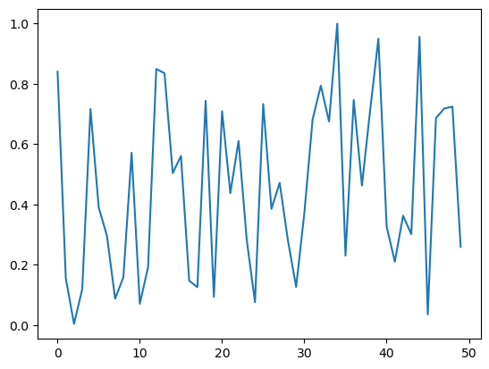

# groundup_003_matmul


```
#| default_exp delete0002
```
---
skip_exec: true
---
## Matrix multiplication from foundations

The *foundations* we'll assume throughout this course are:

- Python
- matplotlib
- The Python standard library
- Jupyter notebooks and nbdev

## imports


```
from fastdebug.utils import *
from fastdebug.core import *
```


<style>.container { width:100% !important; }</style>


```
from fastdebug.groundup import *
```


```
from pathlib import Path
import pickle, gzip, math, os, time, shutil, matplotlib as mpl, matplotlib.pyplot as plt
```

## get_exp_data


```
MNIST_URL='https://github.com/mnielsen/neural-networks-and-deep-learning/blob/master/data/mnist.pkl.gz?raw=true'
path_data = Path('data')
path_data
```


    PosixPath('data')


```
path_data.mkdir(exist_ok=True) # created a data folder in the current directory
```


```
path_gz = path_data/'mnist.pkl.gz'
path_gz
```


    PosixPath('data/mnist.pkl.gz')


[urlretrieve](https://docs.python.org/3/library/urllib.request.html#urllib.request.urlretrieve) - (read the docs!)


```
from urllib.request import urlretrieve
```


```
check(urlretrieve)
```

    signature: (url, filename=None, reporthook=None, data=None)
    __class__: <class 'function'>
    __repr__: <function urlretrieve>
    
    __doc__:
    Retrieve a URL into a temporary location on disk.
    
    Requires a URL argument. If a filename is passed, it is used as
    the temporary file location. The reporthook argument should be
    a callable that accepts a block number, a read size, and the
    total file size of the URL target. The data argument should be
    valid URL encoded data.
    
    If a filename is passed and the URL points to a local resource,
    the result is a copy from local file to new file.
    
    __dict__: 
    {}
    metaclass: False
    class: False
    decorator: False
    function: True
    method: False


```
if not path_gz.exists(): urlretrieve(MNIST_URL, path_gz)
```


```
!ls -l data
```

    total 33312
    -rw-r--r--  1 Natsume  staff  17051982 Oct 11 18:46 mnist.pkl.gz


```
with gzip.open(path_gz, 'rb') as f: ((x_train, y_train), (x_valid, y_valid), _) = pickle.load(f, encoding='latin-1')
```


```
#| export
a = "todelete"
```


```
#| export groundup
def get_exp_data():
    MNIST_URL='https://github.com/mnielsen/neural-networks-and-deep-learning/blob/master/data/mnist.pkl.gz?raw=true'
    path_data = Path('data')
    path_data.mkdir(exist_ok=True) # created a data folder in the current directory
    path_gz = path_data/'mnist.pkl.gz'
    from urllib.request import urlretrieve
    if not path_gz.exists(): urlretrieve(MNIST_URL, path_gz)
    with gzip.open(path_gz, 'rb') as f: ((x_train, y_train), (x_valid, y_valid), _) = pickle.load(f, encoding='latin-1')
    return x_train, y_train, x_valid, y_valid
```


```
x_train, y_train, x_valid, y_valid = get_exp_data()
```


```
x_train[0].shape
x_train[0].size
type(x_train[0])
```


    (784,)


    784


    numpy.ndarray


### range, yield, chunks


```
lst1 = list(x_train[0])
vals = lst1[200:210]
vals
```


    [0.0,
     0.0,
     0.0,
     0.19140625,
     0.9296875,
     0.98828125,
     0.98828125,
     0.98828125,
     0.98828125,
     0.98828125]


```
#| export groundup
def chunks(x, sz):
    for i in range(0, len(x), sz): 
        print(i)
        yield x[i:i+sz]
```


```
vals
list(chunks(vals, 5))
```


    [0.0,
     0.0,
     0.0,
     0.19140625,
     0.9296875,
     0.98828125,
     0.98828125,
     0.98828125,
     0.98828125,
     0.98828125]


    0
    5


    [[0.0, 0.0, 0.0, 0.19140625, 0.9296875],
     [0.98828125, 0.98828125, 0.98828125, 0.98828125, 0.98828125]]


```
def chunks(x, sz):
    for i in range(0, len(x), sz): yield x[i:i+sz]
```


```
type(chunks(lst1, 28))
```


    generator


```
img = list(chunks(lst1, 28))
len(img)
```


    28


```
check(plt.imshow)
```

    signature: (X, cmap=None, norm=None, *, aspect=None, interpolation=None, alpha=None, vmin=None, vmax=None, origin=None, extent=None, interpolation_stage=None, filternorm=True, filterrad=4.0, resample=None, url=None, data=None, **kwargs)
    __class__: <class 'function'>
    __repr__: <function imshow>
    
    __doc__:
    Display data as an image, i.e., on a 2D regular raster.
    
    The input may either be actual RGB(A) data, or 2D scalar data, which
    will be rendered as a pseudocolor image. For displaying a grayscale
    image set up the colormapping using the parameters
    ``cmap='gray', vmin=0, vmax=255``.
    
    The number of pixels used to render an image is set by the Axes size
    and the *dpi* of the figure. This can lead to aliasing artifacts when
    the image is resampled because the displayed image size will usually
    not match the size of *X* (see
    __dict__: 
    {'__signature__': <Signature (X, cmap=None, norm=None, *, aspect=None, interpolation=None, alpha=None, vmin=None, vmax=None, origin=None, extent=None, interpolation_stage=None, filternorm=True, filterrad=4.0, resample=None, url=None, data=None, **kwargs)>,
     '__wrapped__': <function imshow>}
    metaclass: False
    class: False
    decorator: False
    function: True
    method: False


```
mpl.rcParams['image.cmap'] = 'gray'
plt.imshow(list(chunks(lst1, 28)));
```


    

    


### [islice](https://docs.python.org/3/library/itertools.html#itertools.islice)


```
from itertools import islice
```


```
islice.__class__
```


    type


```
help(islice)
```

    Help on class islice in module itertools:
    
    class islice(builtins.object)
     |  islice(iterable, stop) --> islice object
     |  islice(iterable, start, stop[, step]) --> islice object
     |  
     |  Return an iterator whose next() method returns selected values from an
     |  iterable.  If start is specified, will skip all preceding elements;
     |  otherwise, start defaults to zero.  Step defaults to one.  If
     |  specified as another value, step determines how many values are
     |  skipped between successive calls.  Works like a slice() on a list
     |  but returns an iterator.
     |  
     |  Methods defined here:
     |  
     |  __getattribute__(self, name, /)
     |      Return getattr(self, name).
     |  
     |  __iter__(self, /)
     |      Implement iter(self).
     |  
     |  __next__(self, /)
     |      Implement next(self).
     |  
     |  __reduce__(...)
     |      Return state information for pickling.
     |  
     |  __setstate__(...)
     |      Set state information for unpickling.
     |  
     |  ----------------------------------------------------------------------
     |  Static methods defined here:
     |  
     |  __new__(*args, **kwargs) from builtins.type
     |      Create and return a new object.  See help(type) for accurate signature.
    


```
vals
len(vals)
```


    [0.0,
     0.0,
     0.0,
     0.19140625,
     0.9296875,
     0.98828125,
     0.98828125,
     0.98828125,
     0.98828125,
     0.98828125]


    10


```
it = iter(vals)
islice(it, 5)
```


    <itertools.islice>


```
list(islice(it, 5))
```


    [0.0, 0.0, 0.0, 0.19140625, 0.9296875]


```
list(islice(it, 5))
```


    [0.98828125, 0.98828125, 0.98828125, 0.98828125, 0.98828125]


```
list(islice(it, 5))
```


    []


```
check(iter)
```

    signature: None
    __class__: <class 'builtin_function_or_method'>
    __repr__: <built-in function iter>
    
    __doc__:
    iter(iterable) -> iterator
    iter(callable, sentinel) -> iterator
    
    Get an iterator from an object.  In the first form, the argument must
    supply its own iterator, or be a sequence.
    In the second form, the callable is called until it returns the sentinel.
    __dict__: not exist 
    
    metaclass: False
    class: False
    decorator: False
    function: False
    method: False


### islice, iter, chunks_faster
why using `islice` and `iter` over `chunks`


```
%timeit -n 10 it = iter(lst1)
```

    59.5 ns ± 15 ns per loop (mean ± std. dev. of 7 runs, 10 loops each)


```
%timeit -n 10 img = list(iter(lambda: list(islice(it, 28)), []))
```

    386 ns ± 84 ns per loop (mean ± std. dev. of 7 runs, 10 loops each)


```
len(img)
```


    28


```
def chunks(x, sz):
    for i in range(0, len(x), sz): yield x[i:i+sz]
```


```
%timeit -n 10 img = list(chunks(lst1, 28))
```

    3.44 µs ± 468 ns per loop (mean ± std. dev. of 7 runs, 10 loops each)


```
len(img)
```


    28


```
type(x_train[0])
x_train[0].shape
x_train[0].size
```


    numpy.ndarray


    (784,)


    784


```
#| export groundup
def chunks_faster(x, sz):
    "if the data is numpy.ndarray and shape is 1 dimension, then we use chunks to make it a pseudo 2d"
    lst = list(x)
    it = iter(lst)
    img = list(iter(lambda: list(islice(it, sz)), []))
    print(f'len: {len(img)}')
    return img
```


```
img = chunks_faster(x_train[0], 28)
```

    len: 28


```
plt.imshow(img);
```


    

    


## Matrix and tensor

### list and Matrix


```
type(img)
```


    list


```
img[20][15]
```


    0.98828125


```
#| export groundup
class Matrix:
    "turning a list of list into a maxtrix like object"
    def __init__(self, xs): self.xs = xs
    def __getitem__(self, idxs): return self.xs[idxs[0]][idxs[1]]
```


```
m = Matrix(img)
m[20,15]
type(m)
```


    0.98828125


    __main__.Matrix


### tensor, map, np.array


```
import torch
from torch import tensor
```


```
tensor([1,2,3])
```


    tensor([1, 2, 3])


```
type(x_train)
x_train.shape
```


    numpy.ndarray


    (50000, 784)


```
check(tensor)
```

    signature: None
    __class__: <class 'builtin_function_or_method'>
    __repr__: <built-in method tensor of type object>
    
    __doc__:
    tensor(data, *, dtype=None, device=None, requires_grad=False, pin_memory=False) -> Tensor
    
    Constructs a tensor with no autograd history (also known as a "leaf tensor", see :doc:`/notes/autograd`) by copying :attr:`data`.
    
    .. warning::
    
        When working with tensors prefer using :func:`torch.Tensor.clone`,
        :func:`torch.Tensor.detach`, and :func:`torch.Tensor.requires_grad_` for
        readability. Letting `t` be a tensor, ``torch.tensor(t)`` is equivalent to
        ``t.clone().detach()``, and ``torch.tensor(t, requires_grad=True)``
        is equivalent to ``t.clone().detach().requires_grad_(True)``.
    __dict__: not exist 
    
    metaclass: False
    class: False
    decorator: False
    function: False
    method: False


```
x_train,y_train,x_valid,y_valid = map(tensor, (x_train,y_train,x_valid,y_valid))
x_train.shape
```


    torch.Size([50000, 784])


### tensor.type, tensor.reshape


```
check(x_train.type)
```

    signature: None
    __class__: <class 'builtin_function_or_method'>
    __repr__: <built-in method type of Tensor object>
    
    __doc__:
    type(dtype=None, non_blocking=False, **kwargs) -> str or Tensor
    Returns the type if `dtype` is not provided, else casts this object to
    the specified type.
    
    If this is already of the correct type, no copy is performed and the
    original object is returned.
    
    Args:
        dtype (dtype or string): The desired type
        non_blocking (bool): If ``True``, and the source is in pinned memory
            and destination is on the GPU or vice versa, the copy is performed
    __dict__: not exist 
    
    metaclass: False
    class: False
    decorator: False
    function: False
    method: False


```
x_train.type()
```


    'torch.FloatTensor'


```
check(x_train.reshape)
```

    signature: None
    __class__: <class 'builtin_function_or_method'>
    __repr__: <built-in method reshape of Tensor object>
    
    __doc__:
    reshape(*shape) -> Tensor
    
    Returns a tensor with the same data and number of elements as :attr:`self`
    but with the specified shape. This method returns a view if :attr:`shape` is
    compatible with the current shape. See :meth:`torch.Tensor.view` on when it is
    possible to return a view.
    
    See :func:`torch.reshape`
    
    Args:
        shape (tuple of ints or int...): the desired shape
    __dict__: not exist 
    
    metaclass: False
    class: False
    decorator: False
    function: False
    method: False


```
check(torch.reshape)
```

    signature: None
    __class__: <class 'builtin_function_or_method'>
    __repr__: <built-in method reshape of type object>
    
    __doc__:
    reshape(input, shape) -> Tensor
    
    Returns a tensor with the same data and number of elements as :attr:`input`,
    but with the specified shape. When possible, the returned tensor will be a view
    of :attr:`input`. Otherwise, it will be a copy. Contiguous inputs and inputs
    with compatible strides can be reshaped without copying, but you should not
    depend on the copying vs. viewing behavior.
    
    See :meth:`torch.Tensor.view` on when it is possible to return a view.
    
    A single dimension may be -1, in which case it's inferred from the remaining
    __dict__: not exist 
    
    metaclass: False
    class: False
    decorator: False
    function: False
    method: False


```
%whos Tensor
```

    Variable   Type      Data/Info
    ------------------------------
    x_train    Tensor    tensor([[0., 0., 0.,  ...<...>, 0.,  ..., 0., 0., 0.]])
    x_valid    Tensor    tensor([[0., 0., 0.,  ...<...>, 0.,  ..., 0., 0., 0.]])
    y_train    Tensor    tensor([5, 0, 4,  ..., 8, 4, 8])
    y_valid    Tensor    tensor([3, 8, 6,  ..., 5, 6, 8])


```
imgs = x_train.reshape((-1,28,28))
```


```
imgs.shape
```


    torch.Size([50000, 28, 28])


```
plt.imshow(imgs[0]);
```


    

    


```
imgs[0,20,15]
```


    tensor(0.9883)


### torch.shape


```
check(x_train.shape)
```

    signature: None
    __class__: <class 'torch.Size'>
    __repr__: torch.Size([50000, 784])
    
    __doc__: not exist
    
    __dict__: not exist 
    
    metaclass: False
    class: False
    decorator: False
    function: False
    method: False


```
check(torch.Size)
```

    signature: (iterable=(), /)
    __class__: <class 'type'>
    __repr__: <class 'torch.Size'>
    
    __doc__: not exist
    
    __dict__: 
    mappingproxy({'__add__': <slot wrapper '__add__' of 'torch.Size' objects>,
                  '__doc__': None,
                  '__getitem__': <slot wrapper '__getitem__' of 'torch.Size' objects>,
                  '__mul__': <slot wrapper '__mul__' of 'torch.Size' objects>,
                  '__new__': <built-in method __new__ of type object>,
                  '__reduce__': <method '__reduce__' of 'torch.Size' objects>,
                  '__repr__': <slot wrapper '__repr__' of 'torch.Size' objects>,
                  '__rmul__': <slot wrapper '__rmul__' of 'torch.Size' objects>,
                  'numel': <method 'numel' of 'torch.Size' objects>})
    metaclass: False
    class: True
    decorator: False
    function: False
    method: False


```
x_train.shape
n,c = x_train.shape
n,c
```


    torch.Size([50000, 784])


    (50000, 784)


```
y_train, y_train.shape
```


    (tensor([5, 0, 4,  ..., 8, 4, 8]), torch.Size([50000]))


```
min(y_train),max(y_train)
```


    (tensor(0), tensor(9))


```
y_train.min(), y_train.max()
```


    (tensor(0), tensor(9))


```

```

## Random numbers

Based on the Wichmann Hill algorithm used before Python 2.3.

### divmod, seed, rand
Create your own random number between 0 and 1


```
divmod(10, 3)
```


    (3, 1)


```
rnd_state = None
def seed(a):
    global rnd_state
    a, x = divmod(a, 30268)
    a, y = divmod(a, 30306)
    a, z = divmod(a, 30322)
    rnd_state = int(x)+1, int(y)+1, int(z)+1
```


```
seed(457428938475)
rnd_state
```


    (4976, 20238, 499)


```
5%2
5%3
```


    1


    2


```
#| export groundup
def rand():
    "create a random number between 0 and 1"
    global rnd_state
    x, y, z = rnd_state
    x = (171 * x) % 30269
    y = (172 * y) % 30307
    z = (170 * z) % 30323
    rnd_state = x,y,z
    return (x/30269 + y/30307 + z/30323) % 1.0
```


```
rand(),rand(),rand()
```


    (0.7645251082582081, 0.7920889799553945, 0.06912886811267205)


```
check(os.fork)
```

    signature: None
    __class__: <class 'builtin_function_or_method'>
    __repr__: <built-in function fork>
    
    __doc__:
    Fork a child process.
    
    Return 0 to child process and PID of child to parent process.
    __dict__: not exist 
    
    metaclass: False
    class: False
    decorator: False
    function: False
    method: False


```
check(os._exit)
```

    signature: None
    __class__: <class 'builtin_function_or_method'>
    __repr__: <built-in function _exit>
    
    __doc__:
    Exit to the system with specified status, without normal exit processing.
    __dict__: not exist 
    
    metaclass: False
    class: False
    decorator: False
    function: False
    method: False


```
check(os.EX_OK)
```

    signature: None
    __class__: <class 'int'>
    __repr__: 0
    
    __doc__:
    int([x]) -> integer
    int(x, base=10) -> integer
    
    Convert a number or string to an integer, or return 0 if no arguments
    are given.  If x is a number, return x.__int__().  For floating point
    numbers, this truncates towards zero.
    
    If x is not a number or if base is given, then x must be a string,
    bytes, or bytearray instance representing an integer literal in the
    given base.  The literal can be preceded by '+' or '-' and be surrounded
    by whitespace.  The base defaults to 10.  Valid bases are 0 and 2-36.
    __dict__: not exist 
    
    metaclass: False
    class: False
    decorator: False
    function: False
    method: False


```
if os.fork(): print(f'In parent: {rand()}')
else:
    print(f'In child: {rand()}')
    os._exit(os.EX_OK)
```

    In parent: 0.9559050644103264
    In child: 0.9559050644103264


```
if os.fork(): print(f'In parent: {torch.rand(1)}')
else:
    print(f'In child: {torch.rand(1)}')
    os._exit(os.EX_OK)
```

    In parent: tensor([0.5278])
    In child: tensor([0.5278])


```
plt.plot([rand() for _ in range(50)]);
```


    

    


```
plt.hist([rand() for _ in range(10000)]);
```


    

    


### torch.randn
much faster than rand from scratch


```
check(torch.randn)
```

    signature: None
    __class__: <class 'builtin_function_or_method'>
    __repr__: <built-in method randn of type object>
    
    __doc__:
    randn(*size, *, out=None, dtype=None, layout=torch.strided, device=None, requires_grad=False) -> Tensor
    
    Returns a tensor filled with random numbers from a normal distribution
    with mean `0` and variance `1` (also called the standard normal
    distribution).
    
    .. math::
        \text{out}_{i} \sim \mathcal{N}(0, 1)
    
    The shape of the tensor is defined by the variable argument :attr:`size`.
    
    __dict__: not exist 
    
    metaclass: False
    class: False
    decorator: False
    function: False
    method: False


```
%timeit -n 10 list(chunks([rand() for _ in range(7840)], 10))
```

    2.24 ms ± 23 µs per loop (mean ± std. dev. of 7 runs, 10 loops each)


```
%timeit -n 10 torch.randn(784,10)
```

    95.8 µs ± 5.63 µs per loop (mean ± std. dev. of 7 runs, 10 loops each)


```
rd = torch.randn(1, 1,784,10)
rd.shape
rd[:5].shape
```


    torch.Size([1, 1, 784, 10])


    torch.Size([1, 1, 784, 10])


## Matrix multiplication

### matmul_3loops, torch.zeros


```
weights = torch.randn(784,10)
bias = torch.zeros(10)
```


```
weights[0,:]
len(weights[0,:])
bias
len(bias)
```


    tensor([-1.0583e-03,  7.9281e-01, -4.2801e-01,  5.6352e-01,  1.2624e-01,
            -1.5809e+00, -9.4577e-01, -5.4839e-01, -5.6735e-01,  8.4620e-01])


    10


    tensor([0., 0., 0., 0., 0., 0., 0., 0., 0., 0.])


    10


```
m1 = x_valid[:5] # as input
m2 = weights # as layer1 weights
```


```
m1.shape,m2.shape
```


    (torch.Size([5, 784]), torch.Size([784, 10]))


```
ar,ac = m1.shape # n_rows * n_cols
br,bc = m2.shape
(ar,ac),(br,bc)
```


    ((5, 784), (784, 10))


```
t1 = torch.zeros(ar, bc)
t1.shape
```


    torch.Size([5, 10])


```
for i in range(ar):         # 5
    for j in range(bc):     # 10
        for k in range(ac): # 784
            t1[i,j] += m1[i,k] * m2[k,j]
```


```
t1
```


    tensor([[-17.7020,  -8.6148,  12.1728, -15.7812,   5.7751, -14.7503,  -8.6561,
              -4.2844,  13.3434,   7.5200],
            [  2.5126,  -0.4575,  10.7297, -11.6222,  12.9827,   2.5356,  -9.6560,
               8.5241,   6.1100,  15.2349],
            [ -4.3304, -15.7869,   1.8738,   5.8006,   0.3808,   5.1367,   3.6077,
              -1.8988,   7.2987,   9.6041],
            [ -9.2662,  -3.2193,   7.5908,   2.5368,   3.1693,  -2.1447,  -2.5075,
               5.5763,   8.4250,   4.0281],
            [ -2.4684,  -2.5412, -11.9244,  -4.8056,   0.8898,   2.1396,  -5.8808,
               9.9556,  10.6771,  15.9383]])


```
t1.shape
```


    torch.Size([5, 10])


```
#| export groundup
def matmul_3loops(a, b):
    (ar,ac),(br,bc) = a.shape,b.shape
    c = torch.zeros(ar, bc)
    for i in range(ar): # ar == 5
        for j in range(bc): # bc == 10
            for k in range(ac): c[i,j] += a[i,k] * b[k,j] # ac == 784

    print(f'shapes => a: {a.shape}, b: {b.shape}, res: {c.shape}')
    return c
```


```
matmul_3loops(m1,m2)
```

    shapes => a: torch.Size([5, 784]), b: torch.Size([784, 10]), res: torch.Size([5, 10])


    tensor([[-17.7020,  -8.6148,  12.1728, -15.7812,   5.7751, -14.7503,  -8.6561,
              -4.2844,  13.3434,   7.5200],
            [  2.5126,  -0.4575,  10.7297, -11.6222,  12.9827,   2.5356,  -9.6560,
               8.5241,   6.1100,  15.2349],
            [ -4.3304, -15.7869,   1.8738,   5.8006,   0.3808,   5.1367,   3.6077,
              -1.8988,   7.2987,   9.6041],
            [ -9.2662,  -3.2193,   7.5908,   2.5368,   3.1693,  -2.1447,  -2.5075,
               5.5763,   8.4250,   4.0281],
            [ -2.4684,  -2.5412, -11.9244,  -4.8056,   0.8898,   2.1396,  -5.8808,
               9.9556,  10.6771,  15.9383]])


### torch.set_printoptions, np.set_printoptions


```
import numpy as np
```


```
torch.set_printoptions(precision=2, linewidth=140, sci_mode=False)
np.set_printoptions(precision=2, linewidth=140)
t1
```


    tensor([[-17.70,  -8.61,  12.17, -15.78,   5.78, -14.75,  -8.66,  -4.28,  13.34,   7.52],
            [  2.51,  -0.46,  10.73, -11.62,  12.98,   2.54,  -9.66,   8.52,   6.11,  15.23],
            [ -4.33, -15.79,   1.87,   5.80,   0.38,   5.14,   3.61,  -1.90,   7.30,   9.60],
            [ -9.27,  -3.22,   7.59,   2.54,   3.17,  -2.14,  -2.51,   5.58,   8.43,   4.03],
            [ -2.47,  -2.54, -11.92,  -4.81,   0.89,   2.14,  -5.88,   9.96,  10.68,  15.94]])


```
%time _=matmul_3loops(m1, m2)
```

    shapes => a: torch.Size([5, 784]), b: torch.Size([784, 10]), res: torch.Size([5, 10])
    CPU times: user 332 ms, sys: 2.02 ms, total: 334 ms
    Wall time: 333 ms


```

```

## Numba
Numba is an open source JIT compiler that translates a subset of Python and NumPy code into fast machine code.

### njit, dot, np.array


```
import numba
```


```
check(numba)
```

    signature: None
    __class__: <class 'module'>
    __repr__: <module 'numba' from '/Users/Natsume/mambaforge/lib/python3.9/site-packages/numba/__init__.py'>
    
    __doc__:
    Expose top-level symbols that are safe for import *
    __dict__: 
    {'ByteCodeSupportError': <class 'numba.core.errors.ByteCodeSupportError'>,
     'CompilerError': <class 'numba.core.errors.CompilerError'>,
     'ConstantInferenceError': <class 'numba.core.errors.ConstantInferenceError'>,
     'DeprecationError': <class 'numba.core.errors.DeprecationError'>,
     'ForbiddenConstruct': <class 'numba.core.errors.ForbiddenConstruct'>,
     'ForceLiteralArg': <class 'numba.core.errors.ForceLiteralArg'>,
     'IRError': <class 'numba.core.errors.IRError'>,
     'InternalError': <class 'numba.core.errors.InternalError'>,
     'InternalTargetMismatchError': <class 'numba.core.errors.InternalTargetMismatchError'>,
     'LiteralTypingError': <class 'numba.core.errors.LiteralTypingError'>,
     'LoweringError': <class 'numba.core.errors.LoweringError'>,
     'NotDefinedError': <class 'numba.core.errors.NotDefinedError'>,
     'NumbaAssertionError': <class 'numba.core.errors.NumbaAssertionError'>,
     'NumbaAttributeError': <class 'numba.core.errors.NumbaAttributeError'>,
     'NumbaDebugInfoWarning': <class 'numba.core.errors.NumbaDebugInfoWarning'>,
     'NumbaDeprecationWarning': <class 'numba.core.errors.NumbaDeprecationWarning'>,
     'NumbaError': <class 'numba.core.errors.NumbaError'>,
     'NumbaExperimentalFeatureWarning': <class 'numba.core.errors.NumbaExperimentalFeatureWarning'>,
     'NumbaIRAssumptionWarning': <class 'numba.core.errors.NumbaIRAssumptionWarning'>,
     'NumbaIndexError': <class 'numba.core.errors.NumbaIndexError'>,
     'NumbaInvalidConfigWarning': <class 'numba.core.errors.NumbaInvalidConfigWarning'>,
     'NumbaKeyError': <class 'numba.core.errors.NumbaKeyError'>,
     'NumbaNotImplementedError': <class 'numba.core.errors.NumbaNotImplementedError'>,
     'NumbaParallelSafetyWarning': <class 'numba.core.errors.NumbaParallelSafetyWarning'>,
     'NumbaPedanticWarning': <class 'numba.core.errors.NumbaPedanticWarning'>,
     'NumbaPendingDeprecationWarning': <class 'numba.core.errors.NumbaPendingDeprecationWarning'>,
     'NumbaPerformanceWarning': <class 'numba.core.errors.NumbaPerformanceWarning'>,
     'NumbaRuntimeError': <class 'numba.core.errors.NumbaRuntimeError'>,
     'NumbaTypeError': <class 'numba.core.errors.NumbaTypeError'>,
     'NumbaTypeSafetyWarning': <class 'numba.core.errors.NumbaTypeSafetyWarning'>,
     'NumbaValueError': <class 'numba.core.errors.NumbaValueError'>,
     'NumbaWarning': <class 'numba.core.errors.NumbaWarning'>,
     'RedefinedError': <class 'numba.core.errors.RedefinedError'>,
     'RequireLiteralValue': <class 'numba.core.errors.RequireLiteralValue'>,
     'TypingError': <class 'numba.core.errors.TypingError'>,
     'UnsupportedError': <class 'numba.core.errors.UnsupportedError'>,
     'UnsupportedParforsError': <class 'numba.core.errors.UnsupportedParforsError'>,
     'UnsupportedRewriteError': <class 'numba.core.errors.UnsupportedRewriteError'>,
     'UntypedAttributeError': <class 'numba.core.errors.UntypedAttributeError'>,
     'VerificationError': <class 'numba.core.errors.VerificationError'>,
     '__all__': ['cfunc',
                 'from_dtype',
                 'guvectorize',
                 'jit',
                 'experimental',
                 'njit',
                 'stencil',
                 'jit_module',
                 'typeof',
                 'prange',
                 'gdb',
                 'gdb_breakpoint',
                 'gdb_init',
                 'vectorize',
                 'objmode',
                 'literal_unroll',
                 'get_num_threads',
                 'set_num_threads',
                 'set_parallel_chunksize',
                 'get_parallel_chunksize',
                 'parallel_chunksize',
                 'int8',
                 'int16',
                 'int32',
                 'int64',
                 'uint8',
                 'uint16',
                 'uint32',
                 'uint64',
                 'intp',
                 'uintp',
                 'intc',
                 'uintc',
                 'ssize_t',
                 'size_t',
                 'boolean',
                 'float32',
                 'float64',
                 'complex64',
                 'complex128',
                 'bool_',
                 'byte',
                 'char',
                 'uchar',
                 'short',
                 'ushort',
                 'int_',
                 'uint',
                 'long_',
                 'ulong',
                 'longlong',
                 'ulonglong',
                 'float_',
                 'double',
                 'void',
                 'none',
                 'b1',
                 'i1',
                 'i2',
                 'i4',
                 'i8',
                 'u1',
                 'u2',
                 'u4',
                 'u8',
                 'f4',
                 'f8',
                 'c8',
                 'c16',
                 'optional',
                 'ffi_forced_object',
                 'ffi',
                 'deferred_type',
                 'NumbaWarning',
                 'NumbaPerformanceWarning',
                 'NumbaDeprecationWarning',
                 'NumbaPendingDeprecationWarning',
                 'NumbaParallelSafetyWarning',
                 'NumbaTypeSafetyWarning',
                 'NumbaExperimentalFeatureWarning',
                 'NumbaInvalidConfigWarning',
                 'NumbaPedanticWarning',
                 'NumbaIRAssumptionWarning',
                 'NumbaDebugInfoWarning',
                 'NumbaError',
                 'UnsupportedError',
                 'UnsupportedRewriteError',
                 'IRError',
                 'RedefinedError',
                 'NotDefinedError',
                 'VerificationError',
                 'DeprecationError',
                 'LoweringError',
                 'UnsupportedParforsError',
                 'ForbiddenConstruct',
                 'TypingError',
                 'UntypedAttributeError',
                 'ByteCodeSupportError',
                 'CompilerError',
                 'ConstantInferenceError',
                 'InternalError',
                 'InternalTargetMismatchError',
                 'RequireLiteralValue',
                 'ForceLiteralArg',
                 'LiteralTypingError',
                 'NumbaValueError',
                 'NumbaTypeError',
                 'NumbaAttributeError',
                 'NumbaAssertionError',
                 'NumbaNotImplementedError',
                 'NumbaKeyError',
                 'NumbaIndexError',
                 'NumbaRuntimeError'],
     '__builtins__': {'ArithmeticError': <class 'ArithmeticError'>,
                      'AssertionError': <class 'AssertionError'>,
                      'AttributeError': <class 'AttributeError'>,
                      'BaseException': <class 'BaseException'>,
                      'BlockingIOError': <class 'BlockingIOError'>,
                      'BrokenPipeError': <class 'BrokenPipeError'>,
                      'BufferError': <class 'BufferError'>,
                      'BytesWarning': <class 'BytesWarning'>,
                      'ChildProcessError': <class 'ChildProcessError'>,
                      'ConnectionAbortedError': <class 'ConnectionAbortedError'>,
                      'ConnectionError': <class 'ConnectionError'>,
                      'ConnectionRefusedError': <class 'ConnectionRefusedError'>,
                      'ConnectionResetError': <class 'ConnectionResetError'>,
                      'DeprecationWarning': <class 'DeprecationWarning'>,
                      'EOFError': <class 'EOFError'>,
                      'Ellipsis': Ellipsis,
                      'EnvironmentError': <class 'OSError'>,
                      'Exception': <class 'Exception'>,
                      'False': False,
                      'FileExistsError': <class 'FileExistsError'>,
                      'FileNotFoundError': <class 'FileNotFoundError'>,
                      'FloatingPointError': <class 'FloatingPointError'>,
                      'FutureWarning': <class 'FutureWarning'>,
                      'GeneratorExit': <class 'GeneratorExit'>,
                      'IOError': <class 'OSError'>,
                      'ImportError': <class 'ImportError'>,
                      'ImportWarning': <class 'ImportWarning'>,
                      'IndentationError': <class 'IndentationError'>,
                      'IndexError': <class 'IndexError'>,
                      'InterruptedError': <class 'InterruptedError'>,
                      'IsADirectoryError': <class 'IsADirectoryError'>,
                      'KeyError': <class 'KeyError'>,
                      'KeyboardInterrupt': <class 'KeyboardInterrupt'>,
                      'LookupError': <class 'LookupError'>,
                      'MemoryError': <class 'MemoryError'>,
                      'ModuleNotFoundError': <class 'ModuleNotFoundError'>,
                      'NameError': <class 'NameError'>,
                      'None': None,
                      'NotADirectoryError': <class 'NotADirectoryError'>,
                      'NotImplemented': NotImplemented,
                      'NotImplementedError': <class 'NotImplementedError'>,
                      'OSError': <class 'OSError'>,
                      'OverflowError': <class 'OverflowError'>,
                      'PendingDeprecationWarning': <class 'PendingDeprecationWarning'>,
                      'PermissionError': <class 'PermissionError'>,
                      'ProcessLookupError': <class 'ProcessLookupError'>,
                      'RecursionError': <class 'RecursionError'>,
                      'ReferenceError': <class 'ReferenceError'>,
                      'ResourceWarning': <class 'ResourceWarning'>,
                      'RuntimeError': <class 'RuntimeError'>,
                      'RuntimeWarning': <class 'RuntimeWarning'>,
                      'StopAsyncIteration': <class 'StopAsyncIteration'>,
                      'StopIteration': <class 'StopIteration'>,
                      'SyntaxError': <class 'SyntaxError'>,
                      'SyntaxWarning': <class 'SyntaxWarning'>,
                      'SystemError': <class 'SystemError'>,
                      'SystemExit': <class 'SystemExit'>,
                      'TabError': <class 'TabError'>,
                      'TimeoutError': <class 'TimeoutError'>,
                      'True': True,
                      'TypeError': <class 'TypeError'>,
                      'UnboundLocalError': <class 'UnboundLocalError'>,
                      'UnicodeDecodeError': <class 'UnicodeDecodeError'>,
                      'UnicodeEncodeError': <class 'UnicodeEncodeError'>,
                      'UnicodeError': <class 'UnicodeError'>,
                      'UnicodeTranslateError': <class 'UnicodeTranslateError'>,
                      'UnicodeWarning': <class 'UnicodeWarning'>,
                      'UserWarning': <class 'UserWarning'>,
                      'ValueError': <class 'ValueError'>,
                      'Warning': <class 'Warning'>,
                      'ZeroDivisionError': <class 'ZeroDivisionError'>,
                      '__IPYTHON__': True,
                      '__build_class__': <built-in function __build_class__>,
                      '__debug__': True,
                      '__doc__': 'Built-in functions, exceptions, and other '
                                 'objects.\n'
                                 '\n'
                                 "Noteworthy: None is the `nil' object; Ellipsis "
                                 "represents `...' in slices.",
                      '__import__': <built-in function __import__>,
                      '__loader__': <class '_frozen_importlib.BuiltinImporter'>,
                      '__name__': 'builtins',
                      '__package__': '',
                      '__pybind11_internals_v4_clang_libcpp_cxxabi1002__': <capsule object NULL>,
                      '__spec__': ModuleSpec(name='builtins', loader=<class '_frozen_importlib.BuiltinImporter'>, origin='built-in'),
                      'abs': <built-in function abs>,
                      'all': <built-in function all>,
                      'any': <built-in function any>,
                      'ascii': <built-in function ascii>,
                      'bin': <built-in function bin>,
                      'bool': <class 'bool'>,
                      'breakpoint': <built-in function breakpoint>,
                      'bytearray': <class 'bytearray'>,
                      'bytes': <class 'bytes'>,
                      'callable': <built-in function callable>,
                      'chr': <built-in function chr>,
                      'classmethod': <class 'classmethod'>,
                      'compile': <built-in function compile>,
                      'complex': <class 'complex'>,
                      'copyright': Copyright (c) 2001-2022 Python Software Foundation.
    All Rights Reserved.
    
    Copyright (c) 2000 BeOpen.com.
    All Rights Reserved.
    
    Copyright (c) 1995-2001 Corporation for National Research Initiatives.
    All Rights Reserved.
    
    Copyright (c) 1991-1995 Stichting Mathematisch Centrum, Amsterdam.
    All Rights Reserved.,
                      'credits':     Thanks to CWI, CNRI, BeOpen.com, Zope Corporation and a cast of thousands
        for supporting Python development.  See www.python.org for more information.,
                      'delattr': <built-in function delattr>,
                      'dict': <class 'dict'>,
                      'dir': <built-in function dir>,
                      'display': <function display>,
                      'divmod': <built-in function divmod>,
                      'enumerate': <class 'enumerate'>,
                      'eval': <built-in function eval>,
                      'exec': <built-in function exec>,
                      'execfile': <function execfile>,
                      'filter': <class 'filter'>,
                      'float': <class 'float'>,
                      'format': <built-in function format>,
                      'frozenset': <class 'frozenset'>,
                      'get_ipython': <bound method InteractiveShell.get_ipython of <ipykernel.zmqshell.ZMQInteractiveShell object>>,
                      'getattr': <built-in function getattr>,
                      'globals': <built-in function globals>,
                      'hasattr': <built-in function hasattr>,
                      'hash': <built-in function hash>,
                      'help': Type help() for interactive help, or help(object) for help about object.,
                      'hex': <built-in function hex>,
                      'id': <built-in function id>,
                      'input': <bound method Kernel.raw_input of <ipykernel.ipkernel.IPythonKernel object>>,
                      'int': <class 'int'>,
                      'isinstance': <built-in function isinstance>,
                      'issubclass': <built-in function issubclass>,
                      'iter': <built-in function iter>,
                      'len': <built-in function len>,
                      'license': Type license() to see the full license text,
                      'list': <class 'list'>,
                      'locals': <built-in function locals>,
                      'map': <class 'map'>,
                      'max': <built-in function max>,
                      'memoryview': <class 'memoryview'>,
                      'min': <built-in function min>,
                      'next': <built-in function next>,
                      'object': <class 'object'>,
                      'oct': <built-in function oct>,
                      'open': <built-in function open>,
                      'ord': <built-in function ord>,
                      'pow': <built-in function pow>,
                      'print': <built-in function print>,
                      'property': <class 'property'>,
                      'range': <class 'range'>,
                      'repr': <built-in function repr>,
                      'reversed': <class 'reversed'>,
                      'round': <built-in function round>,
                      'runfile': <function runfile>,
                      'set': <class 'set'>,
                      'setattr': <built-in function setattr>,
                      'slice': <class 'slice'>,
                      'sorted': <built-in function sorted>,
                      'staticmethod': <class 'staticmethod'>,
                      'str': <class 'str'>,
                      'sum': <built-in function sum>,
                      'super': <class 'super'>,
                      'tuple': <class 'tuple'>,
                      'type': <class 'type'>,
                      'vars': <built-in function vars>,
                      'zip': <class 'zip'>},
     '__cached__': '/Users/Natsume/mambaforge/lib/python3.9/site-packages/numba/__pycache__/__init__.cpython-39.pyc',
     '__doc__': '\nExpose top-level symbols that are safe for import *\n',
     '__file__': '/Users/Natsume/mambaforge/lib/python3.9/site-packages/numba/__init__.py',
     '__loader__': <_frozen_importlib_external.SourceFileLoader object>,
     '__name__': 'numba',
     '__package__': 'numba',
     '__path__': ['/Users/Natsume/mambaforge/lib/python3.9/site-packages/numba'],
     '__spec__': ModuleSpec(name='numba', loader=<_frozen_importlib_external.SourceFileLoader object>, origin='/Users/Natsume/mambaforge/lib/python3.9/site-packages/numba/__init__.py', submodule_search_locations=['/Users/Natsume/mambaforge/lib/python3.9/site-packages/numba']),
     '__version__': '0.56.2',
     '_devicearray': <module 'numba._devicearray' from '/Users/Natsume/mambaforge/lib/python3.9/site-packages/numba/_devicearray.cpython-39-darwin.so'>,
     '_dispatcher': <module 'numba._dispatcher' from '/Users/Natsume/mambaforge/lib/python3.9/site-packages/numba/_dispatcher.cpython-39-darwin.so'>,
     '_dynfunc': <module 'numba._dynfunc' from '/Users/Natsume/mambaforge/lib/python3.9/site-packages/numba/_dynfunc.cpython-39-darwin.so'>,
     '_ensure_critical_deps': <function _ensure_critical_deps>,
     '_ensure_llvm': <function _ensure_llvm>,
     '_helperlib': <module 'numba._helperlib' from '/Users/Natsume/mambaforge/lib/python3.9/site-packages/numba/_helperlib.cpython-39-darwin.so'>,
     '_min_llvm_version': (11, 0, 0),
     '_min_llvmlite_version': (0, 39, 0),
     '_try_enable_svml': <function _try_enable_svml>,
     '_version': <module 'numba._version' from '/Users/Natsume/mambaforge/lib/python3.9/site-packages/numba/_version.py'>,
     'b1': bool,
     'bool_': bool,
     'boolean': bool,
     'byte': uint8,
     'c16': complex128,
     'c8': complex64,
     'carray': <function carray>,
     'cfunc': <function cfunc>,
     'char': int8,
     'cloudpickle': <module 'numba.cloudpickle' from '/Users/Natsume/mambaforge/lib/python3.9/site-packages/numba/cloudpickle/__init__.py'>,
     'complex128': complex128,
     'complex64': complex64,
     'config': <module 'numba.core.config' from '/Users/Natsume/mambaforge/lib/python3.9/site-packages/numba/core/config.py'>,
     'core': <module 'numba.core' from '/Users/Natsume/mambaforge/lib/python3.9/site-packages/numba/core/__init__.py'>,
     'cpython': <module 'numba.cpython' from '/Users/Natsume/mambaforge/lib/python3.9/site-packages/numba/cpython/__init__.py'>,
     'deferred_type': <class 'numba.core.types.misc.DeferredType'>,
     'double': float64,
     'errors': <module 'numba.core.errors' from '/Users/Natsume/mambaforge/lib/python3.9/site-packages/numba/core/errors.py'>,
     'experimental': <module 'numba.experimental' from '/Users/Natsume/mambaforge/lib/python3.9/site-packages/numba/experimental/__init__.py'>,
     'extending': <module 'numba.extending' from '/Users/Natsume/mambaforge/lib/python3.9/site-packages/numba/extending.py'>,
     'f4': float32,
     'f8': float64,
     'farray': <function farray>,
     'ffi': ffi,
     'ffi_forced_object': ffi_forced_object,
     'float32': float32,
     'float64': float64,
     'float_': float32,
     'from_dtype': <function from_dtype>,
     'gdb': <function gdb>,
     'gdb_breakpoint': <function gdb_breakpoint>,
     'gdb_init': <function gdb_init>,
     'generated_jit': <function generated_jit>,
     'get_num_threads': <function get_num_threads>,
     'get_parallel_chunksize': <function get_parallel_chunksize>,
     'get_thread_id': <function get_thread_id>,
     'guvectorize': <function guvectorize>,
     'i1': int8,
     'i2': int16,
     'i4': int32,
     'i8': int64,
     'int16': int16,
     'int32': int32,
     'int64': int64,
     'int8': int8,
     'int_': int64,
     'intc': int32,
     'intp': int64,
     'jit': <function jit>,
     'jit_module': <function jit_module>,
     'literal_unroll': <function literal_unroll>,
     'literally': <function literally>,
     'llvmlite': <module 'llvmlite' from '/Users/Natsume/mambaforge/lib/python3.9/site-packages/llvmlite/__init__.py'>,
     'long_': int64,
     'longlong': int64,
     'misc': <module 'numba.misc' from '/Users/Natsume/mambaforge/lib/python3.9/site-packages/numba/misc/__init__.py'>,
     'njit': <function njit>,
     'none': none,
     'np': <module 'numba.np' from '/Users/Natsume/mambaforge/lib/python3.9/site-packages/numba/np/__init__.py'>,
     'numba': <module 'numba' from '/Users/Natsume/mambaforge/lib/python3.9/site-packages/numba/__init__.py'>,
     'objmode': <numba.core.withcontexts._ObjModeContextType object>,
     'optional': <class 'numba.core.types.misc.Optional'>,
     'parallel_chunksize': <numba.core.withcontexts._ParallelChunksize object>,
     'parfors': <module 'numba.parfors' from '/Users/Natsume/mambaforge/lib/python3.9/site-packages/numba/parfors/__init__.py'>,
     'platform': <module 'platform' from '/Users/Natsume/mambaforge/lib/python3.9/platform.py'>,
     'pndindex': <function pndindex>,
     'prange': <class 'numba.misc.special.prange'>,
     're': <module 're' from '/Users/Natsume/mambaforge/lib/python3.9/re.py'>,
     'set_num_threads': <function set_num_threads>,
     'set_parallel_chunksize': <function set_parallel_chunksize>,
     'short': int16,
     'size_t': uint64,
     'ssize_t': int64,
     'stencil': <function stencil>,
     'stencils': <module 'numba.stencils' from '/Users/Natsume/mambaforge/lib/python3.9/site-packages/numba/stencils/__init__.py'>,
     'sys': <module 'sys' (built-in)>,
     'test': <function test>,
     'threading_layer': <function threading_layer>,
     'typed': <module 'numba.typed' from '/Users/Natsume/mambaforge/lib/python3.9/site-packages/numba/typed/__init__.py'>,
     'typeof': <function typeof>,
     'types': <module 'numba.core.types' from '/Users/Natsume/mambaforge/lib/python3.9/site-packages/numba/core/types/__init__.py'>,
     'u1': uint8,
     'u2': uint16,
     'u4': uint32,
     'u8': uint64,
     'uchar': uint8,
     'uint': uint64,
     'uint16': uint16,
     'uint32': uint32,
     'uint64': uint64,
     'uint8': uint8,
     'uintc': uint32,
     'uintp': uint64,
     'ulong': uint64,
     'ulonglong': uint64,
     'ushort': uint16,
     'vectorize': <function vectorize>,
     'version_info': version_info(major=0, minor=56, patch=2, short=(0, 56), full=(0, 56, 2), string='0.56.2', tuple=('0', '56', '2'), git_revision=None),
     'void': none,
     'warnings': <module 'warnings' from '/Users/Natsume/mambaforge/lib/python3.9/warnings.py'>}
    metaclass: False
    class: False
    decorator: False
    function: False
    method: False


```
whatinside(numba)
```

    numba has: 
    113 items in its __all__, and 
    28 user defined functions, 
    43 classes or class objects, 
    0 builtin funcs and methods, and
    123 callables.
    
    Expose top-level symbols that are safe for import *


```
from numba import njit, jit
```


```
check(njit)
```

    signature: (*args, **kws)
    __class__: <class 'function'>
    __repr__: <function njit>
    
    __doc__:
    Equivalent to jit(nopython=True)
    
    See documentation for jit function/decorator for full description.
    __dict__: 
    {}
    metaclass: False
    class: False
    decorator: False
    function: True
    method: False


```
check(jit)
```

    signature: (signature_or_function=None, locals={}, cache=False, pipeline_class=None, boundscheck=None, **options)
    __class__: <class 'function'>
    __repr__: <function jit>
    
    __doc__:
    This decorator is used to compile a Python function into native code.
    
    Args
    -----
    signature_or_function:
        The (optional) signature or list of signatures to be compiled.
        If not passed, required signatures will be compiled when the
        decorated function is called, depending on the argument values.
        As a convenience, you can directly pass the function to be compiled
        instead.
    
    __dict__: 
    {}
    metaclass: False
    class: False
    decorator: False
    function: True
    method: False


```
#| export groundup
@njit
def dot(a,b):
    res = 0.
    for i in range(len(a)): res+=a[i]*b[i]
    return res
```


```
from numpy import array
```


```
%time dot(array([1.,2,3]),array([2.,3,4]))
```

    CPU times: user 175 ms, sys: 29.3 ms, total: 204 ms
    Wall time: 251 ms


    20.0


```
%time dot(array([1.,2,3]),array([2.,3,4]))
```

    CPU times: user 17 µs, sys: 1 µs, total: 18 µs
    Wall time: 17.2 µs


    20.0


```
%time dot(array([1.,2,3]),array([2.,3,4]))
```

    CPU times: user 14 µs, sys: 0 ns, total: 14 µs
    Wall time: 16 µs


    20.0


### matmul_2loops_njit, m1.numpy()

Now only two of our loops are running in Python, and the third loop is running in machine code


```
#| export groundup
def matmul_2loops_njit(a,b):
    "doing matrix multiplication with 2 python loops and 1 loop in machine code"
    a,b = a.numpy(),b.numpy() # njit or numba don't work with torch.tensor but numpy array
    (ar,ac),(br,bc) = a.shape,b.shape
    c = torch.zeros(ar, bc)
    for i in range(ar):
        for j in range(bc): c[i,j] = dot(a[i,:], b[:,j])
    return c
```


```
matmul_2loops_njit(m1,m2)
```


    tensor([[-17.70,  -8.61,  12.17, -15.78,   5.78, -14.75,  -8.66,  -4.28,  13.34,   7.52],
            [  2.51,  -0.46,  10.73, -11.62,  12.98,   2.54,  -9.66,   8.52,   6.11,  15.23],
            [ -4.33, -15.79,   1.87,   5.80,   0.38,   5.14,   3.61,  -1.90,   7.30,   9.60],
            [ -9.27,  -3.22,   7.59,   2.54,   3.17,  -2.14,  -2.51,   5.58,   8.43,   4.03],
            [ -2.47,  -2.54, -11.92,  -4.81,   0.89,   2.14,  -5.88,   9.96,  10.68,  15.94]])


```
check(m1.numpy)
```

    signature: None
    __class__: <class 'builtin_function_or_method'>
    __repr__: <built-in method numpy of Tensor object>
    
    __doc__:
    numpy() -> numpy.ndarray
    
    Returns :attr:`self` tensor as a NumPy :class:`ndarray`. This tensor and the
    returned :class:`ndarray` share the same underlying storage. Changes to
    :attr:`self` tensor will be reflected in the :class:`ndarray` and vice versa.
    __dict__: not exist 
    
    metaclass: False
    class: False
    decorator: False
    function: False
    method: False


```
m1a,m2a = m1.numpy(),m2.numpy()
```


```
m1.shape, m1a.shape
```


    (torch.Size([5, 784]), (5, 784))


### test_close, %timeit, %time


```
from fastcore.test import *
```


```
test_close(matmul_3loops(m1, m2),matmul_2loops_njit(m1, m2))
```

    shapes => a: torch.Size([5, 784]), b: torch.Size([784, 10]), res: torch.Size([5, 10])


```
%timeit -n 10 matmul_2loops_njit(m1,m2)
```

    219 µs ± 28.2 µs per loop (mean ± std. dev. of 7 runs, 10 loops each)


```
%time _=matmul_2loops_njit(m1,m2)
```

    CPU times: user 340 µs, sys: 193 µs, total: 533 µs
    Wall time: 338 µs


```

```

## Elementwise ops

[TryAPL](https://tryapl.org/)

### elementwise by tensor


```
a = tensor([10., 6, -4])
b = tensor([2., 8, 7])
a,b
```


    (tensor([10.,  6., -4.]), tensor([2., 8., 7.]))


```
a + b
```


    tensor([12., 14.,  3.])


```
(a < b).float().mean()
```


    tensor(0.67)


```
m = tensor([[1., 2, 3], [4,5,6], [7,8,9]]); m
```


    tensor([[1., 2., 3.],
            [4., 5., 6.],
            [7., 8., 9.]])


Frobenius norm:

$$\| A \|_F = \left( \sum_{i,j=1}^n | a_{ij} |^2 \right)^{1/2}$$

*Hint*: you don't normally need to write equations in LaTeX yourself, instead, you can click 'edit' in Wikipedia and copy the LaTeX from there (which is what I did for the above equation). Or on arxiv.org, click "Download: Other formats" in the top right, then "Download source"; rename the downloaded file to end in `.tgz` if it doesn't already, and you should find the source there, including the equations to copy and paste. This is the source LaTeX that I pasted to render the equation above:

```latex
$$\| A \|_F = \left( \sum_{i,j=1}^n | a_{ij} |^2 \right)^{1/2}$$
```


```
(m*m).sum().sqrt()
```


    tensor(16.88)


```
check(m.sum)
```

    signature: None
    __class__: <class 'builtin_function_or_method'>
    __repr__: <built-in method sum of Tensor object>
    
    __doc__:
    sum(dim=None, keepdim=False, dtype=None) -> Tensor
    
    See :func:`torch.sum`
    __dict__: not exist 
    
    metaclass: False
    class: False
    decorator: False
    function: False
    method: False


```
check(torch.sum)
```

    signature: None
    __class__: <class 'builtin_function_or_method'>
    __repr__: <built-in method sum of type object>
    
    __doc__:
    sum(input, *, dtype=None) -> Tensor
    
    Returns the sum of all elements in the :attr:`input` tensor.
    
    Args:
        input (Tensor): the input tensor.
    
    Keyword args:
        dtype (:class:`torch.dtype`, optional): the desired data type of returned tensor.
            If specified, the input tensor is casted to :attr:`dtype` before the operation
            is performed. This is useful for preventing data type overflows. Default: None.
    __dict__: not exist 
    
    metaclass: False
    class: False
    decorator: False
    function: False
    method: False


### matmul_2loops_elementwise


```
#| export groundup
def matmul_2loops_elementwise(a,b):
    (ar,ac),(br,bc) = a.shape,b.shape
    c = torch.zeros(ar, bc)
    for i in range(ar):
        for j in range(bc): c[i,j] = (a[i,:] * b[:,j]).sum()
    return c
```


```
test_close(matmul_3loops(m1,m2), matmul_2loops_elementwise(m1, m2))
```

    shapes => a: torch.Size([5, 784]), b: torch.Size([784, 10]), res: torch.Size([5, 10])


```
%time _=matmul_3loops(m1, m2)
```

    shapes => a: torch.Size([5, 784]), b: torch.Size([784, 10]), res: torch.Size([5, 10])
    CPU times: user 341 ms, sys: 1.91 ms, total: 342 ms
    Wall time: 342 ms


```
%time _=matmul_2loops_njit(m1, m2)
```

    CPU times: user 335 µs, sys: 168 µs, total: 503 µs
    Wall time: 308 µs


```
%time _=matmul_2loops_elementwise(m1, m2)
```

    CPU times: user 675 µs, sys: 377 µs, total: 1.05 ms
    Wall time: 656 µs


### matmul_2loops_dotproduct


```
#| export groundup
def matmul_2loops_dotproduct(a,b):
    (ar,ac),(br,bc) = a.shape,b.shape
    c = torch.zeros(ar, bc)
    for i in range(ar):
        for j in range(bc): c[i,j] = torch.dot(a[i,:], b[:,j])
    return c
```


```
test_close(t1,matmul_2loops_dotproduct(m1, m2))
```


```
%timeit -n 10 _=matmul_2loops_dotproduct(m1, m2)
```

    400 µs ± 6.77 µs per loop (mean ± std. dev. of 7 runs, 10 loops each)


```
%time _=matmul_2loops_njit(m1, m2)
```

    CPU times: user 548 µs, sys: 445 µs, total: 993 µs
    Wall time: 721 µs


```
%time _=matmul_2loops_elementwise(m1, m2)
```

    CPU times: user 696 µs, sys: 393 µs, total: 1.09 ms
    Wall time: 692 µs


```
%time _=matmul_2loops_dotproduct(m1, m2)
```

    CPU times: user 558 µs, sys: 282 µs, total: 840 µs
    Wall time: 555 µs


```

```

## Broadcasting

The term **broadcasting** describes how arrays with different shapes are treated during arithmetic operations.  The term broadcasting was first used by Numpy.

From the [Numpy Documentation](https://docs.scipy.org/doc/numpy-1.10.0/user/basics.broadcasting.html):

    The term broadcasting describes how numpy treats arrays with 
    different shapes during arithmetic operations. Subject to certain 
    constraints, the smaller array is “broadcast” across the larger 
    array so that they have compatible shapes. Broadcasting provides a 
    means of vectorizing array operations so that looping occurs in C
    instead of Python. It does this without making needless copies of 
    data and usually leads to efficient algorithm implementations.
    
In addition to the efficiency of broadcasting, it allows developers to write less code, which typically leads to fewer errors.

*This section was adapted from [Chapter 4](http://nbviewer.jupyter.org/github/fastai/numerical-linear-algebra/blob/master/nbs/4.%20Compressed%20Sensing%20of%20CT%20Scans%20with%20Robust%20Regression.ipynb#4.-Compressed-Sensing-of-CT-Scans-with-Robust-Regression) of the fast.ai [Computational Linear Algebra](https://github.com/fastai/numerical-linear-algebra) course.*

### Broadcasting with a scalar
How a scalar is broadcasted to do operation with a matrix


```
a
```


    tensor([10.,  6., -4.])


```
a > 0
```


    tensor([ True,  True, False])


How are we able to do `a > 0`?  0 is being **broadcast** to have the same dimensions as a.

For instance you can normalize our dataset by subtracting the mean (a scalar) from the entire data set (a matrix) and dividing by the standard deviation (another scalar), using broadcasting.

Other examples of broadcasting with a scalar:


```
a + 1
```


    tensor([11.,  7., -3.])


```
m
```


    tensor([[1., 2., 3.],
            [4., 5., 6.],
            [7., 8., 9.]])


```
2*m
```


    tensor([[ 2.,  4.,  6.],
            [ 8., 10., 12.],
            [14., 16., 18.]])


### Broadcasting a vector to a matrix

Although broadcasting a scalar is an idea that dates back to APL, the more powerful idea of broadcasting across higher rank tensors [comes from](https://mail.python.org/pipermail/matrix-sig/1995-November/000143.html) a little known language called [Yorick](https://software.llnl.gov/yorick-doc/manual/yorick_50.html).

We can also broadcast a vector to a matrix, when the vector's shape is a scalar


```
c = tensor([10.,20,30]); 
c
```


    tensor([10., 20., 30.])


```
m
```


    tensor([[1., 2., 3.],
            [4., 5., 6.],
            [7., 8., 9.]])


```
m.shape,c.shape
```


    (torch.Size([3, 3]), torch.Size([3]))


```
m + c
```


    tensor([[11., 22., 33.],
            [14., 25., 36.],
            [17., 28., 39.]])


```
c + m
```


    tensor([[11., 22., 33.],
            [14., 25., 36.],
            [17., 28., 39.]])


#### c.expand_as(m), t.storage(), t.stride()

We don't really copy the rows, but it looks as if we did. In fact, the rows are given a *stride* of 0.


```
check(c.expand_as)
```

    signature: None
    __class__: <class 'builtin_function_or_method'>
    __repr__: <built-in method expand_as of Tensor object>
    
    __doc__:
    expand_as(other) -> Tensor
    
    Expand this tensor to the same size as :attr:`other`.
    ``self.expand_as(other)`` is equivalent to ``self.expand(other.size())``.
    
    Please see :meth:`~Tensor.expand` for more information about ``expand``.
    
    Args:
        other (:class:`torch.Tensor`): The result tensor has the same size
            as :attr:`other`.
    __dict__: not exist 
    
    metaclass: False
    class: False
    decorator: False
    function: False
    method: False


```
t = c.expand_as(m)
```


```
t
```


    tensor([[10., 20., 30.],
            [10., 20., 30.],
            [10., 20., 30.]])


```
m + t
```


    tensor([[11., 22., 33.],
            [14., 25., 36.],
            [17., 28., 39.]])


```
check(t.storage)
```

    signature: ()
    __class__: <class 'method'>
    __repr__: <bound method Tensor.storage of tensor([[10., 20., 30.],
            [10., 20., 30.],
            [10., 20., 30.]])>
    
    __doc__:
    storage() -> torch.Storage
    
    Returns the underlying storage.
    __dict__: 
    {}
    metaclass: False
    class: False
    decorator: False
    function: False
    method: True


```
t.storage()
```


     10.0
     20.0
     30.0
    [torch.storage._TypedStorage(dtype=torch.float32, device=cpu) of size 3]


```
check(t.stride)
```

    signature: None
    __class__: <class 'builtin_function_or_method'>
    __repr__: <built-in method stride of Tensor object>
    
    __doc__:
    stride(dim) -> tuple or int
    
    Returns the stride of :attr:`self` tensor.
    
    Stride is the jump necessary to go from one element to the next one in the
    specified dimension :attr:`dim`. A tuple of all strides is returned when no
    argument is passed in. Otherwise, an integer value is returned as the stride in
    the particular dimension :attr:`dim`.
    
    Args:
        dim (int, optional): the desired dimension in which stride is required
    __dict__: not exist 
    
    metaclass: False
    class: False
    decorator: False
    function: False
    method: False


```
t.stride(), t.shape
```


    ((0, 1), torch.Size([3, 3]))


### c.unsqueeze(0), c[None,:], c.unsqueeze(1), c[:, None]

You can index with the special value [None] or use `unsqueeze()` to convert a 1-dimensional array into a 2-dimensional array (although one of those dimensions has value 1).


```
c
c.shape
```


    tensor([10., 20., 30.])


    torch.Size([3])


```
c.unsqueeze(0), c[None, :]
```


    (tensor([[10., 20., 30.]]), tensor([[10., 20., 30.]]))


```
c.unsqueeze(0).shape
c[None, :].shape
```


    torch.Size([1, 3])


    torch.Size([1, 3])


```
c.unsqueeze(1), c[:, None]
```


    (tensor([[10.],
             [20.],
             [30.]]),
     tensor([[10.],
             [20.],
             [30.]]))


```
c.shape
c.unsqueeze(1).shape
c[:, None].shape
```


    torch.Size([3])


    torch.Size([3, 1])


    torch.Size([3, 1])


#### c[None], c[..., None]
You can always skip trailling ':'s. And '...' means '*all preceding dimensions*'


```
c[None].shape,c[...,None].shape
```


    (torch.Size([1, 3]), torch.Size([3, 1]))


### Broadcast a one-row/col matrix


```
# c[None,:].expand_as(m)
c[None].expand_as(m)
```


    tensor([[10., 20., 30.],
            [10., 20., 30.],
            [10., 20., 30.]])


```
c[:,None].expand_as(m)
```


    tensor([[10., 10., 10.],
            [20., 20., 20.],
            [30., 30., 30.]])


```
m + c[:,None]
```


    tensor([[11., 12., 13.],
            [24., 25., 26.],
            [37., 38., 39.]])


```
m + c[None,:]
```


    tensor([[11., 22., 33.],
            [14., 25., 36.],
            [17., 28., 39.]])


### Broadcasting Rules
how to broadcast two 1-row/col matricies


```
c[None,:]
```


    tensor([[10., 20., 30.]])


```
c[None,:].shape
```


    torch.Size([1, 3])


```
c[:,None]
```


    tensor([[10.],
            [20.],
            [30.]])


```
c[:,None].shape
```


    torch.Size([3, 1])


```
c[None,:] * c[:,None]
```


    tensor([[100., 200., 300.],
            [200., 400., 600.],
            [300., 600., 900.]])


```
c[None] > c[:,None]
```


    tensor([[False,  True,  True],
            [False, False,  True],
            [False, False, False]])


When operating on two arrays/tensors, Numpy/PyTorch compares their shapes element-wise. It starts with the **trailing dimensions**, and works its way forward. Two dimensions are **compatible** when

- they are equal, or
- one of them is 1, in which case that dimension is broadcasted to make it the same size

Arrays do not need to have the same number of dimensions. For example, if you have a `256*256*3` array of RGB values, and you want to scale each color in the image by a different value, you can multiply the image by a one-dimensional array with 3 values. Lining up the sizes of the trailing axes of these arrays according to the broadcast rules, shows that they are compatible:

    Image  (3d array): 256 x 256 x 3
    Scale  (1d array):             3
    Result (3d array): 256 x 256 x 3

### Practice Broadcasting
Very helpful [examples](https://docs.scipy.org/doc/numpy-1.13.0/user/basics.broadcasting.html#general-broadcasting-rules) to solidify my practical understanding of Broadcasting.


```

```


```

```

## Matmul with broadcasting

### matmul_1loop_broadcast


```
rowZero = m1[0]
rowZero.shape, m2.shape
```


    (torch.Size([784]), torch.Size([784, 10]))


```
rowZero[:,None].shape # make rowZero flip from horizontal to vertical
```


    torch.Size([784, 1])


```
rowZero[:,None].expand_as(m2).shape # broadcast from one column to 10 columns to match m2
```


    torch.Size([784, 10])


```
(rowZero[:,None]*m2).shape # (broadcast vertically) vector * matrix 
```


    torch.Size([784, 10])


```
(rowZero[:,None]*m2).sum(dim=0) 
# dim=0, smash vertically to the ground so that we just have one row as output
# dim=1, smash horizontal to the left/right so that we just have one column as output
```


    tensor([-17.70,  -8.61,  12.17, -15.78,   5.78, -14.75,  -8.66,  -4.28,  13.34,   7.52])


```
#| export groundup
def matmul_1loop_broadcast(a,b):
    (ar,ac),(br,bc) = a.shape,b.shape
    c = torch.zeros(ar, bc)
    for i in range(ar):
        c[i]   = (a[i,:,None] * b).sum(dim=0) # broadcast version
    return c
```


```
test_close(matmul_3loops(m1,m2),matmul_1loop_broadcast(m1, m2))
```

    shapes => a: torch.Size([5, 784]), b: torch.Size([784, 10]), res: torch.Size([5, 10])


```
%timeit -n 10 _=matmul_1loop_broadcast(m1, m2)
```

    59.6 µs ± 9.68 µs per loop (mean ± std. dev. of 7 runs, 10 loops each)


```
%time _=matmul_2loops_njit(m1,m2)
%time _=matmul_2loops_elementwise(m1,m2)
%time _=matmul_2loops_dotproduct(m1,m2)
%time _=matmul_1loop_broadcast(m1,m2)
```

    CPU times: user 359 µs, sys: 201 µs, total: 560 µs
    Wall time: 377 µs
    CPU times: user 596 µs, sys: 103 µs, total: 699 µs
    Wall time: 638 µs
    CPU times: user 399 µs, sys: 0 ns, total: 399 µs
    Wall time: 401 µs
    CPU times: user 80 µs, sys: 0 ns, total: 80 µs
    Wall time: 82 µs


### matmul on x_train and weights

Our time has gone from ~500ms to <0.1ms, an over 5000x improvement! We can run on the whole dataset now.


```
tr = matmul_1loop_broadcast(x_train, weights)
```


```
tr.shape
```


    torch.Size([50000, 10])


```
%time _=matmul_2loops_njit(x_train, weights)
%time _=matmul_2loops_elementwise(x_train, weights)
%time _=matmul_2loops_dotproduct(x_train, weights)
%time _=matmul_1loop_broadcast(x_train, weights)
```

    CPU times: user 2.16 s, sys: 471 ms, total: 2.63 s
    Wall time: 1.81 s
    CPU times: user 4.44 s, sys: 504 ms, total: 4.94 s
    Wall time: 4.1 s
    CPU times: user 4.1 s, sys: 493 ms, total: 4.59 s
    Wall time: 3.74 s
    CPU times: user 962 ms, sys: 470 ms, total: 1.43 s
    Wall time: 519 ms


```

```

## matmul_einsum_noloop

[Einstein summation](https://ajcr.net/Basic-guide-to-einsum/) ([`einsum`](https://numpy.org/doc/stable/reference/generated/numpy.einsum.html)) is a compact representation for combining products and sums in a general way. The key rules are:

- Repeating letters between input arrays means that values along those axes will be multiplied together.
- Omitting a letter from the output means that values along that axis will be summed.


```
#| export groundup
def matmul_einsum_noloop(a,b): return torch.einsum('ik,kj->ij', a, b)
# c[i,j] += a[i,k] * b[k,j]
# c[i,j] = (a[i,:] * b[:,j]).sum()
```


```
test_close(tr, matmul_einsum_noloop(x_train, weights), eps=1e-3) # question: why 1e-3
```


```
%time _=matmul_2loops_njit(x_train, weights)
%time _=matmul_2loops_elementwise(x_train, weights)
%time _=matmul_2loops_dotproduct(x_train, weights)
%time _=matmul_1loop_broadcast(x_train, weights)
%time _=matmul_einsum_noloop(x_train, weights)
```

    CPU times: user 2.32 s, sys: 550 ms, total: 2.87 s
    Wall time: 1.74 s
    CPU times: user 4.33 s, sys: 487 ms, total: 4.81 s
    Wall time: 3.89 s
    CPU times: user 4.24 s, sys: 538 ms, total: 4.78 s
    Wall time: 3.65 s
    CPU times: user 913 ms, sys: 501 ms, total: 1.41 s
    Wall time: 515 ms
    CPU times: user 149 ms, sys: 10.4 ms, total: 159 ms
    Wall time: 22.8 ms


```

```

## torch.matmul or x_train@weights

We can use pytorch's function or operator directly for matrix multiplication.


```
test_close(tr, x_train@weights, eps=1e-3)
```


```
%time _=matmul_2loops_njit(x_train, weights)
%time _=matmul_2loops_elementwise(x_train, weights)
%time _=matmul_2loops_dotproduct(x_train, weights)
%time _=matmul_1loop_broadcast(x_train, weights)
%time _=matmul_einsum_noloop(x_train, weights)
%time _=torch.matmul(x_train, weights)
```

    CPU times: user 2.18 s, sys: 517 ms, total: 2.7 s
    Wall time: 1.79 s
    CPU times: user 4.48 s, sys: 579 ms, total: 5.06 s
    Wall time: 4.05 s
    CPU times: user 4.13 s, sys: 546 ms, total: 4.68 s
    Wall time: 3.72 s
    CPU times: user 1.01 s, sys: 521 ms, total: 1.53 s
    Wall time: 515 ms
    CPU times: user 157 ms, sys: 8.41 ms, total: 165 ms
    Wall time: 23.2 ms
    CPU times: user 150 ms, sys: 10.1 ms, total: 160 ms
    Wall time: 24 ms


```

```

## CUDA


```
def matmul(grid, a,b,c):
    i,j = grid 
    if i < c.shape[0] and j < c.shape[1]:
        tmp = 0.
        for k in range(a.shape[1]): tmp += a[i, k] * b[k, j]  # this is the 3rd loop
        c[i,j] = tmp
```


```
res = torch.zeros(ar, bc)
matmul((0,0), m1, m2, res)
res
```


    tensor([[-17.70,   0.00,   0.00,   0.00,   0.00,   0.00,   0.00,   0.00,   0.00,   0.00],
            [  0.00,   0.00,   0.00,   0.00,   0.00,   0.00,   0.00,   0.00,   0.00,   0.00],
            [  0.00,   0.00,   0.00,   0.00,   0.00,   0.00,   0.00,   0.00,   0.00,   0.00],
            [  0.00,   0.00,   0.00,   0.00,   0.00,   0.00,   0.00,   0.00,   0.00,   0.00],
            [  0.00,   0.00,   0.00,   0.00,   0.00,   0.00,   0.00,   0.00,   0.00,   0.00]])


```
def launch_kernel(kernel, grid_x, grid_y, *args, **kwargs):
    for i in range(grid_x): # the 1st loop
        for j in range(grid_y): kernel((i,j), *args, **kwargs) # the 2nd loop
```


```
res = torch.zeros(ar, bc)
launch_kernel(matmul, ar, bc, m1, m2, res)
res
```


    tensor([[-17.70,  -8.61,  12.17, -15.78,   5.78, -14.75,  -8.66,  -4.28,  13.34,   7.52],
            [  2.51,  -0.46,  10.73, -11.62,  12.98,   2.54,  -9.66,   8.52,   6.11,  15.23],
            [ -4.33, -15.79,   1.87,   5.80,   0.38,   5.14,   3.61,  -1.90,   7.30,   9.60],
            [ -9.27,  -3.22,   7.59,   2.54,   3.17,  -2.14,  -2.51,   5.58,   8.43,   4.03],
            [ -2.47,  -2.54, -11.92,  -4.81,   0.89,   2.14,  -5.88,   9.96,  10.68,  15.94]])


```
from numba import cuda
```


```
@cuda.jit
def matmul(a,b,c):
    "the 3rd loop from python to machine code"
    i, j = cuda.grid(2)
    if i < c.shape[0] and j < c.shape[1]:
        tmp = 0.
        for k in range(a.shape[1]): tmp += a[i, k] * b[k, j]
        c[i,j] = tmp
    cuda.syncthreads()
```


```
tr.shape
```


    torch.Size([50000, 10])


```
r = np.zeros(tr.shape) # prepare dataset in cuda
m1g,m2g,rg = cuda.to_device(x_train),cuda.to_device(weights),cuda.to_device(r)
```


    ---------------------------------------------------------------------------

    CudaSupportError                          Traceback (most recent call last)

    Input In [130], in <cell line: 2>()
          1 r = np.zeros(tr.shape)
    ----> 2 m1g,m2g,rg = cuda.to_device(x_train),cuda.to_device(weights),cuda.to_device(r)


    File ~/mambaforge/lib/python3.9/site-packages/numba/cuda/cudadrv/devices.py:231, in require_context.<locals>._require_cuda_context(*args, **kws)
        229 @functools.wraps(fn)
        230 def _require_cuda_context(*args, **kws):
    --> 231     with _runtime.ensure_context():
        232         return fn(*args, **kws)


    File ~/mambaforge/lib/python3.9/contextlib.py:119, in _GeneratorContextManager.__enter__(self)
        117 del self.args, self.kwds, self.func
        118 try:
    --> 119     return next(self.gen)
        120 except StopIteration:
        121     raise RuntimeError("generator didn't yield") from None


    File ~/mambaforge/lib/python3.9/site-packages/numba/cuda/cudadrv/devices.py:121, in _Runtime.ensure_context(self)
        110 @contextmanager
        111 def ensure_context(self):
        112     """Ensure a CUDA context is available inside the context.
        113 
        114     On entrance, queries the CUDA driver for an active CUDA context and
       (...)
        119     any top-level Numba CUDA API.
        120     """
    --> 121     with driver.get_active_context():
        122         oldctx = self._get_attached_context()
        123         newctx = self.get_or_create_context(None)


    File ~/mambaforge/lib/python3.9/site-packages/numba/cuda/cudadrv/driver.py:488, in _ActiveContext.__enter__(self)
        486 else:
        487     hctx = drvapi.cu_context(0)
    --> 488     driver.cuCtxGetCurrent(byref(hctx))
        489     hctx = hctx if hctx.value else None
        491 if hctx is None:


    File ~/mambaforge/lib/python3.9/site-packages/numba/cuda/cudadrv/driver.py:288, in Driver.__getattr__(self, fname)
        285 self.ensure_initialized()
        287 if self.initialization_error is not None:
    --> 288     raise CudaSupportError("Error at driver init: \n%s:" %
        289                            self.initialization_error)
        291 if USE_NV_BINDING:
        292     return self._cuda_python_wrap_fn(fname)


    CudaSupportError: Error at driver init: 
    
    CUDA driver library cannot be found.
    If you are sure that a CUDA driver is installed,
    try setting environment variable NUMBA_CUDA_DRIVER
    with the file path of the CUDA driver shared library.
    :


```
r.shape
```


    (50000, 10)


```
TPB = 16
rr,rc = r.shape
blockspergrid = (math.ceil(rr / TPB), math.ceil(rc / TPB))
blockspergrid
```


    (3125, 1)


```
matmul[blockspergrid, (TPB,TPB)](m1g,m2g,rg)
r = rg.copy_to_host()
test_close(tr, r, eps=1.03)
```


    ---------------------------------------------------------------------------

    NameError                                 Traceback (most recent call last)

    Input In [133], in <cell line: 1>()
    ----> 1 matmul[blockspergrid, (TPB,TPB)](m1g,m2g,rg)
          2 r = rg.copy_to_host()
          3 test_close(tr, r, eps=1.03)


    NameError: name 'm1g' is not defined


```
%%timeit -n 1
matmul[blockspergrid, (TPB,TPB)](m1g,m2g,rg)
r = rg.copy_to_host()
```


    ---------------------------------------------------------------------------

    NameError                                 Traceback (most recent call last)

    Input In [134], in <cell line: 1>()
    ----> 1 get_ipython().run_cell_magic('timeit', '-n 1', 'matmul[blockspergrid, (TPB,TPB)](m1g,m2g,rg)\nr = rg.copy_to_host()\n')


    File ~/mambaforge/lib/python3.9/site-packages/IPython/core/interactiveshell.py:2358, in InteractiveShell.run_cell_magic(self, magic_name, line, cell)
       2356 with self.builtin_trap:
       2357     args = (magic_arg_s, cell)
    -> 2358     result = fn(*args, **kwargs)
       2359 return result


    File ~/mambaforge/lib/python3.9/site-packages/IPython/core/magics/execution.py:1166, in ExecutionMagics.timeit(self, line, cell, local_ns)
       1163         if time_number >= 0.2:
       1164             break
    -> 1166 all_runs = timer.repeat(repeat, number)
       1167 best = min(all_runs) / number
       1168 worst = max(all_runs) / number


    File ~/mambaforge/lib/python3.9/timeit.py:205, in Timer.repeat(self, repeat, number)
        203 r = []
        204 for i in range(repeat):
    --> 205     t = self.timeit(number)
        206     r.append(t)
        207 return r


    File ~/mambaforge/lib/python3.9/site-packages/IPython/core/magics/execution.py:156, in Timer.timeit(self, number)
        154 gc.disable()
        155 try:
    --> 156     timing = self.inner(it, self.timer)
        157 finally:
        158     if gcold:


    File <magic-timeit>:1, in inner(_it, _timer)


    NameError: name 'm1g' is not defined


```
m1c,m2c = x_train.cuda(),weights.cuda()
```


    ---------------------------------------------------------------------------

    AssertionError                            Traceback (most recent call last)

    Input In [135], in <cell line: 1>()
    ----> 1 m1c,m2c = x_train.cuda(),weights.cuda()


    File ~/mambaforge/lib/python3.9/site-packages/torch/cuda/__init__.py:211, in _lazy_init()
        207     raise RuntimeError(
        208         "Cannot re-initialize CUDA in forked subprocess. To use CUDA with "
        209         "multiprocessing, you must use the 'spawn' start method")
        210 if not hasattr(torch._C, '_cuda_getDeviceCount'):
    --> 211     raise AssertionError("Torch not compiled with CUDA enabled")
        212 if _cudart is None:
        213     raise AssertionError(
        214         "libcudart functions unavailable. It looks like you have a broken build?")


    AssertionError: Torch not compiled with CUDA enabled


```
%timeit -n 1 r==(m1c@m2c).cpu()
```

Our broadcasting version was >500ms, and our CUDA version is around 0.5ms, which is another 1000x improvement compared to broadcasting. So our total speedup is around 5 million times!


```

```


```

```


```
# |hide
import nbdev
nbdev.nbdev_export()
```


```

```
