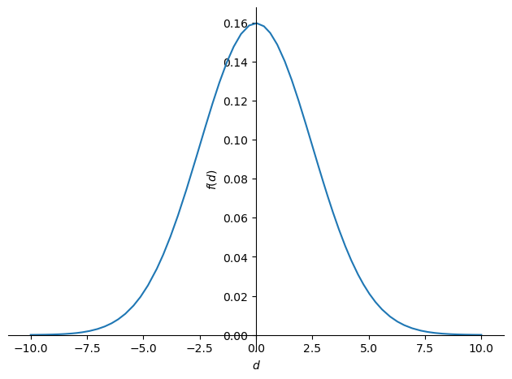

# groundup_004_meanshift
---
skip_exec: true
---
# Clustering

Clustering techniques are unsupervised learning algorithms that try to group unlabelled data into "clusters", using the (typically spatial) structure of the data itself.

The easiest way to demonstrate how clustering works is to simply generate some data and show them in action. We'll start off by importing the libraries we'll be using today.

## Imports


```
import math, matplotlib.pyplot as plt, operator, torch
from fastdebug.utils import * 
```


<style>.container { width:100% !important; }</style>


## torch.manual_seed(1)


```
torch.manual_seed(1);
```


```
check(torch.manual_seed)
```

    signature: (seed) -> torch._C.Generator
    __class__: <class 'function'>
    __repr__: <function manual_seed>
    
    __module__: torch.random
    __doc__:
    Sets the seed for generating random numbers. Returns a
    `torch.Generator` object.
    
    Args:
        seed (int): The desired seed. Value must be within the inclusive range
            `[-0x8000_0000_0000_0000, 0xffff_ffff_ffff_ffff]`. Otherwise, a RuntimeError
            is raised. Negative inputs are remapped to positive values with the formula
            `0xffff_ffff_ffff_ffff + seed`.
    __dict__: 
    {}
    metaclass: False
    class: False
    decorator: False
    function: True
    method: False


## centroids, torch.randint(low, high, size)


```
n_clusters=6
n_samples =250
```

To generate our data, we're going to pick 6 random points, which we'll call centroids, and for each point we're going to generate 250 random points about it.


```
centroids = torch.randint(-35, 35, (n_clusters, 2)).float()
```


```
centroids
```


    tensor([[  0.,  24.],
            [-31.,   3.],
            [-32., -22.],
            [-14.,  26.],
            [ 14.,  17.],
            [-17.,  34.]])


```
check(torch.randint, n=20)
```

    signature: None
    __class__: <class 'builtin_function_or_method'>
    __repr__: <built-in method randint of type object>
    
    __module__: torch
    __doc__:
    randint(low=0, high, size, \*, generator=None, out=None, dtype=None, layout=torch.strided, device=None, requires_grad=False) -> Tensor
    
    Returns a tensor filled with random integers generated uniformly
    between :attr:`low` (inclusive) and :attr:`high` (exclusive).
    
    The shape of the tensor is defined by the variable argument :attr:`size`.
    
    .. note::
        With the global dtype default (``torch.float32``), this function returns
        a tensor with dtype ``torch.int64``.
    
    Args:
        low (int, optional): Lowest integer to be drawn from the distribution. Default: 0.
        high (int): One above the highest integer to be drawn from the distribution.
        size (tuple): a tuple defining the shape of the output tensor.
    
    Keyword args:
        generator (:class:`torch.Generator`, optional): a pseudorandom number generator for sampling
        out (Tensor, optional): the output tensor.
        dtype (`torch.dtype`, optional) - the desired data type of returned tensor. Default: if ``None``,
            this function returns a tensor with dtype ``torch.int64``.
    __dict__: not exist 
    
    metaclass: False
    class: False
    decorator: False
    function: False
    method: False


## MultivariateNormal, torch.diag, mvn.sample
creating samples on centroids

docs on [MultivariateNormal](https://pytorch.org/docs/stable/distributions.html#multivariatenormal)


```
from torch.distributions.multivariate_normal import MultivariateNormal
from torch import tensor
```


```
torch.diag(tensor([5.,5.]))
```


    tensor([[5., 0.],
            [0., 5.]])


```
c1 = centroids[0]
c1
```


    tensor([ 0., 24.])


```
mvn = MultivariateNormal(c1, torch.diag(tensor([5.,5.])))
c1
mvn.mean
mvn.covariance_matrix
sample = mvn.sample((10,))
```


    tensor([ 0., 24.])


    tensor([ 0., 24.])


    tensor([[5., 0.],
            [0., 5.]])


Suppose there are two data sets X = {3, 2} and Y = {7, 4}. The sample variance of dataset X = 0.5, and Y = 4.5. The covariance between X and Y is 1.5. The covariance matrix is expressed as follows:

```[ 0.5 1.5
  1.5 4.5 ]```


```
torch.var_mean(sample[:,0]) # calc variance and mean
torch.var_mean(sample[:,1]) 
torch.cov(sample.T) # calc covariance matrix
```


    (tensor(6.0844), tensor(1.0054))


    (tensor(1.0135), tensor(23.4095))


    tensor([[ 6.0844, -1.4073],
            [-1.4073,  1.0135]])


```
check(mvn.sample)
```

    signature: (sample_shape=torch.Size([]))
    __class__: <class 'method'>
    __repr__: <bound method Distribution.sample of MultivariateNormal(loc: torch.Size([2]), covariance_matrix: torch.Size([2, 2]))>
    
    __module__: torch.distributions.distribution
    __doc__:
    Generates a sample_shape shaped sample or sample_shape shaped batch of
    samples if the distribution parameters are batched.
    __dict__: 
    {}
    metaclass: False
    class: False
    decorator: False
    function: False
    method: True


```
MultivariateNormal(c1, torch.diag(tensor([5.,5.]))).sample((100,)).shape
```


    torch.Size([100, 2])


```
def sample(m): return MultivariateNormal(m, torch.diag(tensor([5.,5.]))).sample((n_samples,))
```


```
centroids.shape
[c for c in centroids]
slices = [sample(c) for c in centroids]
slices[0].shape
data = torch.cat(slices)
data.shape
```


    torch.Size([6, 2])


    [tensor([ 0., 24.]),
     tensor([-31.,   3.]),
     tensor([-32., -22.]),
     tensor([-14.,  26.]),
     tensor([14., 17.]),
     tensor([-17.,  34.])]


    torch.Size([250, 2])


    torch.Size([1500, 2])


## plot_centroids_sample, enumerate, plt.scatter, plt.plot
plotting centroids and sample

Below we can see each centroid marked w/ X, and the coloring associated to each respective cluster.


```
centroids
```


    tensor([[  0.,  24.],
            [-31.,   3.],
            [-32., -22.],
            [-14.,  26.],
            [ 14.,  17.],
            [-17.,  34.]])


```
def plot_centroids_sample(centroids, data, n_samples):
    for i, centroid in enumerate(centroids):
        samples = data[i*n_samples:(i+1)*n_samples]
        plt.scatter(samples[:,0], samples[:,1], s=1)
        plt.plot(centroid[0], centroid[1], markersize=10, marker="x", color='k', mew=5)
        plt.plot(centroid[0], centroid[1], markersize=5, marker="x", color='m', mew=2)
```


```
plot_centroids_sample(centroids, data, n_samples)
```


    

    


## Mean shift

Most people that have come across clustering algorithms have learnt about **k-means**. Mean shift clustering is a newer and less well-known approach, but it has some important advantages:
* It doesn't require selecting the number of clusters in advance, but instead just requires a **bandwidth** to be specified, which can be easily chosen automatically
* It can handle clusters of any shape, whereas k-means (without using special extensions) requires that clusters be roughly ball shaped.

The algorithm is as follows:
* For each data point x in the sample X, find the distance between that point x and every other point in X
* Create weights for each point in X by using the **Gaussian kernel** of that point's distance to x
    * This weighting approach penalizes points further away from x
    * The rate at which the weights fall to zero is determined by the **bandwidth**, which is the standard deviation of the Gaussian
* Update x as the weighted average of all other points in X, weighted based on the previous step

This will iteratively push points that are close together even closer until they are next to each other.

## gaussian kernel

So here's the definition of the gaussian kernel, which you may remember from high school...

### torch.linspace, torch.exp


```
check(torch.linspace)
```

    signature: None
    __class__: <class 'builtin_function_or_method'>
    __repr__: <built-in method linspace of type object>
    
    __module__: torch
    __doc__:
    linspace(start, end, steps, *, out=None, dtype=None, layout=torch.strided, device=None, requires_grad=False) -> Tensor
    
    Creates a one-dimensional tensor of size :attr:`steps` whose values are evenly
    spaced from :attr:`start` to :attr:`end`, inclusive. That is, the value are:
    
    .. math::
        (\text{start},
        \text{start} + \frac{\text{end} - \text{start}}{\text{steps} - 1},
        \ldots,
        \text{start} + (\text{steps} - 2) * \frac{\text{end} - \text{start}}{\text{steps} - 1},
        \text{end})
    __dict__: not exist 
    
    metaclass: False
    class: False
    decorator: False
    function: False
    method: False


```
x = torch.linspace(0,10,100)
x.shape
x
```


    torch.Size([100])


    tensor([ 0.0000,  0.1010,  0.2020,  0.3030,  0.4040,  0.5051,  0.6061,  0.7071,
             0.8081,  0.9091,  1.0101,  1.1111,  1.2121,  1.3131,  1.4141,  1.5152,
             1.6162,  1.7172,  1.8182,  1.9192,  2.0202,  2.1212,  2.2222,  2.3232,
             2.4242,  2.5253,  2.6263,  2.7273,  2.8283,  2.9293,  3.0303,  3.1313,
             3.2323,  3.3333,  3.4343,  3.5354,  3.6364,  3.7374,  3.8384,  3.9394,
             4.0404,  4.1414,  4.2424,  4.3434,  4.4444,  4.5455,  4.6465,  4.7475,
             4.8485,  4.9495,  5.0505,  5.1515,  5.2525,  5.3535,  5.4545,  5.5556,
             5.6566,  5.7576,  5.8586,  5.9596,  6.0606,  6.1616,  6.2626,  6.3636,
             6.4646,  6.5657,  6.6667,  6.7677,  6.8687,  6.9697,  7.0707,  7.1717,
             7.2727,  7.3737,  7.4747,  7.5758,  7.6768,  7.7778,  7.8788,  7.9798,
             8.0808,  8.1818,  8.2828,  8.3838,  8.4848,  8.5859,  8.6869,  8.7879,
             8.8889,  8.9899,  9.0909,  9.1919,  9.2929,  9.3939,  9.4950,  9.5960,
             9.6970,  9.7980,  9.8990, 10.0000])


```
check(torch.exp)
```

    signature: None
    __class__: <class 'builtin_function_or_method'>
    __repr__: <built-in method exp of type object>
    
    __module__: torch
    __doc__:
    exp(input, *, out=None) -> Tensor
    
    Returns a new tensor with the exponential of the elements
    of the input tensor :attr:`input`.
    
    .. math::
        y_{i} = e^{x_{i}}
    
    Args:
        input (Tensor): the input tensor.
    
    __dict__: not exist 
    
    metaclass: False
    class: False
    decorator: False
    function: False
    method: False


### gaussian kernel in sympy


```
from sympy import sympify, plot, pi, exp, symbols, sqrt, Eq
```


```
d, bw, G_1d = symbols("d,bw, G_1d")
```


```
exp(-0.5*((d/bw))**2)
```


$\displaystyle e^{- \frac{0.5 d^{2}}{bw^{2}}}$


```
expr = exp(-0.5*((d/bw))**2)/(bw*sqrt(2*pi))
expr
```


$\displaystyle \frac{\sqrt{2} e^{- \frac{0.5 d^{2}}{bw^{2}}}}{2 \sqrt{\pi} bw}$


```
Eq(G_1d, expr)
```


$\displaystyle G_{1d} = \frac{\sqrt{2} e^{- \frac{0.5 d^{2}}{bw^{2}}}}{2 \sqrt{\pi} bw}$


```
expr
expr1 = expr.subs({bw: 2.5})
expr1
```


$\displaystyle \frac{\sqrt{2} e^{- \frac{0.5 d^{2}}{bw^{2}}}}{2 \sqrt{\pi} bw}$


$\displaystyle \frac{0.2 \sqrt{2} e^{- 0.08 d^{2}}}{\sqrt{\pi}}$


```
plot(expr1)
```


    

    


    <sympy.plotting.plot.Plot>


### gaussian kernel for weight


```
def gaussian(d, bw): return torch.exp(-0.5*((d/bw))**2) / (bw*math.sqrt(2*math.pi))
```


```
x
```


    tensor([ 0.0000,  0.1010,  0.2020,  0.3030,  0.4040,  0.5051,  0.6061,  0.7071,
             0.8081,  0.9091,  1.0101,  1.1111,  1.2121,  1.3131,  1.4141,  1.5152,
             1.6162,  1.7172,  1.8182,  1.9192,  2.0202,  2.1212,  2.2222,  2.3232,
             2.4242,  2.5253,  2.6263,  2.7273,  2.8283,  2.9293,  3.0303,  3.1313,
             3.2323,  3.3333,  3.4343,  3.5354,  3.6364,  3.7374,  3.8384,  3.9394,
             4.0404,  4.1414,  4.2424,  4.3434,  4.4444,  4.5455,  4.6465,  4.7475,
             4.8485,  4.9495,  5.0505,  5.1515,  5.2525,  5.3535,  5.4545,  5.5556,
             5.6566,  5.7576,  5.8586,  5.9596,  6.0606,  6.1616,  6.2626,  6.3636,
             6.4646,  6.5657,  6.6667,  6.7677,  6.8687,  6.9697,  7.0707,  7.1717,
             7.2727,  7.3737,  7.4747,  7.5758,  7.6768,  7.7778,  7.8788,  7.9798,
             8.0808,  8.1818,  8.2828,  8.3838,  8.4848,  8.5859,  8.6869,  8.7879,
             8.8889,  8.9899,  9.0909,  9.1919,  9.2929,  9.3939,  9.4950,  9.5960,
             9.6970,  9.7980,  9.8990, 10.0000])


```
plt.plot(x, gaussian(x,2.5));
```


    

    


 This person at the science march certainly remembered!


In our implementation, we choose the bandwidth to be 2.5. 

One easy way to choose bandwidth is to find which bandwidth covers one third of the data.

### from distance to weight


```
X = data.clone()
x = data[0]
data.shape
X, x
```


    torch.Size([1500, 2])


    (tensor([[ -2.2934,  25.1656],
             [ -1.0131,  23.7182],
             [  5.2227,  22.6092],
             ...,
             [-17.3308,  33.4929],
             [-12.5499,  33.5847],
             [-16.5074,  35.8346]]),
     tensor([-2.2934, 25.1656]))


```
sympify("sqrt(a**2 + b**2)")
```


$\displaystyle \sqrt{a^{2} + b^{2}}$


```
x-X
(x-X)**2
((x-X)**2).sum(1)
torch.sqrt(((x-X)**2).sum(1))
```


    tensor([[  0.0000,   0.0000],
            [ -1.2803,   1.4474],
            [ -7.5161,   2.5564],
            ...,
            [ 15.0373,  -8.3273],
            [ 10.2565,  -8.4191],
            [ 14.2140, -10.6690]])


    tensor([[  0.0000,   0.0000],
            [  1.6393,   2.0948],
            [ 56.4922,   6.5353],
            ...,
            [226.1211,  69.3436],
            [105.1960,  70.8818],
            [202.0365, 113.8286]])


    tensor([  0.0000,   3.7341,  63.0275,  ..., 295.4647, 176.0777, 315.8650])


    tensor([ 0.0000,  1.9324,  7.9390,  ..., 17.1891, 13.2694, 17.7726])


```
dist = torch.sqrt(((x-X)**2).sum(1))
dist.shape
dist.min(), dist.max()
```


    torch.Size([1500])


    (tensor(0.), tensor(61.8455))


```
weight = gaussian(dist, 2.5)
weight
```


    tensor([1.5958e-01, 1.1837e-01, 1.0308e-03,  ..., 8.6591e-12, 1.2173e-07,
            1.6932e-12])


```
weight.shape,X.shape
weight[:, None].shape
```


    (torch.Size([1500]), torch.Size([1500, 2]))


    torch.Size([1500, 1])


```
(weight[:,None]*X)
```


    tensor([[-3.6598e-01,  4.0158e+00],
            [-1.1992e-01,  2.8075e+00],
            [ 5.3835e-03,  2.3305e-02],
            ...,
            [-1.5007e-10,  2.9002e-10],
            [-1.5277e-06,  4.0883e-06],
            [-2.7950e-11,  6.0673e-11]])


```
(weight[:,None]*X).sum(0)
weight.sum()
```


    tensor([-18.4532, 425.6993])


    tensor(17.3609)


## meanshift


```
@snoop
def meanshift(data):
    X = data.clone()
    for it in range(5):
        for i, x in enumerate(X):
            dist = torch.sqrt(((x-X)**2).sum(1))
            weight = gaussian(dist, 2.5)
#             pp.deep(lambda: (weight[:,None]*X).sum(0)/weight.sum())
            pp(weight.shape, weight[:,None].shape, (weight[:,None]*X).shape, (weight[:,None]*X).sum(0).shape, (weight.sum()).shape)
            X[i] = (weight[:,None]*X).sum(0)/weight.sum()
            if i>0: break
    return X
```


```
%time X=meanshift(data)
```

    10:34:43.62 >>> Call to meanshift in File "/var/folders/gz/ch3n2mp51m9386sytqf97s6w0000gn/T/ipykernel_82989/929059324.py", line 2
    10:34:43.62 ...... data = tensor([[ -2.2934,  25.1656],
    10:34:43.62                       [ -1.0131,...2.5499,  33.5847],
    10:34:43.62                       [-16.5074,  35.8346]])
    10:34:43.62 ...... type(data) = <class 'torch.Tensor'>
    10:34:43.62 ...... data.shape = (1500, 2)
    10:34:43.62    2 | def meanshift(data):
    10:34:43.62    3 |     X = data.clone()
    10:34:43.63 .......... X = tensor([[ -2.2934,  25.1656],
    10:34:43.63                        [ -1.0131,...2.5499,  33.5847],
    10:34:43.63                        [-16.5074,  35.8346]])
    10:34:43.63 .......... type(X) = <class 'torch.Tensor'>
    10:34:43.63 .......... X.shape = (1500, 2)
    10:34:43.63    4 |     for it in range(5):
    10:34:43.63 .......... it = 0
    10:34:43.63 .......... type(it) = <class 'int'>
    10:34:43.63    5 |         for i, x in enumerate(X):
    10:34:43.63 .............. i = 0
    10:34:43.63 .............. type(i) = <class 'int'>
    10:34:43.63 .............. x = tensor([-2.2934, 25.1656])
    10:34:43.63 .............. type(x) = <class 'torch.Tensor'>
    10:34:43.63 .............. x.shape = (2,)
    10:34:43.63    6 |             dist = torch.sqrt(((x-X)**2).sum(1))
    10:34:43.63 .................. dist = tensor([ 0.0000,  1.9324,  7.9390,  ..., 17.1891, 13.2694, 17.7726])
    10:34:43.63 .................. type(dist) = <class 'torch.Tensor'>
    10:34:43.63 .................. dist.shape = (1500,)
    10:34:43.63    7 |             weight = gaussian(dist, 2.5)
    10:34:43.63 .................. weight = tensor([1.5958e-01, 1.1837e-01, 1.0308e-03,  ..., 8.6591e-12, 1.2173e-07,
    10:34:43.63                                     1.6932e-12])
    10:34:43.63 .................. type(weight) = <class 'torch.Tensor'>
    10:34:43.63 .................. weight.shape = (1500,)
    10:34:43.63    9 |             pp(weight.shape, weight[:,None].shape, (weight[:,None]*X).shape, (weight[:,None]*X).sum(0).shape, (weight.sum()).shape)
    10:34:43.63 LOG:
    10:34:43.93 .... weight.shape = torch.Size([1500])
    10:34:43.93 .... weight[:,None].shape = torch.Size([1500, 1])
    10:34:43.93 .... (weight[:,None]*X).shape = torch.Size([1500, 2])
    10:34:43.93 .... (weight[:,None]*X).sum(0).shape = torch.Size([2])
    10:34:43.93 .... (weight.sum()).shape = torch.Size([])
    10:34:43.93   10 |             X[i] = (weight[:,None]*X).sum(0)/weight.sum()
    10:34:43.93 .................. X = tensor([[ -1.0629,  24.5206],
    10:34:43.93                                [ -1.0131,...2.5499,  33.5847],
    10:34:43.93                                [-16.5074,  35.8346]])
    10:34:43.93 .................. x = tensor([-1.0629, 24.5206])
    10:34:43.93   11 |             if i>0: break
    10:34:43.93    5 |         for i, x in enumerate(X):
    10:34:43.93 .............. i = 1
    10:34:43.93 .............. x = tensor([-1.0131, 23.7182])
    10:34:43.93    6 |             dist = torch.sqrt(((x-X)**2).sum(1))
    10:34:43.93 .................. dist = tensor([ 0.8039,  0.0000,  6.3336,  ..., 19.0213, 15.1805, 19.6693])
    10:34:43.93    7 |             weight = gaussian(dist, 2.5)
    10:34:43.94 .................. weight = tensor([1.5154e-01, 1.5958e-01, 6.4451e-03,  ..., 4.2895e-14, 1.5720e-09,
    10:34:43.94                                     5.7726e-15])
    10:34:43.94    9 |             pp(weight.shape, weight[:,None].shape, (weight[:,None]*X).shape, (weight[:,None]*X).sum(0).shape, (weight.sum()).shape)
    10:34:43.94 LOG:
    10:34:43.94 .... weight.shape = torch.Size([1500])
    10:34:43.94 .... weight[:,None].shape = torch.Size([1500, 1])
    10:34:43.94 .... (weight[:,None]*X).shape = torch.Size([1500, 2])
    10:34:43.94 .... (weight[:,None]*X).sum(0).shape = torch.Size([2])
    10:34:43.94 .... (weight.sum()).shape = torch.Size([])
    10:34:43.94   10 |             X[i] = (weight[:,None]*X).sum(0)/weight.sum()
    10:34:43.94 .................. X = tensor([[ -1.0629,  24.5206],
    10:34:43.94                                [ -0.4872,...2.5499,  33.5847],
    10:34:43.94                                [-16.5074,  35.8346]])
    10:34:43.94 .................. x = tensor([-0.4872, 23.9744])
    10:34:43.94   11 |             if i>0: break
    10:34:43.94    4 |     for it in range(5):
    10:34:43.94 .......... it = 1
    10:34:43.94    5 |         for i, x in enumerate(X):
    10:34:43.95 .............. i = 0
    10:34:43.95 .............. x = tensor([-1.0629, 24.5206])
    10:34:43.95    6 |             dist = torch.sqrt(((x-X)**2).sum(1))
    10:34:43.95 .................. dist = tensor([ 0.0000,  0.7936,  6.5698,  ..., 18.5780, 14.6325, 19.1452])
    10:34:43.95    7 |             weight = gaussian(dist, 2.5)
    10:34:43.95 .................. weight = tensor([1.5958e-01, 1.5174e-01, 5.0506e-03,  ..., 1.6273e-13, 5.8083e-09,
    10:34:43.95                                     2.9385e-14])
    10:34:43.95    9 |             pp(weight.shape, weight[:,None].shape, (weight[:,None]*X).shape, (weight[:,None]*X).sum(0).shape, (weight.sum()).shape)
    10:34:43.95 LOG:
    10:34:43.95 .... weight.shape = torch.Size([1500])
    10:34:43.95 .... weight[:,None].shape = torch.Size([1500, 1])
    10:34:43.95 .... (weight[:,None]*X).shape = torch.Size([1500, 2])
    10:34:43.95 .... (weight[:,None]*X).sum(0).shape = torch.Size([2])
    10:34:43.95 .... (weight.sum()).shape = torch.Size([])
    10:34:43.95   10 |             X[i] = (weight[:,None]*X).sum(0)/weight.sum()
    10:34:43.95 .................. X = tensor([[ -0.4665,  24.2912],
    10:34:43.95                                [ -0.4872,...2.5499,  33.5847],
    10:34:43.95                                [-16.5074,  35.8346]])
    10:34:43.95 .................. x = tensor([-0.4665, 24.2912])
    10:34:43.95   11 |             if i>0: break
    10:34:43.96    5 |         for i, x in enumerate(X):
    10:34:43.96 .............. i = 1
    10:34:43.96 .............. x = tensor([-0.4872, 23.9744])
    10:34:43.96    6 |             dist = torch.sqrt(((x-X)**2).sum(1))
    10:34:43.96 .................. dist = tensor([ 0.3175,  0.0000,  5.8709,  ..., 19.3470, 15.4229, 19.9326])
    10:34:43.96    7 |             weight = gaussian(dist, 2.5)
    10:34:43.96 .................. weight = tensor([1.5830e-01, 1.5958e-01, 1.0126e-02,  ..., 1.5786e-14, 8.6823e-10,
    10:34:43.96                                     2.5062e-15])
    10:34:43.96    9 |             pp(weight.shape, weight[:,None].shape, (weight[:,None]*X).shape, (weight[:,None]*X).sum(0).shape, (weight.sum()).shape)
    10:34:43.96 LOG:
    10:34:43.96 .... weight.shape = torch.Size([1500])
    10:34:43.96 .... weight[:,None].shape = torch.Size([1500, 1])
    10:34:43.96 .... (weight[:,None]*X).shape = torch.Size([1500, 2])
    10:34:43.96 .... (weight[:,None]*X).sum(0).shape = torch.Size([2])
    10:34:43.96 .... (weight.sum()).shape = torch.Size([])
    10:34:43.97   10 |             X[i] = (weight[:,None]*X).sum(0)/weight.sum()
    10:34:43.97 .................. X = tensor([[ -0.4665,  24.2912],
    10:34:43.97                                [ -0.2165,...2.5499,  33.5847],
    10:34:43.97                                [-16.5074,  35.8346]])
    10:34:43.97 .................. x = tensor([-0.2165, 24.1023])
    10:34:43.97   11 |             if i>0: break
    10:34:43.97    4 |     for it in range(5):
    10:34:43.97 .......... it = 2
    10:34:43.97    5 |         for i, x in enumerate(X):
    10:34:43.97 .............. i = 0
    10:34:43.97 .............. x = tensor([-0.4665, 24.2912])
    10:34:43.97    6 |             dist = torch.sqrt(((x-X)**2).sum(1))
    10:34:43.97 .................. dist = tensor([ 0.0000,  0.3134,  5.9327,  ..., 19.2113, 15.2439, 19.7626])
    10:34:43.97    7 |             weight = gaussian(dist, 2.5)
    10:34:43.98 .................. weight = tensor([1.5958e-01, 1.5833e-01, 9.5525e-03,  ..., 2.3993e-14, 1.3469e-09,
    10:34:43.98                                     4.3009e-15])
    10:34:43.98    9 |             pp(weight.shape, weight[:,None].shape, (weight[:,None]*X).shape, (weight[:,None]*X).sum(0).shape, (weight.sum()).shape)
    10:34:43.98 LOG:
    10:34:43.98 .... weight.shape = torch.Size([1500])
    10:34:43.98 .... weight[:,None].shape = torch.Size([1500, 1])
    10:34:43.98 .... (weight[:,None]*X).shape = torch.Size([1500, 2])
    10:34:43.98 .... (weight[:,None]*X).sum(0).shape = torch.Size([2])
    10:34:43.98 .... (weight.sum()).shape = torch.Size([])
    10:34:43.98   10 |             X[i] = (weight[:,None]*X).sum(0)/weight.sum()
    10:34:43.98 .................. X = tensor([[ -0.1901,  24.2264],
    10:34:43.98                                [ -0.2165,...2.5499,  33.5847],
    10:34:43.98                                [-16.5074,  35.8346]])
    10:34:43.98 .................. x = tensor([-0.1901, 24.2264])
    10:34:43.98   11 |             if i>0: break
    10:34:43.98    5 |         for i, x in enumerate(X):
    10:34:43.98 .............. i = 1
    10:34:43.98 .............. x = tensor([-0.2165, 24.1023])
    10:34:43.98    6 |             dist = torch.sqrt(((x-X)**2).sum(1))
    10:34:43.99 .................. dist = tensor([ 0.1269,  0.0000,  5.6404,  ..., 19.5213, 15.5573, 20.0759])
    10:34:43.99    7 |             weight = gaussian(dist, 2.5)
    10:34:43.99 .................. weight = tensor([1.5937e-01, 1.5958e-01, 1.2521e-02,  ..., 9.1809e-15, 6.2231e-10,
    10:34:43.99                                     1.5846e-15])
    10:34:43.99    9 |             pp(weight.shape, weight[:,None].shape, (weight[:,None]*X).shape, (weight[:,None]*X).sum(0).shape, (weight.sum()).shape)
    10:34:43.99 LOG:
    10:34:43.99 .... weight.shape = torch.Size([1500])
    10:34:43.99 .... weight[:,None].shape = torch.Size([1500, 1])
    10:34:43.99 .... (weight[:,None]*X).shape = torch.Size([1500, 2])
    10:34:44.00 .... (weight[:,None]*X).sum(0).shape = torch.Size([2])
    10:34:44.00 .... (weight.sum()).shape = torch.Size([])
    10:34:44.00   10 |             X[i] = (weight[:,None]*X).sum(0)/weight.sum()
    10:34:44.00 .................. X = tensor([[ -0.1901,  24.2264],
    10:34:44.00                                [ -0.0806,...2.5499,  33.5847],
    10:34:44.00                                [-16.5074,  35.8346]])
    10:34:44.00 .................. x = tensor([-0.0806, 24.1645])
    10:34:44.00   11 |             if i>0: break
    10:34:44.00    4 |     for it in range(5):
    10:34:44.00 .......... it = 3
    10:34:44.00    5 |         for i, x in enumerate(X):
    10:34:44.01 .............. i = 0
    10:34:44.01 .............. x = tensor([-0.1901, 24.2264])
    10:34:44.01    6 |             dist = torch.sqrt(((x-X)**2).sum(1))
    10:34:44.01 .................. dist = tensor([ 0.0000,  0.1258,  5.6493,  ..., 19.4851, 15.5030, 20.0251])
    10:34:44.01    7 |             weight = gaussian(dist, 2.5)
    10:34:44.01 .................. weight = tensor([1.5958e-01, 1.5937e-01, 1.2421e-02,  ..., 1.0279e-14, 7.1224e-10,
    10:34:44.01                                     1.8651e-15])
    10:34:44.01    9 |             pp(weight.shape, weight[:,None].shape, (weight[:,None]*X).shape, (weight[:,None]*X).sum(0).shape, (weight.sum()).shape)
    10:34:44.01 LOG:
    10:34:44.01 .... weight.shape = torch.Size([1500])
    10:34:44.01 .... weight[:,None].shape = torch.Size([1500, 1])
    10:34:44.01 .... (weight[:,None]*X).shape = torch.Size([1500, 2])
    10:34:44.01 .... (weight[:,None]*X).sum(0).shape = torch.Size([2])
    10:34:44.01 .... (weight.sum()).shape = torch.Size([])
    10:34:44.01   10 |             X[i] = (weight[:,None]*X).sum(0)/weight.sum()
    10:34:44.02 .................. X = tensor([[ -0.0621,  24.2134],
    10:34:44.02                                [ -0.0806,...2.5499,  33.5847],
    10:34:44.02                                [-16.5074,  35.8346]])
    10:34:44.02 .................. x = tensor([-0.0621, 24.2134])
    10:34:44.02   11 |             if i>0: break
    10:34:44.02    5 |         for i, x in enumerate(X):
    10:34:44.02 .............. i = 1
    10:34:44.02 .............. x = tensor([-0.0806, 24.1645])
    10:34:44.02    6 |             dist = torch.sqrt(((x-X)**2).sum(1))
    10:34:44.02 .................. dist = tensor([ 0.0523,  0.0000,  5.5267,  ..., 19.6109, 15.6277, 20.1502])
    10:34:44.02    7 |             weight = gaussian(dist, 2.5)
    10:34:44.02 .................. weight = tensor([1.5954e-01, 1.5958e-01, 1.3860e-02,  ..., 6.9357e-15, 5.2209e-10,
    10:34:44.02                                     1.2474e-15])
    10:34:44.02    9 |             pp(weight.shape, weight[:,None].shape, (weight[:,None]*X).shape, (weight[:,None]*X).sum(0).shape, (weight.sum()).shape)
    10:34:44.02 LOG:
    10:34:44.02 .... weight.shape = torch.Size([1500])
    10:34:44.02 .... weight[:,None].shape = torch.Size([1500, 1])
    10:34:44.02 .... (weight[:,None]*X).shape = torch.Size([1500, 2])
    10:34:44.02 .... (weight[:,None]*X).sum(0).shape = torch.Size([2])
    10:34:44.02 .... (weight.sum()).shape = torch.Size([])
    10:34:44.03   10 |             X[i] = (weight[:,None]*X).sum(0)/weight.sum()
    10:34:44.03 .................. X = tensor([[-6.2132e-02,  2.4213e+01],
    10:34:44.03                                [-1....3.3585e+01],
    10:34:44.03                                [-1.6507e+01,  3.5835e+01]])
    10:34:44.03 .................. x = tensor([-1.3469e-02,  2.4194e+01])
    10:34:44.03   11 |             if i>0: break
    10:34:44.03    4 |     for it in range(5):
    10:34:44.03 .......... it = 4
    10:34:44.03    5 |         for i, x in enumerate(X):
    10:34:44.03 .............. i = 0
    10:34:44.03 .............. x = tensor([-0.0621, 24.2134])
    10:34:44.03    6 |             dist = torch.sqrt(((x-X)**2).sum(1))
    10:34:44.03 .................. dist = tensor([ 0.0000,  0.0523,  5.5230,  ..., 19.6039, 15.6130, 20.1370])
    10:34:44.03    7 |             weight = gaussian(dist, 2.5)
    10:34:44.03 .................. weight = tensor([1.5958e-01, 1.5954e-01, 1.3906e-02,  ..., 7.0882e-15, 5.4155e-10,
    10:34:44.03                                     1.3016e-15])
    10:34:44.03    9 |             pp(weight.shape, weight[:,None].shape, (weight[:,None]*X).shape, (weight[:,None]*X).sum(0).shape, (weight.sum()).shape)
    10:34:44.04 LOG:
    10:34:44.04 .... weight.shape = torch.Size([1500])
    10:34:44.04 .... weight[:,None].shape = torch.Size([1500, 1])
    10:34:44.04 .... (weight[:,None]*X).shape = torch.Size([1500, 2])
    10:34:44.04 .... (weight[:,None]*X).sum(0).shape = torch.Size([2])
    10:34:44.04 .... (weight.sum()).shape = torch.Size([])
    10:34:44.04   10 |             X[i] = (weight[:,None]*X).sum(0)/weight.sum()
    10:34:44.04 .................. X = tensor([[-2.5109e-03,  2.4214e+01],
    10:34:44.04                                [-1....3.3585e+01],
    10:34:44.04                                [-1.6507e+01,  3.5835e+01]])
    10:34:44.04 .................. x = tensor([-2.5109e-03,  2.4214e+01])
    10:34:44.04   11 |             if i>0: break
    10:34:44.04    5 |         for i, x in enumerate(X):
    10:34:44.04 .............. i = 1
    10:34:44.04 .............. x = tensor([-1.3469e-02,  2.4194e+01])
    10:34:44.04    6 |             dist = torch.sqrt(((x-X)**2).sum(1))
    10:34:44.05 .................. dist = tensor([ 0.0224,  0.0000,  5.4709,  ..., 19.6558, 15.6634, 20.1878])
    10:34:44.05    7 |             weight = gaussian(dist, 2.5)
    10:34:44.05 .................. weight = tensor([1.5957e-01, 1.5958e-01, 1.4557e-02,  ..., 6.0224e-15, 4.7743e-10,
    10:34:44.05                                     1.1051e-15])
    10:34:44.05    9 |             pp(weight.shape, weight[:,None].shape, (weight[:,None]*X).shape, (weight[:,None]*X).sum(0).shape, (weight.sum()).shape)
    10:34:44.05 LOG:
    10:34:44.05 .... weight.shape = torch.Size([1500])
    10:34:44.05 .... weight[:,None].shape = torch.Size([1500, 1])
    10:34:44.05 .... (weight[:,None]*X).shape = torch.Size([1500, 2])
    10:34:44.05 .... (weight[:,None]*X).sum(0).shape = torch.Size([2])
    10:34:44.05 .... (weight.sum()).shape = torch.Size([])
    10:34:44.05   10 |             X[i] = (weight[:,None]*X).sum(0)/weight.sum()
    10:34:44.05 .................. X = tensor([[-2.5109e-03,  2.4214e+01],
    10:34:44.05                                [ 1....3.3585e+01],
    10:34:44.05                                [-1.6507e+01,  3.5835e+01]])
    10:34:44.05 .................. x = tensor([1.9417e-02, 2.4209e+01])
    10:34:44.05   11 |             if i>0: break
    10:34:44.05    4 |     for it in range(5):
    10:34:44.06   12 |     return X
    10:34:44.06 <<< Return value from meanshift: tensor([[-2.5109e-03,  2.4214e+01],
    10:34:44.06                                          [ 1....3.3585e+01],
    10:34:44.06                                          [-1.6507e+01,  3.5835e+01]])


    CPU times: user 393 ms, sys: 26.8 ms, total: 420 ms
    Wall time: 435 ms


```
data.shape
X.shape

```


    torch.Size([1500, 2])


    torch.Size([1500, 2])


We can see that mean shift clustering has almost reproduced our original clustering. The one exception are the very close clusters, but if we really wanted to differentiate them we could lower the bandwidth.

What is impressive is that this algorithm nearly reproduced the original clusters without telling it how many clusters there should be.


```
centroids+2, X, n_samples
```


    (tensor([[  2.,  26.],
             [-29.,   5.],
             [-30., -20.],
             [-12.,  28.],
             [ 16.,  19.],
             [-15.,  36.]]),
     tensor([[-2.5109e-03,  2.4214e+01],
             [ 1.9417e-02,  2.4209e+01],
             [ 5.2227e+00,  2.2609e+01],
             ...,
             [-1.7331e+01,  3.3493e+01],
             [-1.2550e+01,  3.3585e+01],
             [-1.6507e+01,  3.5835e+01]]),
     250)


```
plot_centroids_sample(centroids+2, X, n_samples)
```


    

    


All the computation is happening in the <tt>for</tt> loop, which isn't accelerated by pytorch. Each iteration launches a new cuda kernel, which takes time and slows the algorithm down as a whole. Furthermore, each iteration doesn't have enough processing to do to fill up all of the threads of the GPU. But at least the results are correct...

We should be able to accelerate this algorithm with a GPU.

## GPU batched algorithm

To truly accelerate the algorithm, we need to be performing updates on a batch of points per iteration, instead of just one as we were doing.


```
def dist_b(a,b): 
    pp(a.shape, a[None].shape, b.shape, b[:, None].shape)
    return torch.sqrt(((a[None]-b[:,None])**2).sum(2)) # see how the dim change to make wonders
```


```
X=torch.rand(8,2)
x=torch.rand(5,2)
X[None].shape, x[:,None].shape # to make sure broadcast is available
```


    (torch.Size([1, 8, 2]), torch.Size([5, 1, 2]))


```
dist_b(X, x).shape
```

    10:34:53.03 LOG:
    10:34:53.03 .... a.shape = torch.Size([8, 2])
    10:34:53.03 .... a[None].shape = torch.Size([1, 8, 2])
    10:34:53.03 .... b.shape = torch.Size([5, 2])
    10:34:53.04 .... b[:, None].shape = torch.Size([5, 1, 2])


    torch.Size([5, 8])


```
# %%snoop
bs=5
X = data.clone()
x = X[:bs]
weight = gaussian(dist_b(X, x), 2) # create 5 weights all together
weight.shape
```

    10:34:58.66 >>> Call to <module> in File "/var/folders/gz/ch3n2mp51m9386sytqf97s6w0000gn/T/ipykernel_82989/3953761289.py", line 1
    10:34:58.66 ...... data = tensor([[ -2.2934,  25.1656],
    10:34:58.66                       [ -1.0131,...2.5499,  33.5847],
    10:34:58.66                       [-16.5074,  35.8346]])
    10:34:58.66 ...... type(data) = <class 'torch.Tensor'>
    10:34:58.66 ...... data.shape = (1500, 2)
    10:34:58.66 ...... x = tensor([[0.0410, 0.7762],
    10:34:58.66                    [0.2208, 0.648...     [0.9170, 0.1253],
    10:34:58.66                    [0.1236, 0.0128]])
    10:34:58.66 ...... type(x) = <class 'torch.Tensor'>
    10:34:58.66 ...... x.shape = (5, 2)
    10:34:58.66 ...... gaussian = <function gaussian>
    10:34:58.66 ...... type(gaussian) = <class 'function'>
    10:34:58.66 ...... sig(gaussian) = <Signature (d, bw)>
    10:34:58.66 ...... X = tensor([[0.1449, 0.1985],
    10:34:58.66                    [0.0179, 0.883...     [0.0893, 0.3448],
    10:34:58.66                    [0.8390, 0.4202]])
    10:34:58.66 ...... type(X) = <class 'torch.Tensor'>
    10:34:58.66 ...... X.shape = (8, 2)
    10:34:58.66 ...... weight = tensor([1.5958e-01, 1.1837e-01, 1.0308e-03,  ..., 8.6591e-12, 1.2173e-07,
    10:34:58.66                         1.6932e-12])
    10:34:58.66 ...... type(weight) = <class 'torch.Tensor'>
    10:34:58.66 ...... weight.shape = (1500,)
    10:34:58.66 ...... dist_b = <function dist_b>
    10:34:58.66 ...... type(dist_b) = <class 'function'>
    10:34:58.66 ...... sig(dist_b) = <Signature (a, b)>
    10:34:58.66    1 | bs=5
    10:34:58.66    1 | bs=5
    10:34:58.66 ...... bs = 5
    10:34:58.66 ...... type(bs) = <class 'int'>
    10:34:58.66    2 | X = data.clone()
    10:34:58.66 ...... X = tensor([[ -2.2934,  25.1656],
    10:34:58.66                    [ -1.0131,...2.5499,  33.5847],
    10:34:58.66                    [-16.5074,  35.8346]])
    10:34:58.66 ...... X.shape = (1500, 2)
    10:34:58.66    3 | x = X[:bs]
    10:34:58.66 ...... x = tensor([[-2.2934, 25.1656],
    10:34:58.66                    [-1.0131, 23... [-0.2641, 20.7757],
    10:34:58.66                    [-2.1248, 23.3078]])
    10:34:58.66    4 | weight = gaussian(dist_b(X, x), 2) # create 5 weights all together
    10:34:58.66 LOG:
    10:34:58.66 .... a.shape = torch.Size([1500, 2])
    10:34:58.66 .... a[None].shape = torch.Size([1, 1500, 2])
    10:34:58.66 .... b.shape = torch.Size([5, 2])
    10:34:58.66 .... b[:, None].shape = torch.Size([5, 1, 2])
    10:34:58.67 ...... weight = tensor([[1.9947e-01, 1.2507e-01, 7.5565e-05,  ......, 1.3068e-19, 4.6383e-13,
    10:34:58.67                          3.5603e-21]])
    10:34:58.67 ...... weight.shape = (5, 1500)
    10:34:58.67    5 | weight.shape
    10:34:58.67 <<< Return value from <module>: None


```
weight.shape,X.shape
weight[..., None].shape,X[None].shape
```


    (torch.Size([5, 1500]), torch.Size([1500, 2]))


    (torch.Size([5, 1500, 1]), torch.Size([1, 1500, 2]))


```
num = (weight[...,None]*X[None]).sum(1)
num.shape
```


    torch.Size([5, 2])


```
div = weight.sum(1, keepdim=True)
div.shape
```


    torch.Size([5, 1])


```
num/div
```


    tensor([[-1.2688, 24.6079],
            [-0.5848, 23.9076],
            [ 2.8672, 23.3891],
            [-0.3928, 22.5619],
            [-1.2959, 23.5955]])


```
from fastcore.all import chunked
```


```
X[slice(0,5,3)]
```


    tensor([[-2.2934, 25.1656],
            [-0.2641, 20.7757]])


```
from snoop import snoop
```


```
@snoop
def meanshift(data, bs=500):
    n = len(data)
    X = data.clone()
    for it in range(5):
        for i in range(0, n, bs):
            s = slice(i, min(i+bs,n))
            weight = gaussian(dist_b(X, X[s]), 2)
            num = (weight[...,None]*X[None]).sum(1)
            div = weight.sum(1, keepdim=True)
            X[s] = num/div
            if i>0: break
    return X
```

Although each iteration still has to launch a new cuda kernel, there are now fewer iterations, and the acceleration from updating a batch of points more than makes up for it.


```
data = data.cuda()
```


    ---------------------------------------------------------------------------

    AssertionError                            Traceback (most recent call last)

    Input In [60], in <cell line: 1>()
    ----> 1 data = data.cuda()


    File ~/mambaforge/lib/python3.9/site-packages/torch/cuda/__init__.py:211, in _lazy_init()
        207     raise RuntimeError(
        208         "Cannot re-initialize CUDA in forked subprocess. To use CUDA with "
        209         "multiprocessing, you must use the 'spawn' start method")
        210 if not hasattr(torch._C, '_cuda_getDeviceCount'):
    --> 211     raise AssertionError("Torch not compiled with CUDA enabled")
        212 if _cudart is None:
        213     raise AssertionError(
        214         "libcudart functions unavailable. It looks like you have a broken build?")


    AssertionError: Torch not compiled with CUDA enabled


```
data
```


    tensor([[ -2.2934,  25.1656],
            [ -1.0131,  23.7182],
            [  5.2227,  22.6092],
            ...,
            [-17.3308,  33.4929],
            [-12.5499,  33.5847],
            [-16.5074,  35.8346]])


```
meanshift(data)
```

    09:52:36.46 >>> Call to meanshift in File "/var/folders/gz/ch3n2mp51m9386sytqf97s6w0000gn/T/ipykernel_81668/3440653179.py", line 2
    09:52:36.46 ...... data = tensor([[ -2.2934,  25.1656],
    09:52:36.46                       [ -1.0131,...2.5499,  33.5847],
    09:52:36.46                       [-16.5074,  35.8346]])
    09:52:36.46 ...... type(data) = <class 'torch.Tensor'>
    09:52:36.46 ...... data.shape = (1500, 2)
    09:52:36.46 ...... bs = 500
    09:52:36.46 ...... type(bs) = <class 'int'>
    09:52:36.46    2 | def meanshift(data, bs=500):
    09:52:36.47    3 |     n = len(data)
    09:52:36.47 .......... n = 1500
    09:52:36.47 .......... type(n) = <class 'int'>
    09:52:36.47    4 |     X = data.clone()
    09:52:36.47 .......... X = tensor([[ -2.2934,  25.1656],
    09:52:36.47                        [ -1.0131,...2.5499,  33.5847],
    09:52:36.47                        [-16.5074,  35.8346]])
    09:52:36.47 .......... type(X) = <class 'torch.Tensor'>
    09:52:36.47 .......... X.shape = (1500, 2)
    09:52:36.47    5 |     for it in range(5):
    09:52:36.47 .......... it = 0
    09:52:36.47 .......... type(it) = <class 'int'>
    09:52:36.47    6 |         for i in range(0, n, bs):
    09:52:36.47 .............. i = 0
    09:52:36.47 .............. type(i) = <class 'int'>
    09:52:36.47    7 |             s = slice(i, min(i+bs,n))
    09:52:36.47 .................. s = slice(0, 500, None)
    09:52:36.47 .................. type(s) = <class 'slice'>
    09:52:36.47    8 |             weight = gaussian(dist_b(X, X[s]), 2)
    09:52:36.48 .................. weight = tensor([[1.9947e-01, 1.2507e-01, 7.5565e-05,  ......, 0.0000e+00, 0.0000e+00,
    09:52:36.48                                      0.0000e+00]])
    09:52:36.48 .................. type(weight) = <class 'torch.Tensor'>
    09:52:36.48 .................. weight.shape = (500, 1500)
    09:52:36.48    9 |             num = (weight[...,None]*X[None]).sum(1)
    09:52:36.49 .................. num = tensor([[-2.0126e+01,  3.9035e+02],
    09:52:36.49                                  [-1....4.1320e+01],
    09:52:36.49                                  [-6.5962e+02,  4.2435e+01]])
    09:52:36.49 .................. type(num) = <class 'torch.Tensor'>
    09:52:36.49 .................. num.shape = (500, 2)
    09:52:36.49   10 |             div = weight.sum(1, keepdim=True)
    09:52:36.50 .................. div = tensor([[15.8627],
    09:52:36.50                                  [21.5736],
    09:52:36.50                                  [ ...[15.2682],
    09:52:36.50                                  [12.5273],
    09:52:36.50                                  [21.1957]])
    09:52:36.50 .................. type(div) = <class 'torch.Tensor'>
    09:52:36.50 .................. div.shape = (500, 1)
    09:52:36.50   11 |             X[s] = num/div
    09:52:36.51 .................. X = tensor([[ -1.2688,  24.6079],
    09:52:36.51                                [ -0.5848,...2.5499,  33.5847],
    09:52:36.51                                [-16.5074,  35.8346]])
    09:52:36.51   12 |             if i>0: break
    09:52:36.52    6 |         for i in range(0, n, bs):
    09:52:36.53 .............. i = 500
    09:52:36.53    7 |             s = slice(i, min(i+bs,n))
    09:52:36.54 .................. s = slice(500, 1000, None)
    09:52:36.54    8 |             weight = gaussian(dist_b(X, X[s]), 2)
    09:52:36.55 .................. weight = tensor([[0.0000e+00, 0.0000e+00, 0.0000e+00,  ......, 8.7558e-02, 3.9484e-02,
    09:52:36.55                                      1.9519e-02]])
    09:52:36.55    9 |             num = (weight[...,None]*X[None]).sum(1)
    09:52:36.56 .................. num = tensor([[-639.5085, -448.8248],
    09:52:36.56                                  [-613.72...666,  456.5186],
    09:52:36.56                                  [-303.0859,  611.3094]])
    09:52:36.56   10 |             div = weight.sum(1, keepdim=True)
    09:52:36.57 .................. div = tensor([[19.8963],
    09:52:36.57                                  [18.8103],
    09:52:36.57                                  [1...[18.9626],
    09:52:36.57                                  [16.1867],
    09:52:36.57                                  [19.0076]])
    09:52:36.57   11 |             X[s] = num/div
    09:52:36.57   12 |             if i>0: break
    09:52:36.58    5 |     for it in range(5):
    09:52:36.59 .......... it = 1
    09:52:36.59    6 |         for i in range(0, n, bs):
    09:52:36.60 .............. i = 0
    09:52:36.60    7 |             s = slice(i, min(i+bs,n))
    09:52:36.60 .................. s = slice(0, 500, None)
    09:52:36.60    8 |             weight = gaussian(dist_b(X, X[s]), 2)
    09:52:36.62 .................. weight = tensor([[1.9947e-01, 1.7695e-01, 1.9526e-02,  ......, 0.0000e+00, 0.0000e+00,
    09:52:36.62                                      0.0000e+00]])
    09:52:36.62    9 |             num = (weight[...,None]*X[None]).sum(1)
    09:52:36.63 .................. num = tensor([[-1.2080e+01,  7.6440e+02],
    09:52:36.63                                  [-7....7.7165e+01],
    09:52:36.63                                  [-1.0821e+03,  8.4763e+01]])
    09:52:36.63   10 |             div = weight.sum(1, keepdim=True)
    09:52:36.63 .................. div = tensor([[31.5374],
    09:52:36.63                                  [35.6308],
    09:52:36.63                                  [1...[30.3101],
    09:52:36.63                                  [27.3907],
    09:52:36.63                                  [34.7660]])
    09:52:36.63   11 |             X[s] = num/div
    09:52:36.64 .................. X = tensor([[ -0.3830,  24.2378],
    09:52:36.64                                [ -0.2031,...2.5499,  33.5847],
    09:52:36.64                                [-16.5074,  35.8346]])
    09:52:36.64   12 |             if i>0: break
    09:52:36.65    6 |         for i in range(0, n, bs):
    09:52:36.66 .............. i = 500
    09:52:36.66    7 |             s = slice(i, min(i+bs,n))
    09:52:36.67 .................. s = slice(500, 1000, None)
    09:52:36.67    8 |             weight = gaussian(dist_b(X, X[s]), 2)
    09:52:36.68 .................. weight = tensor([[0.0000e+00, 0.0000e+00, 0.0000e+00,  ......, 1.2574e-01, 3.6641e-02,
    09:52:36.68                                      3.5503e-02]])
    09:52:36.68    9 |             num = (weight[...,None]*X[None]).sum(1)
    09:52:36.69 .................. num = tensor([[-1062.2085,  -739.7573],
    09:52:36.69                                  [-1035...,   653.5828],
    09:52:36.69                                  [ -345.2695,   695.4567]])
    09:52:36.69   10 |             div = weight.sum(1, keepdim=True)
    09:52:36.69 .................. div = tensor([[33.2794],
    09:52:36.69                                  [32.3154],
    09:52:36.69                                  [3...[30.4263],
    09:52:36.69                                  [24.0536],
    09:52:36.69                                  [21.2702]])
    09:52:36.69   11 |             X[s] = num/div
    09:52:36.70   12 |             if i>0: break
    09:52:36.71    5 |     for it in range(5):
    09:52:36.72 .......... it = 2
    09:52:36.72    6 |         for i in range(0, n, bs):
    09:52:36.72 .............. i = 0
    09:52:36.72    7 |             s = slice(i, min(i+bs,n))
    09:52:36.73 .................. s = slice(0, 500, None)
    09:52:36.73    8 |             weight = gaussian(dist_b(X, X[s]), 2)
    09:52:36.74 .................. weight = tensor([[1.9947e-01, 1.9835e-01, 1.6781e-01,  ......, 0.0000e+00, 0.0000e+00,
    09:52:36.74                                      0.0000e+00]])
    09:52:36.74    9 |             num = (weight[...,None]*X[None]).sum(1)
    09:52:36.75 .................. num = tensor([[-3.6333e+00,  1.1485e+03],
    09:52:36.75                                  [-3....1.2599e+02],
    09:52:36.75                                  [-1.4818e+03,  1.2671e+02]])
    09:52:36.75   10 |             div = weight.sum(1, keepdim=True)
    09:52:36.76 .................. div = tensor([[47.4618],
    09:52:36.76                                  [47.9114],
    09:52:36.76                                  [4...[47.2023],
    09:52:36.76                                  [46.9654],
    09:52:36.76                                  [47.5876]])
    09:52:36.76   11 |             X[s] = num/div
    09:52:36.77 .................. X = tensor([[-7.6553e-02,  2.4199e+01],
    09:52:36.77                                [-6....3.3585e+01],
    09:52:36.77                                [-1.6507e+01,  3.5835e+01]])
    09:52:36.77   12 |             if i>0: break
    09:52:36.78    6 |         for i in range(0, n, bs):
    09:52:36.78 .............. i = 500
    09:52:36.78    7 |             s = slice(i, min(i+bs,n))
    09:52:36.79 .................. s = slice(500, 1000, None)
    09:52:36.79    8 |             weight = gaussian(dist_b(X, X[s]), 2)
    09:52:36.81 .................. weight = tensor([[0.0000e+00, 0.0000e+00, 0.0000e+00,  ......, 1.5848e-01, 3.3175e-02,
    09:52:36.81                                      5.7691e-02]])
    09:52:36.81    9 |             num = (weight[...,None]*X[None]).sum(1)
    09:52:36.81 .................. num = tensor([[-1504.0679, -1043.1628],
    09:52:36.81                                  [-1501...,  1029.1405],
    09:52:36.81                                  [ -378.9971,   764.0771]])
    09:52:36.81   10 |             div = weight.sum(1, keepdim=True)
    09:52:36.82 .................. div = tensor([[47.2437],
    09:52:36.82                                  [47.1479],
    09:52:36.82                                  [4...[43.1282],
    09:52:36.82                                  [39.0487],
    09:52:36.82                                  [23.0402]])
    09:52:36.82   11 |             X[s] = num/div
    09:52:36.83   12 |             if i>0: break
    09:52:36.84    5 |     for it in range(5):
    09:52:36.84 .......... it = 3
    09:52:36.84    6 |         for i in range(0, n, bs):
    09:52:36.85 .............. i = 0
    09:52:36.85    7 |             s = slice(i, min(i+bs,n))
    09:52:36.86 .................. s = slice(0, 500, None)
    09:52:36.86    8 |             weight = gaussian(dist_b(X, X[s]), 2)
    09:52:36.87 .................. weight = tensor([[1.9947e-01, 1.9947e-01, 1.9940e-01,  ......, 0.0000e+00, 0.0000e+00,
    09:52:36.87                                      0.0000e+00]])
    09:52:36.87    9 |             num = (weight[...,None]*X[None]).sum(1)
    09:52:36.88 .................. num = tensor([[   -3.1881,  1201.8821],
    09:52:36.88                                  [   -3...,   133.4833],
    09:52:36.88                                  [-1552.6561,   133.4810]])
    09:52:36.88   10 |             div = weight.sum(1, keepdim=True)
    09:52:36.89 .................. div = tensor([[49.6624],
    09:52:36.89                                  [49.6632],
    09:52:36.89                                  [4...[49.8608],
    09:52:36.89                                  [49.8611],
    09:52:36.89                                  [49.8603]])
    09:52:36.89   11 |             X[s] = num/div
    09:52:36.90 .................. X = tensor([[ -0.0642,  24.2010],
    09:52:36.90                                [ -0.0642,...2.5499,  33.5847],
    09:52:36.90                                [-16.5074,  35.8346]])
    09:52:36.90   12 |             if i>0: break
    09:52:36.90    6 |         for i in range(0, n, bs):
    09:52:36.91 .............. i = 500
    09:52:36.91    7 |             s = slice(i, min(i+bs,n))
    09:52:36.92 .................. s = slice(500, 1000, None)
    09:52:36.92    8 |             weight = gaussian(dist_b(X, X[s]), 2)
    09:52:36.93 .................. weight = tensor([[0.0000e+00, 0.0000e+00, 0.0000e+00,  ......, 1.7856e-01, 2.9158e-02,
    09:52:36.93                                      8.1685e-02]])
    09:52:36.93    9 |             num = (weight[...,None]*X[None]).sum(1)
    09:52:36.94 .................. num = tensor([[-1587.1396, -1100.2794],
    09:52:36.94                                  [-1587...,  1240.1628],
    09:52:36.94                                  [ -404.7397,   816.4583]])
    09:52:36.94   10 |             div = weight.sum(1, keepdim=True)
    09:52:36.95 .................. div = tensor([[49.8547],
    09:52:36.95                                  [49.8553],
    09:52:36.95                                  [4...[47.3067],
    09:52:36.95                                  [47.2877],
    09:52:36.95                                  [24.3823]])
    09:52:36.95   11 |             X[s] = num/div
    09:52:36.95   12 |             if i>0: break
    09:52:36.96    5 |     for it in range(5):
    09:52:36.97 .......... it = 4
    09:52:36.97    6 |         for i in range(0, n, bs):
    09:52:36.98 .............. i = 0
    09:52:36.98    7 |             s = slice(i, min(i+bs,n))
    09:52:36.98 .................. s = slice(0, 500, None)
    09:52:36.98    8 |             weight = gaussian(dist_b(X, X[s]), 2)
    09:52:37.00 .................. weight = tensor([[1.9947e-01, 1.9947e-01, 1.9947e-01,  ......, 0.0000e+00, 0.0000e+00,
    09:52:37.00                                      0.0000e+00]])
    09:52:37.00    9 |             num = (weight[...,None]*X[None]).sum(1)
    09:52:37.00 .................. num = tensor([[   -3.1884,  1202.0250],
    09:52:37.00                                  [   -3...,   133.5012],
    09:52:37.00                                  [-1552.8890,   133.5012]])
    09:52:37.00   10 |             div = weight.sum(1, keepdim=True)
    09:52:37.01 .................. div = tensor([[49.6683],
    09:52:37.01                                  [49.6683],
    09:52:37.01                                  [4...[49.8678],
    09:52:37.01                                  [49.8678],
    09:52:37.01                                  [49.8678]])
    09:52:37.01   11 |             X[s] = num/div
    09:52:37.02   12 |             if i>0: break
    09:52:37.03    6 |         for i in range(0, n, bs):
    09:52:37.03 .............. i = 500
    09:52:37.03    7 |             s = slice(i, min(i+bs,n))
    09:52:37.04 .................. s = slice(500, 1000, None)
    09:52:37.04    8 |             weight = gaussian(dist_b(X, X[s]), 2)
    09:52:37.06 .................. weight = tensor([[0.0000e+00, 0.0000e+00, 0.0000e+00,  ......, 1.8658e-01, 2.5644e-02,
    09:52:37.06                                      9.9978e-02]])
    09:52:37.06    9 |             num = (weight[...,None]*X[None]).sum(1)
    09:52:37.06 .................. num = tensor([[-1587.5552, -1100.5671],
    09:52:37.06                                  [-1587...,  1259.1680],
    09:52:37.06                                  [ -419.7876,   846.9378]])
    09:52:37.06   10 |             div = weight.sum(1, keepdim=True)
    09:52:37.07 .................. div = tensor([[49.8678],
    09:52:37.07                                  [49.8678],
    09:52:37.07                                  [4...[47.9306],
    09:52:37.07                                  [47.9412],
    09:52:37.07                                  [25.1421]])
    09:52:37.07   11 |             X[s] = num/div
    09:52:37.08   12 |             if i>0: break
    09:52:37.09    5 |     for it in range(5):
    09:52:37.09   13 |     return X
    09:52:37.10 <<< Return value from meanshift: tensor([[ -0.0642,  24.2010],
    09:52:37.10                                          [ -0.0642,...2.5499,  33.5847],
    09:52:37.10                                          [-16.5074,  35.8346]])


    tensor([[ -0.0642,  24.2010],
            [ -0.0642,  24.2010],
            [ -0.0642,  24.2010],
            ...,
            [-17.3308,  33.4929],
            [-12.5499,  33.5847],
            [-16.5074,  35.8346]])


```
X = meanshift(data).cpu()
```


```
%timeit -n 1 X = meanshift(data).cpu()
```

    4.5 ms  171 s per loop (mean  std. dev. of 7 runs, 1 loop each)


```
plot_data(centroids+2, X, n_samples)
```


    

    


```

```
